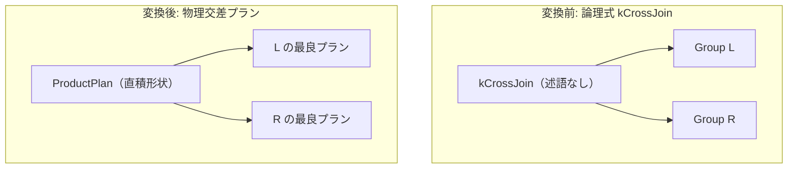

# cross_join

- 状態: draft   /   執筆基準リビジョン: `3880673` (2026-09-12)
- 定義位置: `plan/implementation_rules.cpp` の `DefaultImplementationRules()` 内の登録 `"cross_join"`（パターンは `cascades::dsl::CrossJoin()`、共有ヘルパー `JoinAlternatives(..., condition=std::nullopt, cross=true)` に委譲）

## 概要

論理式 `kCrossJoin`（直積演算）を、述語を持たない物理交差プラン `ProductPlan` として具現化する Rule です。

左右の入力リレーションのすべてのタプル対を無条件に直積結合して出力します。結合述語を伴う内部結合（`kJoin`）とは論理演算子レベルで明確に区別されており、本 Rule は述語評価ロジックを一切含みません。

## 変換前後の関係



左右の子プランから取得されたタプル対は、述語によるフィルタリングを受けずにそのまま上位へ出力されます。

## 適用条件

パターンは `CrossJoin()`（2 つの子を持つ `kCrossJoin`）です。登録ラムダ式では行位置要求を検査し、結合ヘルパー `JoinAlternatives` を呼び出します。

```cpp
if (children.size() != 2 || required.require_row_position) {
  return std::vector<PlanAlternative>{};
}
return JoinAlternatives(memo, logical.children[1], std::nullopt,
                        children[0], children[1], context, false,
                        false, true);
```

引数として `condition = std::nullopt`、`hash = false`、`index = false`、`cross = true` が渡されます。

発火しない条件は、「子の数が 2 以外の場合」、または「行位置要求（`require_row_position`）が存在する場合」です。

## 意味論的根拠と物理実行の契約

本 Rule の意味論的根拠は、直積の厳密な定義（$|L| \times |R|$ の全組列挙）と行数推定の整合性にあります。

共有ヘルパー `JoinAlternatives` において、推定行数は次のように算出されます。

```cpp
const double cross_estimate =
    equi_conjuncts.empty() ? l_rows * r_rows : equi_estimate;
```

本 Rule では `condition = std::nullopt` で呼び出されるため、等値結合節（`equi_conjuncts`）は常に空となり、推定行数は常に厳密な交差サイズ $l\_rows \times r\_rows$ となります。もし本 Rule が誤って結合述語を受け取って選択率を反映した推定値を返してしまうと、上位の最適化フェーズに対して「直積演算子であるにもかかわらず等値結合の行数を申告する」という矛盾を生じさせ、誤ったプラン選択を招きます。

結合述語を伴うクエリは、論理最適化層の `cross_to_inner_with_predicate` によってあらかじめ `kJoin` へと書き換えられ、`nested_loop_join` や `hash_join` などの内部結合実装 Rule へ委ねられる設計になっています。

## 実装の詳細

プランの構築は、`JoinAlternatives` 内の `cross = true` 分岐を通って行われます。

```cpp
if (cross) {
  auto product_plan = std::make_shared<ProductPlan>(left.plan, right.plan);
  Plan product = std::move(product_plan);
  const double local_cost = (l_rows * r_rows) + l_rows + r_rows;
  candidates.push_back(PlanAlternative{.plan = std::move(product),
                                       .local_cost = local_cost,
                                       .estimated_rows = cross_estimate});
}
```

- `ProductPlan`: 左右の子プランのみを受け取る 2 引数コンストラクタで生成され、結合キー列や特殊な `JoinKind` を持ちません。
- `local_cost`: 出力組数 $l\_rows \times r\_rows$ に加え、左右リレーションの読み込みコスト $l\_rows + r\_rows$ を合算した値です。述語評価を行わないため、これが直積実行における理論的下限コストとなります。
- `estimated_rows`: $l\_rows \times r\_rows$。

## 最適化効果

明示的または暗黙的な直積クエリに対して、最小のオーバーヘッドで実行可能な物理プランを供給します。

直積の計算量・出力サイズは $O(|L| \times |R|)$ と急激に増大するため、本 Rule が最終プランに採用されるのは両入力が極めて小さい場合や、論理層で直積を除去できなかったケースに限定されます。論理最適化層の `one_row_cross_join_elimination` や `join_empty_simplification` が事前に適用されれば、直積の実行そのものが回避されます。

## 関連 Rule との相互作用

- `join_to_cross_if_no_predicate`: 述語を持たない内部結合 `kJoin` を `kCrossJoin` に変換し、本 Rule への誘導を一意化する論理 Rule です。
- `cross_to_inner_with_predicate`: 述語が付与された直積を内部結合 `kJoin` へ戻す論理 Rule です。
- `nested_loop_join`: 内部結合 `kJoin` に対する物理実装 Rule です。述語なしの入れ子ループ結合と直積は同一のコスト計算式を持ちますが、入力となる論理演算子の違いによって住み分けられています。
- `one_row_cross_join_elimination`: 片側が確実に 1 行である直積を除去する論理 Rule です。

## 検証テスト

- `plan/optimizer_test.cpp` の `OptimizerTest.UnqualifiedJoinBecomesExplicitCrossJoin`: ON 句を持たない結合が直積として解釈され、正しく計画されることを検証。
