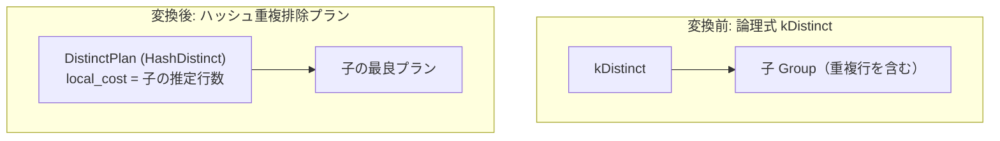

# distinct

- 状態: draft   /   執筆基準リビジョン: `3880673` (2026-09-12)
- 定義位置: `plan/implementation_rules.cpp` の `DefaultImplementationRules()` 内の登録 `"distinct"`（パターンは `cascades::dsl::Distinct()`）

## 概要

論理式 `kDistinct`（重複行排除演算）を、インメモリのハッシュセットを用いて重複行をフィルタリングする物理プラン `DistinctPlan`（文字列表現 `HashDistinct`）として具現化する Rule です。

入力のソート順序やインデックスの有無に依存せず、任意の入力に対して常に適用可能な標準の重複排除物理実装を供給します。

## 変換前後の関係



変換後プランは子プランの出力ストリームを受け取り、未見のタプルのみを即座に後続へ放出し、既出のタプルを破棄します。

## 適用条件

パターンは `Distinct()`（子を 1 つ持つ `kDistinct`）です。登録ラムダ式では子の個数のみを検証します。

```cpp
if (children.size() != 1) {
  return std::vector<PlanAlternative>{};
}
```

発火しない条件は、子の数が 1 でない場合のみです。行位置要求（`require_row_position`）や順序要求によるガードは設けられておらず、常に出現可能な代替案を返却します。

## 意味論的根拠と順序・重複度保存の契約

本 Rule の意味論的妥当性と物理特性の保証には、以下の重要な契約が存在します。

第一に、出力の順序性保存です。`DistinctPlan` は `IsOrderedBy` の判定を子プランへそのまま委譲します。

```cpp
// DistinctPlan passes through ordering properties from its child:
// DistinctExecutor emits rows in insertion order (first appearance).
```

実行器である `DistinctExecutor` は、タプルを走査しながらハッシュセットに未登録のタプルを検知した瞬間、その場で即座にタプルを上位へ放出（ストリーミング出力）します。二度目以降の重複行のみがドロップされるため、入力ストリームの順序関係は完全に維持されます。これにより、入力が既に目的のソート順を満たしている場合、追加のソート処理を伴うことなく `sort_distinct` とコスト競争を行うことが可能になります。

第二に、重複排除の申告契約（`EnforcesDistinct`）です。`DistinctPlan` は、特定の列のみをキーとする `DISTINCT ON` が指定されていない通常の `DISTINCT` の場合、自らが重複排除を完了することをオプティマイザに申告します。

第三に、行数見積もりの保守性です。重複排除により実際の出力タプル数は減少しますが、本 Rule はユニーク値数（NDV）の高度な統計情報を持たない場合、保守的に子の推定行数をそのまま引き継ぎます。行数を過大に見積もる方向の誤差は実行の正しさを損なわず、上位演算子のコスト評価において安全側の判断を促します。

## 実装の詳細

プランの構築は、`DistinctPlan` のインスタンス化とコスト設定によって行われます。

```cpp
Plan distinct = std::make_shared<DistinctPlan>(children[0].plan);
return std::vector<PlanAlternative>{
    PlanAlternative{.plan = std::move(distinct),
                    .local_cost = children[0].estimated_rows,
                    .estimated_rows = children[0].estimated_rows}};
```

- `DistinctPlan`: 子プランを内包する物理プランノードであり、エグゼキュータ生成時には `DistinctExecutor` をインスタンス化します。
- `local_cost`: 子プランの推定行数（$1$ 行あたり $1$ 回のハッシュテーブル参照・挿入コストを想定）。
- `estimated_rows`: 子プランの推定行数をそのまま維持。

## 最適化効果

任意の入力関係に対して、事前のソート処理を要求せずに重複排除を実行できる物理代替案を提供します。

入力がすでにインデックス等によって順序付けされている場合や、上位演算子がソート順を要求しないパイプラインにおいて、`sort_distinct` のソートオーバーヘッドを回避し、高速なインメモリ重複排除を実現します。

## 関連 Rule との相互作用

- `sort_distinct` / `skip_scan_distinct`: 同一の `kDistinct` 論理式に対する競合物理実装 Rule 群です。探索エンジンにおいてコスト比較が行われ、入力の順序性やインデックスの有無に応じて最適な実装が選択されます。
- `push_filter_through_distinct`: 選択フィルタを重複排除ノードの下位へ押し込む論理 Rule であり、本 Rule が処理すべきタプル数を削減します。
- `distinct_over_group_by` / `distinct_and_group_by_interchange`: 重複排除と集約を相互変換する論理 Rule 群です。集約に変換された場合は `aggregation` 実装 Rule の管轄となります。
- `pk_unique_distinct_elimination`: 主キーの一意性に基づいて `kDistinct` そのものを除去する論理 Rule です。

## 検証テスト

- `plan/plan_test.cpp` の `PlanTest.DistinctPlanUsesHashExecutorAndPreservesOrderingMetadata`: `DistinctPlan` が `HashDistinct` として表示され、推定行数および順序メタデータを正しく子から継承することを検証。
- `plan/cascades_test.cpp` の `CascadesTest.FilterIsPushedBelowDistinct`: フィルタプッシュダウンと DISTINCT 演算の組み合わせが正しく機能することを検証。
