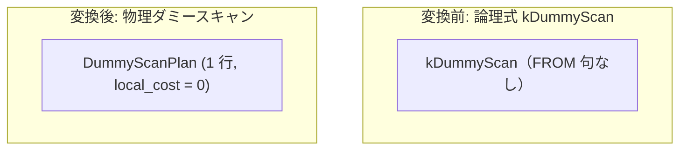

# dummy_scan

- 状態: draft   /   執筆基準リビジョン: `3880673` (2026-09-12)
- 定義位置: `plan/implementation_rules.cpp` の `DefaultImplementationRules()` 内の登録 `"dummy_scan"`（パターンは `cascades::dsl::DummyScan()`）

## 概要

論理式 `kDummyScan`（FROM 句を持たない SELECT クエリのための仮想 1 行リレーション）を、定数 1 行を出力する物理葉ノード `DummyScanPlan` として具現化する Rule です。

`SELECT 1 + 1` のような定数式評価クエリに対し、実テーブル走査やカタログアクセスを一切行わずに式評価エンジンへ単一タプルを供給する最小の物理実行単位を提供します。

## 変換前後の関係



子ノードを持たない葉ノードとして、直接 `DummyScanPlan` がインスタンス化されます。

## 適用条件

パターンは `DummyScan()`（子を持たない葉ノード）です。登録ラムダ式では子が空であることを検査します。

```cpp
if (!children.empty()) {
  return std::vector<PlanAlternative>{};
}
```

発火しない条件は、子ノードが存在する場合のみです。

## 意味論的根拠と物理実行の契約

`kDummyScan` はリレーショナル代数における単位元（1 行 0 列の空タプル、または定数行）を表現する論理演算子です。

`DummyScanPlan`（`plan/values_plan.hpp`）は、以下の厳密な物理契約を保持しています。

```cpp
[[nodiscard]] size_t AccessRowCount() const override { return 1; }
[[nodiscard]] size_t EmitRowCount() const override { return 1; }
[[nodiscard]] bool IsOrderedBy(
    const std::vector<Expression>& /*expressions*/,
    const std::vector<bool>& /*ascending*/) const override {
  return true;
}
[[nodiscard]] bool EnforcesDistinct() const override { return true; }
```

1. **アクセス行数および出力行数**: 常に厳密に `1`。
2. **順序要求の無条件充足**: 出力が 1 行のみであるため、あらゆる順序要求（`ordering`）を自明に満たします（`IsOrderedBy` は常に `true`）。
3. **重複排除の無条件充足**: 1 行しか存在しないため、重複は原理的に発生せず、`EnforcesDistinct` も常に `true` を返します。

この契約により、上位演算子からの不要なソート処理（`sort`）や重複排除（`distinct`）のエンフォーサ挿入を未然に防止します。

## 実装の詳細

実装は子ノードを持たない `DummyScanPlan` を割り当て、固定コストを返却します。

```cpp
Plan plan = std::make_shared<DummyScanPlan>();
return std::vector<PlanAlternative>{PlanAlternative{
    .plan = std::move(plan), .local_cost = 0, .estimated_rows = 1}};
```

- `local_cost`: 0（ディスク I/O やメモリ割り当てオーバーヘッドは実質皆無）。
- `estimated_rows`: 1。

論理プラン構築段階（`query/sql_engine.cpp`）において、FROM 句が存在しない SELECT クエリの起点として `kDummyScan` が Memo のルートまたは葉ノードとして登録されます。

## 最適化効果

テーブルアクセスを伴わないクエリにおいて、ストレージエンジンやバッファプールのリソースを消費することなく、最小限のインメモリ実行パスを確定させます。

推定行数 `1` とコスト `0` は上位の式評価射影ノード（`ProjectionPlan`）やフィルタノードへ正確に伝播し、探索を最短ステップで収束させます。

## 関連 Rule との相互作用

- `join_identity_dummy`: 結合の片辺が `DummyScan` である場合に結合演算そのものを消去する論理 Rule です。消去されずに残った単独の `DummyScan` を本 Rule が物理実装します。
- `values`: 複数行または明示的な VALUES 句を持つ定数リレーションを具現化する兄弟 Rule です。
- `constant_table`: 定数リレーションの別形態を担当する物理実装 Rule です。

## 検証テスト

- `plan/cascades_test.cpp` の `CascadesTest.DummyScanAndValuesHavePhysicalImplementationRules`: 手動で構築した `kDummyScan` 式が正しく `DummyScanPlan` に具現化され、表示名に "DummyScan" が現れることを検証。
- `plan/optimizer_test.cpp` の `OptimizerTest.OptimizeWithoutFromUsesDummyScanForConstantProjection`: FROM 句のない定数射影クエリが `DummyScanPlan` を起点として計画されることを検証。
