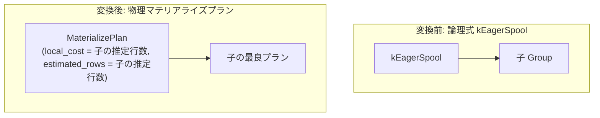

# eager_spool

- 状態: draft   /   執筆基準リビジョン: `3880673` (2026-09-12)
- 定義位置: `plan/implementation_rules.cpp` の `DefaultImplementationRules()` 内の登録 `"eager_spool"`（パターンは `cascades::dsl::EagerSpool()`、共有ラムダ `materialize_child` に委譲）

## 概要

論理式 `kEagerSpool`（子の出力ストリームを先行して一時退避・キャッシュするスプール演算）を、物理プラン `MaterializePlan` として具現化する Rule です。

`materialize` および `lazy_spool` と同一の実装ラムダ `materialize_child` を共有し、同一の物理ノードを生成します。論理演算子と実装 Rule を個別に分離して登録することにより、将来的な実行ヒントや先行評価（eager）と遅延評価（lazy）の挙動分岐に向けた個別アドレス性を担保しています。

## 変換前後の関係



物理プランの文字列表現は `Materialize` となり、子プランの出力が一度メモリバッファへ退避されます。

## 適用条件

パターンは `EagerSpool()`（子を 1 つ持つ `kEagerSpool`）です。共有ラムダ `materialize_child` では、子の個数、行位置要求、および演算子種別を検査します。

```cpp
if (children.size() != 1 || required.require_row_position) {
  return std::vector<PlanAlternative>{};
}
```

ラムダ内部の switch 文において、`kMaterialize`、`kEagerSpool`、`kLazySpool` の 3 演算子が受理されます。

発火しない条件は、「子の数が 1 でない場合」、「行位置要求（`require_row_position`）が存在する場合」、または「演算子が上記 3 種以外の場合」です。

## 意味論的根拠と物理実行の契約

本 Rule が物理プランとして成立するための技術的根拠は、以下の 2 点に集約されます。

第一に、行位置要求（`require_row_position`）の拒否です。マテリアライズおよびスプール処理は、入力タプルを一度メモリ上のバッファへ書き出し、走査要求に応じて挿入順に再生します。この過程でストレージ層固有の物理ページ内タプル位置（TID / RID）は完全に失われます。したがって、上位演算子がタプル位置の同一性に依存した更新・削除などの操作を要求している場合、本 Rule を適用すると誤ったタプル操作を引き起こすため、探索段階で明示的に排除します。

第二に、順序性の保存とコスト計上です。エグゼキュータである `MaterializeExecutor` は、タプルを挿入された順序のまま忠実に再生します。そのため、子プランが保証していた順序プロパティ（`ordering`）はマテリアライズ後も破壊されずに維持されます。

```cpp
// materialize / spool: cache the child for multi-pass consumers (CTE
// references read twice, recurring work-table scans). The executor
// replays rows in insertion order, so ordering and row counts pass
// through; the local cost is the single caching pass. Eager and lazy
// spools share the implementation (the executor materializes on first
// read) and stay separately addressable for hints.
```

なお、「eager」の本来の概念は消費者が読み出す前に先行してバッファへ書き込む動作を指しますが、現在の tinylamb の実装では初回読み出し時にバッファリングを行う `MaterializeExecutor` に一本化されています。

## 実装の詳細

実装はスプール・マテリアライズファミリで共通のラムダ式によって記述されます。

```cpp
Plan plan = std::make_shared<MaterializePlan>(children[0].plan);
return std::vector<PlanAlternative>{
    PlanAlternative{.plan = std::move(plan),
                    .local_cost = children[0].estimated_rows,
                    .estimated_rows = children[0].estimated_rows}};
```

- `MaterializePlan`: 子プランを内包し、初回走査時に全タプルをバッファへ退避して 2 回目以降の走査で再利用を可能にします。
- `local_cost`: キャッシュ構築のための 1 パス走査費用として `children[0].estimated_rows` を計上します。
- `estimated_rows`: フィルタリングや重複排除を行わないため、子の推定行数をそのまま引き継ぎます。

## 最適化効果

共通テーブル式（CTE）の複数回参照や再帰クエリのワークテーブル走査において、部分木の再実行を防ぐ物理キャッシュノードを生成します。

先行評価の指示を持つ論理スプールノードに対して正しく実行可能な物理代替案を供給し、コストベース探索において多重走査の削減効果を評価可能にします。

## 関連 Rule との相互作用

- `materialize` / `lazy_spool`: 同一の実装ラムダ `materialize_child` を共有する兄弟 Rule 群です。
- `recursive_cte`: 再帰的共通テーブル式の展開においてスプール演算子を導入する論理・物理 Rule です。

## 検証テスト

- `plan/cascades_test.cpp` の `CascadesTest.MaterializeAndSpoolHaveImplementationRules`: `kEagerSpool` を含む 3 種類の演算子がそれぞれ `MaterializePlan` へ具現化されることを検証。
- `plan/cascades_test.cpp` の `CascadesTest.WindowAndSpoolAreUnaryLogicalOperators`: `kEagerSpool` が単項演算子として整合性を保っていることを検証。
