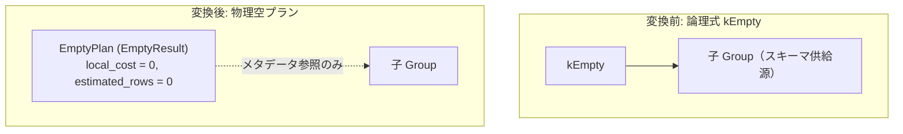

# empty

- 状態: draft   /   執筆基準リビジョン: `3880673` (2026-09-12)
- 定義位置: `plan/implementation_rules.cpp` の `DefaultImplementationRules()` 内の登録 `"empty"`（パターンは `cascades::dsl::Empty()`）

## 概要

論理式 `kEmpty`（0 行確定のリレーション演算子）を、子プランの出力スキーマを保持したまま何も出力しない物理プラン `EmptyPlan`（文字列表現 `EmptyResult`）として具現化する Rule です。

論理最適化において結果が常に 0 行になると確定した部分木に対し、実行コスト 0 かつ推定行数 0 の物理ノードを割り当てることで、下位のテーブルスキャンや結合処理を完全に消去します。

## 変換前後の関係



変換後プランは子プランのメタデータを保持しますが、物理実行時に子プランが開かれる（エグゼキュータが初期化される）ことはありません。

## 適用条件

パターンは `Empty()`（子を 1 つ持つ `kEmpty`）です。登録ラムダ式では子の個数を検査します。

```cpp
if (children.size() != 1) {
  return std::vector<PlanAlternative>{};
}
```

発火しない条件は、子の数が 1 以外の場合のみです。

## 意味論的根拠と物理実行の契約

`kEmpty` は、関係代数的には「行数が 0 であるが、列定義（スキーマ）は子リレーションと厳密に一致する」リレーションを表します。

`EmptyPlan`（`plan/empty_plan.hpp`）は、以下の厳密な実行契約を提供します。

```cpp
// A zero-row alternative that preserves the child's output schema. The child
// is retained for metadata but is never opened by EmitExecutor.
```

子プランは `GetSchema()` や `ScanSource()` などのメタデータ解決のためだけに保持され、エグゼキュータ生成時（`EmitExecutor`）に子エグゼキュータが開かれることはありません。

また、0 行のリレーションは数学的にあらゆる順序要求や一意性要求を自明に満たすため、以下のプロパティ充足契約を持ちます。

```cpp
[[nodiscard]] bool IsOrderedBy(
    const std::vector<Expression>& /*expressions*/,
    const std::vector<bool>& /*ascending*/) const override {
  // An empty relation satisfies every ordering requirement.
  return true;
}
[[nodiscard]] bool EnforcesLimit() const override { return true; }
[[nodiscard]] bool EnforcesDistinct() const override { return true; }
```

この契約により、上位演算子からの順序要求（`ordering`）や行制限要求（`limit`）、重複排除要求（`distinct`）に対して、追加のソートや集約ノードを挿入することなく即座に要求を充足させます。

## 実装の詳細

実装は子プランをラップした `EmptyPlan` を生成し、コスト 0 を返却します。

```cpp
Plan empty = std::make_shared<EmptyPlan>(children[0].plan);
return std::vector<PlanAlternative>{PlanAlternative{
    .plan = std::move(empty), .local_cost = 0, .estimated_rows = 0}};
```

- `local_cost`: 0。
- `estimated_rows`: 0。
- 文字列表現: `ToString()` および `Dump()` の出力は `EmptyResult` となります。

コストが 0 かつ推定行数が 0 であるため、探索エンジン（`SearchEngine`）において該当 Group の最良代替案として確実に採択されます。

## 最適化効果

0 行確定の部分木について、ストレージ読み込みや演算子処理のコストを完全に排除します。

さらに、推定行数 `0` は親演算子（結合や集合演算など）のコスト計算にも直ちに波及し、結合の相手側リレーションの読み込み無駄を抑制するなどの強力な枝刈り効果をもたらします。

## 関連 Rule との相互作用

- `join_on_false_to_empty`: ON 句が定数 FALSE / NULL である結合を `kEmpty` に変換する論理 Rule です。
- `join_empty_simplification`: 空のリレーションを含む結合を空に簡約する論理 Rule です。
- `setop_empty_simplification`: 空の入力を含む集合演算を簡約する論理 Rule です。
- `selection`: 定数 FALSE / NULL の選択述語を直接 `EmptyPlan` に具現化するショートカット経路を保持しています。

## 検証テスト

- `plan/optimizer_test.cpp` の `OptimizerTest.ConstantFalseSelectionBecomesEmptyPlan`: 定数 FALSE の選択述語が `EmptyPlan` に具現化され、下位の `FullScanPlan` が除去されることを検証。
- `plan/optimizer_test.cpp` の `OptimizerTest.ContradictoryConjunctsBecomeEmptyResult`: 矛盾する AND 条件が `EmptyResult` として計画されることを検証。
- `plan/cascades_test.cpp` の `CascadesTest.JoinEmptySimplification`: 空リレーションを含む結合の論理簡約を検証。
