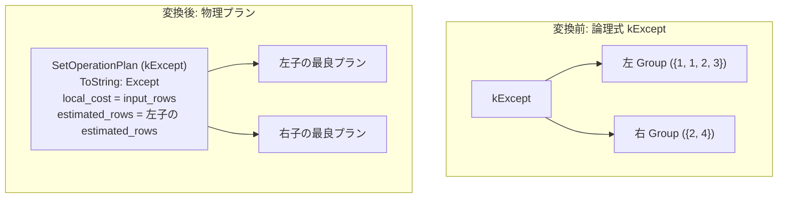

# except

- 状態: done   /   執筆基準リビジョン: `3880673` (2026-09-12)
- 定義位置: `plan/implementation_rules.cpp` の `DefaultImplementationRules()` 内の登録 `"except"`（パターン: `cascades::dsl::Except()`、実装ラムダ: 6 種の集合演算で共有される `implement_set_operation`）

## 概要

論理演算子 `kExcept`（SQL の `EXCEPT` に対応する重複排除つき集合差）を物理プラン `SetOperationPlan`（演算種別 `SetOperationKind::kExcept`）へ実装する規則です。最初の入力リレーションにのみ現れる個別行を出力し、出力結果から重複行を排除します。本規則は 6 種の集合演算実装（`union`, `union_all`, `intersect`, `intersect_all`, `except`, `except_all`）で共有される `implement_set_operation` ラムダによって提供されます。

## 変換前後の関係



上記例の出力は `{1, 3}` です（左入力に 1 が 2 行存在しても重複が排除され 1 行のみ出力されます。重複度を保持する `EXCEPT ALL` の場合は `{1, 1, 3}` となります）。

## 適用条件

パターンは 2 以上の任意のアリティを持つ `kExcept` です。共有実装ラムダにおけるガード条件は以下の通りです。

```cpp
if (children.size() < 2) {
  return std::vector<PlanAlternative>{};
}
```

集合差は入力リレーションの順序に依存する非対称な演算です。共有ラムダは `children` の出現順序をそのまま保持して `plans` 配列を構築するため、先頭の子（`children.front()`）が被減算リレーション（引き算の引かれる側）として扱われます。なお、`MergeAppend` 経路は `kUnionAll` 専用であるため、上流から順序要求（`required.ordering`）が渡された場合でも整序キーは伝播されず、通常形態の 1 つの代替案のみが生成されます。

## 意味論的根拠と物理実行の契約

本規則における意味論保存の要件は、重複排除の契約と非対称性の保持の 2 点です。

1. **重複排除の保証**: `SetOperationPlan::EnforcesDistinct()` は `kExcept` に対して真を返します。物理実行器である `SetOperationExecutor::AppendExcept(rows, /*all=*/false)` はハッシュ集合を用いて後続入力に含まれる値を記録し、第 1 入力からそれらを除外した上で出力の重複を排除します。
2. **非対称性の厳密な保持**: 集合差演算は非可換（$A \setminus B \neq B \setminus A$）です。したがって、子の順序入れ替えは一切許容されません。論理最適化規則 `except_to_antijoin` においても、第 1 入力を外側（プローブ側）、第 2 入力以降を内側（ビルド側）とする反結合関係が厳密に維持されます。

もし `kExcept` に対して `kExceptAll` の物理実行器を割り当てた場合、重複排除が行われず左側の多重度が維持されて解が破損します。逆に `kExceptAll` に重複排除を適用すると必要な行多重度が失われます。そのため、ALL の有無に応じた個別規則と物理演算種別の分離が必須となります。

## 実装の詳細

`plan/implementation_rules.cpp` の共有ラムダ `implement_set_operation` における主要実装部は以下の通りです。

```cpp
Plan set_operation = std::make_shared<SetOperationPlan>(
    std::move(plans), operation, std::move(order_keys));
const double output_rows = operation == SetOperationKind::kUnionAll
                               ? input_rows
                               : children.front().estimated_rows;
return std::vector<PlanAlternative>{
    PlanAlternative{.plan = std::move(set_operation),
                    .local_cost = input_rows,
                    .estimated_rows = output_rows}};
```

- **`local_cost = input_rows`**: 全入力リレーションの推定行数の総和です。`SetOperationExecutor::AppendExcept` は第 2 入力以降のすべての行をスキャンして除外対象を構築し、第 1 入力の全行を判定するため、全入力の走査コストの総和が局所コストとなります。
- **`estimated_rows = children.front().estimated_rows`**: 差集合の出力行数は第 1 入力の行数を決して超えません。右入力が空の場合に第 1 入力の行数と完全に一致するため、`children.front().estimated_rows` は厳密な上界となります。
- **文字列表現**: 生成された物理演算子は `SetOperationPlan::ToString` により `Except` と出力されます。

## 最適化効果

論理式 `kExcept` から単一の物理演算子 `SetOperationPlan`（`Except`）が生成されます。論理規則 `except_to_antijoin` が適用された場合は論理式が `kAntiJoin` へ変換されるため、ハッシュ反結合（`anti_hash_join` 等）と本規則による集合演算実装が物理プラン候補として競合し、コストモデル（`intersect_except_cost_based_lowering`）に基づいて最適な実装が選択されます。

## 関連 Rule との相互作用

- `except_all`, `union`, `union_all`, `intersect`, `intersect_all`: 同一の `implement_set_operation` ラムダを共有する集合演算実装規則群です。
- `except_to_antijoin`: `kExcept` を `kAntiJoin` へ書き換える論理同値規則です。
- `intersect_except_cost_based_lowering`: 集合差を集合演算として物理化するか、反結合へ降ろすかをコスト比較により決定する制御機構です。
- `push_filter_past_setop`, `setop_empty_simplification`, `setop_empty_identity`: `kExcept` の子式に対する述語プッシュダウンや空入力簡約を行う論理規則群です。
- `anti_hash_join`, `anti_nested_loop_join`: 反結合に変換された場合に適用される物理結合規則群です。

## 検証テスト

- `plan/cascades_test.cpp`:
  - `CascadesTest.SetOperationValidatesArityRelationsAndDropsProperties`: 集合演算の子ノード数バリデーションおよび上流プロパティのドロップ処理を検証します。
  - `CascadesTest.ExceptToAntiJoinRewrite`: EXCEPT から AntiJoin への論理書き換えの正当性を検証します。
  - `CascadesTest.IntersectExceptCostBasedLowering`: EXCEPT の直接実装と AntiJoin 実装の間でのコスト基準の選択を検証します。
