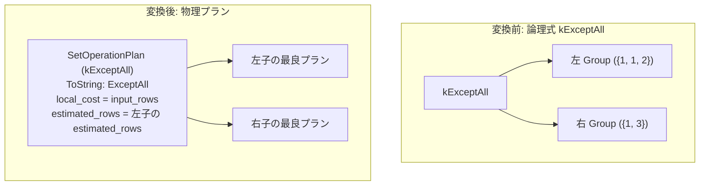

# except_all

- 状態: done   /   執筆基準リビジョン: `3880673` (2026-09-12)
- 定義位置: `plan/implementation_rules.cpp` の `DefaultImplementationRules()` 内の登録 `"except_all"`（パターン: `cascades::dsl::ExceptAll()`、実装ラムダ: 6 種の集合演算で共有される `implement_set_operation`）

## 概要

論理演算子 `kExceptAll`（SQL の `EXCEPT ALL` に対応する多重度を保持するマルチセット差）を物理プラン `SetOperationPlan`（演算種別 `SetOperationKind::kExceptAll`）へ実装する規則です。第 1 入力リレーションに含まれる行の出現回数から、後続の入力リレーションに含まれる出現回数を減算した多重度（$\max(0, \text{cnt}_L - \text{cnt}_R)$）で行を出力します。兄弟規則 `except` と同様に共有ラムダ `implement_set_operation` を用いますが、重複排除を行わない点が異なります。

## 変換前後の関係



上記例の出力は `{1, 2}` です（左入力の 1 は 2 行、右入力の 1 は 1 行存在するため、差引 1 行が出力されます。重複を潰す `except` の場合は `{2}` となります）。

## 適用条件

パターンは 2 以上の任意のアリティを持つ `kExceptAll` です。共有実装ラムダにおけるガード条件は以下の通りです。

```cpp
if (children.size() < 2) {
  return std::vector<PlanAlternative>{};
}
```

集合差であるため項の順序は非可換であり、`children.front()` が被減算リレーションとなります。また `MergeAppend` 経路は `kUnionAll` 専用であるため、上流から順序要求（`required.ordering`）が提示されても本規則は整序を行わず、通常形態の代替案を 1 件返します。

## 意味論的根拠と物理実行の契約

本規則の意味論保存の核心は、マルチセット差における行多重度の保持です。

`SetOperationPlan::EnforcesDistinct()` は `kExceptAll` に対して偽を返します。`plan/set_operation_plan.hpp` において重複排除フラグを偽と定義することにより、親演算子に対して重複排除保証を提供しないことが明示されます。物理実行器 `SetOperationExecutor::AppendExcept(rows, /*all=*/true)`（`executor/set_operation.cpp`）は、右入力の各行の出現頻度マップを構築し、左入力の行を走査しながら残余多重度分だけ出力行を蓄積します。

仮に `kExceptAll` に対して重複排除を行う `kExcept` の物理実行器を割り当てた場合、左入力の重複行が削ぎ落とされ、クエリ結果の行数および多重度が変化します（例えば左 `{1, 1, 2}` と右 `{1}` の差において `{1, 2}` ではなく `{2}` が出力される誤謬が生じます）。したがって、多重度保存の有無に応じた規則の完全分離が意味論の厳密性に直結します。

## 実装の詳細

共有ラムダ `implement_set_operation` の主要部におけるコストおよび行数計算は以下の通りです。

```cpp
Plan set_operation = std::make_shared<SetOperationPlan>(
    std::move(plans), operation, std::move(order_keys));
const double output_rows = operation == SetOperationKind::kUnionAll
                               ? input_rows
                               : children.front().estimated_rows;
return std::vector<PlanAlternative>{
    PlanAlternative{.plan = std::move(set_operation),
                    .local_cost = input_rows,
                    .estimated_rows = output_rows}};
```

- **`local_cost = input_rows`**: 全入力リレーションの推定行数の総和です。マルチセット差の算出には全入力行を走査して出現頻度を計上する必要があるため、局所コストは入力総行数となります。
- **`estimated_rows = children.front().estimated_rows`**: 出力行数の真値 $\sum \max(0, \text{cnt}_L(x) - \text{cnt}_R(x))$ は各行において $\text{cnt}_L(x)$ を超えないため、第 1 入力の行数 `children.front().estimated_rows` が厳密な上界となります。
- **物理表現**: 物理ノードの文字列表現は `SetOperationPlan::ToString` により `ExceptAll` と出力されます。

## 最適化効果

論理式 `kExceptAll` から単一の物理演算子 `SetOperationPlan`（`ExceptAll`）を生成します。`EXCEPT ALL` は行の重複度を保持しなければならないため、右側の単一存在判定のみを行う標準的な反結合（AntiJoin）への書き換えは意味論的に安全ではありません。したがって、本規則による物理化が `EXCEPT ALL` の確定的かつ唯一の物理実行経路となります。

## 関連 Rule との相互作用

- `except`, `union`, `union_all`, `intersect`, `intersect_all`: 同一の `implement_set_operation` ラムダを共有する集合演算実装規則群です。
- `except_to_antijoin`: **`kExceptAll` には適用されません**。反結合への変換は重複排除を伴う `kExcept` にのみ安全であり、本規則の多重度契約を侵害しないよう厳密に除外されています。
- `setop_empty_simplification`, `setop_empty_identity`: 右入力が空の場合、`EXCEPT ALL` は左入力との恒等（左入力をそのまま出力）となるため、先行する論理規則によって簡約される場合があります。

## 検証テスト

- `plan/cascades_test.cpp`:
  - `CascadesTest.SetOperationValidatesArityRelationsAndDropsProperties`: 集合演算の子数バリデーションおよび上流プロパティの伝播抑制を検証します。
  - `CascadesTest.ExceptToAntiJoinRewrite`: 反結合への書き換えが ALL なしの `kExcept` のみに限定され、`kExceptAll` が対象外であることを間接的に担保します。
