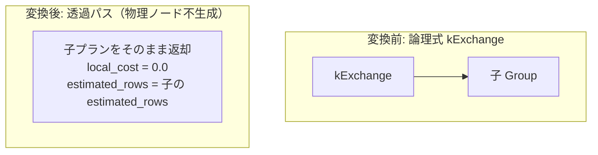

# exchange_noop

- 状態: done   /   執筆基準リビジョン: `3880673` (2026-09-12)
- 定義位置: `plan/implementation_rules.cpp` の `DefaultImplementationRules()` 内の登録 `"exchange_noop"`（パターン: `cascades::dsl::Exchange()`、実装ラムダ: 4 本の分散 no-op で共有される `exchange_passthrough`）

## 概要

論理演算子 `kExchange`（分散実行モデルにおいてノード間のデータ再配置を表す演算子）を物理実行上「追加コストなしの透過パス（no-op）」として実装する規則です。`PhysicalProperties::distribution` を用いた分散プロパティ管理の枠組みにおいて、単一ノード構成では任意のデータ分布要求が自明に充足されているため、物理ノードを新規生成せず子プランをそのまま透過させます。

## 変換前後の関係



`plan/implementation_rules.cpp` の登録箇所には、以下の設計意図が明記されています。

```cpp
// exchange_noop: single-node distribution enforcement. kExchange /
// kGather / kBroadcast / kRedistribute exist for the distributed
// property model (PhysicalProperties::distribution); with one node every
// distribution is already satisfied, so the rule passes the child plan
// through at zero cost and keeps exchange shapes plannable.
```

## 適用条件

パターンは子を 1 つ持つ `kExchange` です。ガード条件は子ノード数チェックおよび共有ラムダ内の演算子種別判定です。

```cpp
if (children.size() != 1) {
  return std::vector<PlanAlternative>{};
}
switch (logical.operation) {
  case c::LogicalOperator::kExchange:
  case c::LogicalOperator::kGather:
  case c::LogicalOperator::kBroadcast:
  case c::LogicalOperator::kRedistribute:
    break;
  default:
    return std::vector<PlanAlternative>{};
}
```

本 switch 文は、4 つの分散 no-op 規則（`exchange_noop`, `gather_noop`, `broadcast_noop`, `redistribute_noop`）が同一の `exchange_passthrough` ラムダを参照していることに対する契約確認として機能します。

## 意味論的根拠と物理実行の契約

単一ノード環境における分散演算子の意味論保存と、探索完走性の保証が本規則の論理的根拠です。

1. **単一ノードにおける分散自明性**: 単一ノード構成においては、すべての行が単一のメモリ・ストレージ空間に局在しているため、シャッフルやパーティショニングを伴う再配置を実行しても行集合および順序は一切変化しません。したがって、子プランを物理的にそのまま通過させることが数学的・意味論的に厳密な恒等写像となります。
2. **探索空間の完走性（Plannability）の確保**: Memo 内に `kExchange` 演算子を含む論理式が登録された際、対応する物理実装規則が存在しない場合、その Group に対する最良プランが `std::nullopt` となり、クエリ全体が `Status::kNotImplemented` で異常終了します。ゼロコストの透過代替案を提供することにより、将来的な分散演算子が論理プラン木に介在しても探索プロセスを破綻なく完走させます。

## 実装の詳細

共有ラムダ `exchange_passthrough` は新規ノードをアロケーションせず、子プランの属性を保持して返却します。

```cpp
return std::vector<PlanAlternative>{
    PlanAlternative{.plan = children[0].plan,
                    .local_cost = 0.0,
                    .estimated_rows = children[0].estimated_rows}};
```

- **`local_cost = 0.0`**: 物理的な処理を行わないため局所コストはゼロです。Cascades 最適化器の Branch-and-Bound 枝刈りにおける非負コスト契約を満たします。
- **`estimated_rows = children[0].estimated_rows`**: 行数は子の値をそのまま引き継ぎます。
- **物理プロパティの伝播**: `SearchEngine::RequiredChildProperties` において `kExchange` は単項透過演算子として定義されており、親が要求する順序プロパティ等はそのまま子ノードへ要求されます。子が要求順序を満たしていれば、透過された本代替案もその順序を保持します。

## 最適化効果

物理演算子を一切生成せず、子プランをそのまま昇格させます。探索エンジンは中間オーバーヘッドなしに論理式 `kExchange` を解消し、クエリ実行時にも無駄なイテレータラッパーを排除できます。分散実行エンジンが導入された際には、実際のネットワーク転送コストを計上する分散版実装規則とコスト比較されるベースラインとなります。

## 関連 Rule との相互作用

- `gather_noop`, `broadcast_noop`, `redistribute_noop`: 同一の `exchange_passthrough` ラムダを共有する兄弟規則群です。
- `PhysicalProperties::distribution`: 分布要求を表すプロパティであり、`PhysicalProperties::Key` に組み込まれて探索キャッシュを分離します。
- `sort`, `limit`: 特定の条件（順序充足時やソート未確定時）において物理ノードを作らず子プランを透過させる類似機構を持ちます。

## 検証テスト

- `plan/cascades_test.cpp`:
  - `CascadesTest.ExchangeNoopPassesChildThrough`: `kExchange` 論理式が挿入された場合に、最良物理プランが子プラン（`Values` 等）を直接指し、ゼロコストで透過されることを検証します。
