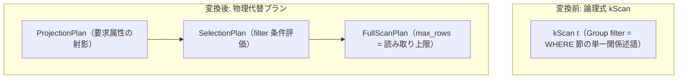

# full_scan

- 状態: draft   /   執筆基準リビジョン: `3880673` (2026-09-12)
- 定義位置: `plan/implementation_rules.cpp` の `DefaultImplementationRules()` 内の登録 `"full_scan"`（パターンは `cascades::dsl::Scan()`、実装は共有ヘルパー `ScanAlternatives` に委譲）

## 概要

論理テーブルスキャン演算子 `kScan` に対し、テーブルの全ページを順次走査する `FullScanPlan`（必要に応じて上層に `SelectionPlan` および `ProjectionPlan` を付加）を生成する物理実装 Rule です。

索引が存在しない場合や述語の選択率が低く全表走査が有利な場合の確実な実行経路であり、フィルタ選択性や LIMIT による最大読み取り行数制限をコストモデルへ正確に反映した上で、`index_scan` が生成する索引スキャン候補とコスト競争を行います。

## 変換前後の関係



残余フィルタが存在する場合は `SelectionPlan` がスキャン直上に配置され、要求列とテーブル格納列が異なる場合は `ProjectionPlan` が最上位に配置されます。自己結合等の別名が存在する場合は `RelationRenamePlan` によりスキーマが調整されます。

## 適用条件

パターンは葉ノード `Scan()` です。実装処理は `ScanAlternatives(..., /*include_indexes=*/false, /*include_full_scan=*/true)` に委譲されます。

カタログ内にテーブル情報および統計情報が存在しない場合（マテリアライズド CTE の一時 Group 等）、本 Rule は空リストを返して処理を中断します。

```cpp
  const auto table_it = context.tables.find(logical.table);
  const auto statistics_it = context.statistics.find(logical.table);
  if (table_it == context.tables.end() ||
      statistics_it == context.statistics.end()) {
    return {};
  }
```

## 意味論的根拠と安全性制約

### 1. グループフィルタの完全評価
論理最適化の述語プッシュダウンフェーズにより、単一関係に閉じた WHERE 述語はすべて Group の `filter` 属性へ集約されます。

```cpp
  // The group filter carries the single-relation conjuncts of the WHERE
  // clause (Phase 2 pushdown); it must be applied in full because the root
  // SelectionPlan wrap no longer exists. Conjuncts speak relation identities
  // while scan machinery speaks physical table names, so translate down.
  Expression filter = QualifyDown(memo.Get(group).filter, relation, physical);
```

ルートノードの `SelectionPlan` はプッシュダウン完了後に消去されるため、物理スキャン演算子側でこの `filter` を漏れなく適用しなければ行漏洩（不正なタプル増加）を招きます。`QualifyDown` により、クエリ論理名（別名）から物理テーブルスキーマの列オフセットへのマッピング変換が行われます。

### 2. LIMIT 条件の安全な押し込み判定
順序保証を伴わない単純な LIMIT は、スキャンの反復上限（`scan_limit`）として下位へ沈めることが可能です。ただし、以下のケースではスキャン上限を設定すると誤った結果を生じるため、`CanPushLimitIntoFullScan` により厳格に排除されます。
- 述語（`filter`）が存在する場合（フィルタ通過前の行数で打ち切る誤りを防止）。
- `DISTINCT`、`ORDER BY`、または集約関数を含む場合（全タプルを走査しなければ最終結果が確定しないため）。

```cpp
  if (filter || context.query == nullptr || context.query->limit_count_ == 0 ||
      context.query->distinct_ || !context.query->order_expressions_.empty() ||
      required.limit_hint == std::numeric_limits<size_t>::max() ||
      required.limit_hint == 0) {
    return false;
  }
  return !std::ranges::any_of(context.query->select_, [](const auto& output) {
    return ContainsAggregateExpression(output.expression);
  });
```

## 実装の詳細

### 1. IntegerPeekCompare による生バイト早期除外
整数型の単純比較条件（例: `id = 100` や `status < 3`）が存在する場合、`TryCompileSimpleCompare` を用いて `IntegerPeekCompare` 構造体へコンパイルします。スキャンイテレータはタプル全体のデシリアライズを行う前に、スロット内の生バイト列を直接比較して不一致行を高速に破棄します。

### 2. コストと推定行数
```cpp
    auto local_cost = static_cast<double>(full_scan->AccessRowCount());
    if (required.access_method == cascades::AccessMethod::kPreferIndex &&
        table.IndexCount() > 0) {
      local_cost *= 2.0;
    }
    auto estimated_rows = static_cast<double>(full_scan->EmitRowCount());
    ApplyLimitHint(full_scan, required, context, filter_selectivity,
                   &local_cost, &estimated_rows);
```

- **ローカルコスト**: テーブル全ページを走査するアクセス行数（`AccessRowCount()`）。索引優先ヒント（`kPreferIndex`）が指定されている場合はペナルティ係数 $2.0$ を乗算します。
- **Top-K ヒントの適用**: 要求順序をスキャンが偶然満たしているか無順序でよい場合、`ApplyLimitHint` によりコストと行数が `limit_hint` を上限として圧縮されます。

## 最適化効果

- **シーケンシャル I/O の最大化**: ディスクまたはバッファプールからの連続ブロック先読み（Sequential Prefetching）を活用し、ランダムアクセス主体の索引探索よりも高速に大量データを処理します。
- **並列スキャンの適用**: テーブル規模が閾値を超える場合、実行エンジン側で自動的に morsel-driven 型のマルチスレッド並列スキャンへ昇格されます。

## 関連 Rule との相互作用

- `index_scan`: 同一グループの論理 `kScan` に対し索引アクセス案を提示する競合 Rule です。コストエンジンが両者の見積もりを比較して最適な方を採択します。
- `push_selection_into_scan`: WHERE 節の述語をスキャンノードの直上へ集約し、本 Rule が受け取る `filter` を供給します。
- `eliminate_false_selection`: 恒偽述語を検知して空関係（`kEmpty`）に置き換えることで、無駄な全表スキャンの生成を未然に防ぎます。

## 検証テスト

`plan/optimizer_test.cpp` における以下のテストケースで検証されています。

- `OptimizerTest.UnorderedLimitPushesRowCapIntoFullScan`:
  順序なし LIMIT がスキャンの最大読み取り上限（`scan_limit`）へ正しく反映されることを確認します。
- `OptimizerTest.AggregateLimitDoesNotCapInputScan`:
  集約を含むクエリにおいて LIMIT がスキャンへ誤って押し込まれないことを確認します。
- `OptimizerTest.PhysicalRulesCanBeRemovedIndependently`:
  `full_scan` および `index_scan` を個別にルールセットから着脱してもオプティマイザが正常動作することを確認します。
