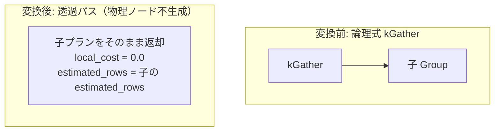

# gather_noop

- 状態: done   /   執筆基準リビジョン: `3880673` (2026-09-12)
- 定義位置: `plan/implementation_rules.cpp` の `DefaultImplementationRules()` 内の登録 `"gather_noop"`（パターン: `cascades::dsl::Gather()`、実装ラムダ: 4 本の分散 no-op で共有される `exchange_passthrough`）

## 概要

論理演算子 `kGather`（分散実行モデルにおいて複数ノード上の断片化データを単一ノードへ集約する演算子）を物理実行上「追加コストなしの透過パス（no-op）」として実装する規則です。単一ノード構成では全データが初めから同一ノード上に存在するため、集約処理の実体化を伴わずに子プランをそのまま透過させます。

## 変換前後の関係



## 適用条件

パターンは子を 1 つ持つ `kGather` です。共有実装ラムダ `exchange_passthrough` におけるガード条件は以下の通りです。

```cpp
if (children.size() != 1) {
  return std::vector<PlanAlternative>{};
}
```

共有ラムダ内の演算子種別判定 switch 文において、`kGather` は許可された 4 演算子の 1 つとして処理されます。

## 意味論的根拠と物理実行の契約

分散環境における `kGather` の責務は、複数ワーカーに分散したリレーションを収集して後続の集約や最終出力を可能にすることです。しかし、単一ノード環境においてはデータ分散自体が存在しないため、物理的な集約処理を行わない透過パスが意味論的に完全な恒等写像となります。

また、`SearchEngine::RequiredChildProperties` において `kGather` は単項透過演算子群（`kSelection`, `kLimit`, `kDistinct`, `kExchange`, `kRedistribute` 等と同等）に分類されており、上流からのプロパティ要求（順序等）をそのまま子ノードへ伝播させます。

探索完走性（Plannability）の観点においても、論理プラン内に `kGather` が出現した際に物理プランが欠落して `Status::kNotImplemented` に陥ることを防ぎ、単一ノード向けの有効な物理木を確立する安全弁として機能します。

## 実装の詳細

`plan/implementation_rules.cpp` の共有ラムダ `exchange_passthrough` による実装部は以下の通りです。

```cpp
return std::vector<PlanAlternative>{
    PlanAlternative{.plan = children[0].plan,
                    .local_cost = 0.0,
                    .estimated_rows = children[0].estimated_rows}};
```

- **`local_cost = 0.0`**: 物理的な追加処理が存在しないため、局所コストはゼロです。
- **`estimated_rows = children[0].estimated_rows`**: 行数は子プランの推定行数をそのまま維持します。
- **物理演算子の非生成**: ラッパー演算子を生成せず、`children[0].plan` ポインタを直接返却します。

## 最適化効果

物理演算子を生成せず子プランをそのまま最良プラン候補とすることで、ランタイムのオーバーヘッドを発生させずに分散構文・論理演算子を処理できます。将来的にネットワーク転送を伴う物理 Gather 演算子が導入された際には、単一ノード環境におけるゼロコストベースラインとして機能し、通信コストとの比較選択が行われます。

## 関連 Rule との相互作用

- `exchange_noop`, `broadcast_noop`, `redistribute_noop`: 同一の `exchange_passthrough` 実装ラムダを共有する兄弟規則群です。
- `PhysicalProperties::distribution`: 分散プロパティモデル。単一ノード環境では任意の分布要求を満たすものとして扱われます。

## 検証テスト

- `plan/cascades_test.cpp`:
  - `CascadesTest.ExchangeNoopPassesChildThrough`: 共有ラムダ `exchange_passthrough` の代表テストとして、子プランがゼロコストで透過されることを検証します。

