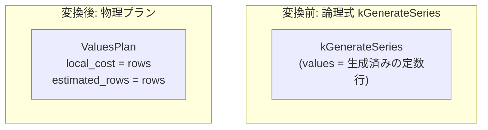

# generate_series

- 状態: done   /   執筆基準リビジョン: `3880673` (2026-09-12)
- 定義位置: `plan/implementation_rules.cpp` の `DefaultImplementationRules()` 内の登録 `"generate_series"`（パターン: `cascades::dsl::GenerateSeries()`）

## 概要

テーブル関数 `generate_series` に対応する論理葉ノード `kGenerateSeries` を、インメモリ展開済みの行リストを順次走査する物理プラン `ValuesPlan` へ実装する規則です。数列の生成計算自体は先行処理によって論理ノードの `logical.values` 内に定数行として確定・保持されている前提であり、本物理実装規則はそれらを反復出力する責務のみを担います。

## 変換前後の関係



## 適用条件

パターンは子を持たない `kGenerateSeries` 葉ノードです。ガード条件は存在せず、無条件に適用されます。

```cpp
"generate_series", c::dsl::GenerateSeries(),
[](c::GroupId, const c::Memo&, const c::Bindings&,
   const c::LogicalExpression& logical, const std::vector<BestPlan>&,
   const PhysicalProperties&, const c::RuleContext&) {
  Plan values = std::make_shared<ValuesPlan>(logical.output_schema,
                                             logical.values);
  const auto rows = static_cast<double>(logical.values.size());
  return std::vector<PlanAlternative>{
      PlanAlternative{.plan = std::move(values),
                      .local_cost = rows,
                      .estimated_rows = rows}};
},
c::LogicalOperator::kGenerateSeries
```

## 意味論的根拠と物理実行の契約

本規則の適用における意味論保存の根拠は、定数テーブルリレーションとの等価性です。

`logical.values` に保持された行タプルはすでに型付けおよび境界値・刻み幅の計算が完了した確定データです。したがって、物理実行レイヤにおいてこれを `kValues` と区別して動的に再計算する必要はなく、静的な `ValuesPlan` を用いて 1 パス走査することが完全な意味論的一致を保証します。

なお、数列境界の正当性検査（無限ループの防止や NULL 引数の伝播など）は、論理式 `kGenerateSeries` を構築するフロントエンド側の不変条件として担保されます。

## 実装の詳細

`plan/implementation_rules.cpp` における実装は、`ValuesPlan` のインスタンス化と行数基準のコスト計算で構成されます。

- **`local_cost = rows`**: `rows = logical.values.size()` です。`ValuesPlan`（`plan/values_plan.hpp`）の実行契約は `AccessRowCount() == EmitRowCount() == rows_.size()` であり、インメモリの全行を走査して出力する線形コストを反映します。
- **`estimated_rows = rows`**: 推定行数は展開済み行配列のサイズそのものであり、厳密値となります。
- **スキーマの継承**: `logical.output_schema` をそのまま `ValuesPlan` に引き渡すことで、系列生成元の型情報および列名を保持します。

## 最適化効果

静的に展開された系列に対して追加の実行時演算を行わず、最小限のメモリ走査イテレータを割り当てます。コストモデル上も確定した要素数に応じた正確な行数・コストが上流演算子（結合やフィルタ）に伝播され、正確なプラン選択が可能になります。

## 関連 Rule との相互作用

- `values`, `constant_table`: 同一の `ValuesPlan` 物理演算子を生成する定数リレーション実装規則群です。
- 葉ノードの分類: `kGenerateSeries` は `plan/cascades.hpp` において子を持たない葉演算子として規定されており、結合ツリーの走査基点として機能します。

## 検証テスト

- `plan/cascades_test.cpp`:
  - `CascadesTest.ConstantTableAndGenerateSeriesAreLeafOperators`: `kGenerateSeries` が子を持たない葉ノードとして Cascades Memo に正しく収容され、探索基点となることを検証します。

