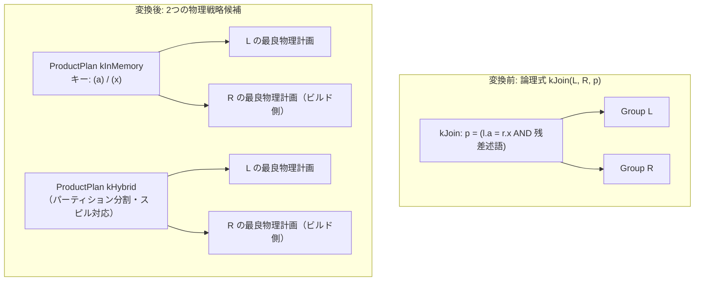

# hash_join

- 状態: draft / 執筆基準リビジョン: `3880673` (2026-09-12)
- 定義位置: `plan/implementation_rules.cpp` の `DefaultImplementationRules()` 内（登録名 `"hash_join"`、共有ヘルパー `JoinAlternatives(..., hash=true, index=false, cross=false)` に委譲）

## 概要

`hash_join` は、論理結合演算 `kJoin` を、等値条件（`l.col = r.col` または NULL安全な等値 `IS NOT DISTINCT FROM`）に基づいてハッシュ表を構築する物理計画 `ProductPlan`（ハッシュ結合形態）へと変換する実装Ruleです。インメモリ実行（`kInMemory`）とハイブリッドスピル実行（`kHybrid`）の2つの物理戦略候補を生成し、メモリ予算に応じたコスト評価を行います。

## 変換前後の関係

論理式の結合条件から等値キーを抽出し、物理実行計画ノード `ProductPlan` を生成します。等値条件以外の述語が存在する場合は、ハッシュ結合の直上に `SelectionPlan`（残差フィルタ）を付与します。



## 適用条件

パターンは `Join()`（2子ノードを持つ `kJoin`）です。適用条件は以下のとおりです（`plan/implementation_rules.cpp`）。

```cpp
          if (children.size() != 2 || required.require_row_position) {
            return std::vector<PlanAlternative>{};
          }
```

1. **行位置要求の非存在**: 物理要求プロパティとして `require_row_position`（RIDや行位置の保持要求）が指定されている場合は適用できません。ハッシュ表を経由すると元の物理行順序・位置が破棄されるためです。
2. **等値結合キーの存在**: 結合述語の連言分解内に、列参照同士の等値比較（`=`）またはNULL安全等値比較（`IS NOT DISTINCT FROM`）が1対以上存在すること。

```cpp
    const bool null_safe = binary.Op() == BinaryOperation::kIsNotDistinctFrom;
    if ((binary.Op() != BinaryOperation::kEquals && !null_safe) ||
        binary.Left()->Type() != TypeTag::kColumnValue ||
        binary.Right()->Type() != TypeTag::kColumnValue) {
      continue;
    }
```

等値キー条件を満たさない非等値述語（例: `l.a > r.x`）は残差述語（residual）として分離され、ハッシュ結合ノードの上位に配置される `SelectionPlan` によって事後評価されます。等値キー対が1つも存在しない場合、本Ruleは候補計画を返却しません。

## 意味論的根拠とコストモデル

ハッシュ結合はハッシュ値の一致を契機としてマッチングを行うアルゴリズムであるため、不等値比較を直接結合キーとして処理できません。非等値述語を残差フィルタとして分離することで、アルゴリズムの前提制約を守りつつ任意述語結合の意味論を正確に保存します。

NULL安全等値比較（`IS NOT DISTINCT FROM`）への対応は、SQL標準における三値論理とNULLの等価比較を整合させるための仕様です。通常の `=` 演算子では `NULL = NULL` はUNKNOWN（不一致）となりますが、`IS NOT DISTINCT FROM` では一致と評価されます。この挙動の差異は `equality_null_safe` フラグとして `ProductPlan` に記録され、実行エンジン側へ伝達されます。

カーディナリティの見積もりは `JoinCardinality`（設計方針D3）に従います。

```cpp
  const double cross = left.estimated_rows * right.estimated_rows;
  if (max_ndv < 1) {
    return cross;
  }
  return std::min(cross, cross / max_ndv);
```

交差サイズ（直積サイズ）を結合キー列の最大異なり数（NDV: Number of Distinct Values）で除算して出力行数を推定します。統計情報が欠落している場合（`max_ndv < 1`）は直積サイズを採用する保守的なフォールバックを行い、過小見積もりによる不適切な計画選択を防止します。

## 実装の詳細

物理戦略として `HashJoinMode::kInMemory` と `HashJoinMode::kHybrid` の双方が生成されます（`plan/implementation_rules.cpp`）。

```cpp
    // Offer both physical strategies; the in-memory build is penalized when
    // its estimated footprint exceeds the query-memory soft budget.
    for (const HashJoinMode mode :
         {HashJoinMode::kInMemory, HashJoinMode::kHybrid}) {
```

- **インメモリ戦略（`kInMemory`）**: ビルド側の全タプルをメモリ上のハッシュテーブルに保持します。
- **ハイブリッド戦略（`kHybrid`）**: メモリに収まらないパーティションを一時領域へスピルし、段階的に結合を処理します（DeWitt方式ハイブリッドハッシュ結合）。

コスト計算では、入力の走査コスト（$|L| + |R|$）を基本コストとし、インメモリ戦略においてビルド側フットプリントがソフトメモリ予算を超過すると予測される場合は、スピルに伴うI/Oペナルティを加算します。

```cpp
      double local_cost = l_rows + r_rows;
      const double build_bytes = r_rows * kHashJoinRowBytesEstimate;
      if (mode == HashJoinMode::kInMemory &&
          PreferHybridHashJoin(static_cast<size_t>(build_bytes))) {
        local_cost += r_rows * 3;
      }
```

`PreferHybridHashJoin` は、ビルド側の推定メモリ使用量がグローバルクエリメモリ予算（`QueryMemoryBudget`）の上限（80%）を超えるかを判定します。

## 最適化効果

ハッシュ結合の計算量は $O(|L| + |R|)$ であり、ネステッドループ結合の $O(|L| \times |R|)$ と比較してデータ量増加に伴うコスト増大が大幅に抑えられます。探索器は右子ノード（ビルド側）が小さく、左子ノード（プローブ側）が大きい構成においてハッシュ結合を優先的に採択します。

## 関連Ruleとの相互作用

- `nested_loop_join` / `cross_join`: 等値条件を持たない非等値結合を処理する代替実装Rule。
- `merge_join` / `index_join`: 等値条件を共有する競合物理Rule。入力があらかじめソートされている場合はソートマージ結合、索引アクセスが可能な場合はインデックス結合が優位となります。
- `infer_join_predicates` / `join_predicate_transitivity`: 論理層において等値述語を推論・補完し、本Ruleの適用機会を拡大します。
- 物理コード生成: `ProductPlan::EmitExecutor`（`executor/relational_factory.cpp`）が、キーの幅および指定された `HashJoinMode` に応じたエグゼキュータを生成します。

## 検証テスト

- `plan/optimizer_test.cpp`:
  - `OptimizerTest.HashJoinPreferredOverCrossProductForEquiJoin`: 等値結合においてハッシュ結合が直積結合よりも低いコストで採択されることを検証。
  - `OptimizerTest.CascadesSemiAndAntiJoinImplementationsUseHashJoinKind`: セミ結合およびアンチ結合がハッシュ経路において適切な結合種別とプローブ側スキーマを持つことを検証。
  - `HashJoinKindTest.*`: NULL安全等値比較やセミ結合におけるタプルの重複排除など、実行時意味論の正確性を検証。

