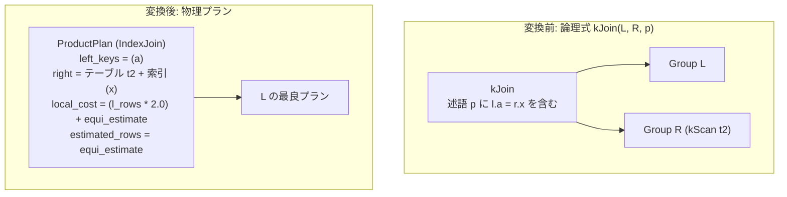

# index_join

- 状態: done   /   執筆基準リビジョン: `3880673` (2026-09-12)
- 定義位置: `plan/implementation_rules.cpp` の `DefaultImplementationRules()` 内の登録 `"index_join"`（パターン: `cascades::dsl::Join()`、実装ラムダ: 共有ヘルパー `JoinAlternatives(..., hash=false, index=true, cross=false)` に委譲）

## 概要

論理等値内部結合 `kJoin` を、内側（右側）リレーションの B+Tree 索引を外側（左側）行ごとに直接シーク・プローブする `ProductPlan`（インデックス結合形態）へ実装する規則です。右側の全表走査およびハッシュテーブル構築を回避し、左側入力から取得した結合キー値を用いて右側テーブルの索引を直接ポイントルックアップします。

## 変換前後の関係



右子プランは実行時には起動されず、物理実行器がテーブルストレージおよび B+Tree 索引ハンドルを直接参照してタプルを生成します（出力スキーマはリネーム解決済みの `declared_output` を使用します）。

## 適用条件

パターンは 2 つの子を持つ `kJoin` です。結合規則共通のガード条件に加え、`JoinAlternatives` 内のインデックス結合特有のガード条件が存在します。

```cpp
if (children.size() != 2 || required.require_row_position) {
  return std::vector<PlanAlternative>{};
}
```

インデックス結合固有の 3 つの必須条件（Gate）は以下の通りです。

1. **右子が単一物理テーブルスキャンであること**:
   ```cpp
   if (index) {
     const Table* right_table = right.plan->ScanSource();
     if (right_table != nullptr) {
   ```
2. **右側 Group に未処理の scan filter が存在しないこと**:
   ```cpp
   // The IndexJoin executor bypasses the right child plan entirely and
   // probes the raw table through its index. A filter merged into the
   // right scan group is implemented by that child plan, so offering an
   // index join here would silently drop it; hash/NL joins consume the
   // child executor and stay safe.
   if (!memo.Get(right_group).filter) {
   ```
3. **等値結合キーの右側属性が、右側テーブルのいずれかの索引の先頭キー列に一致すること**:
   ```cpp
   for (const ColumnName& column : right_columns) {
     if (to_physical(column) ==
         physical_schema.GetColumn(index_handle.sc_.key_.front()).Name()) {
   ```

さらに、右側リレーションの統計情報（`context.statistics`）が存在しない場合はインデックス結合代替案は生成されません。

## 意味論的根拠と例外保護・述語脱落防止

本規則において最も重大な意味論的制約は、第 2 のガード条件である「右側スキャングループのフィルタ不在性」です。

`ProductPlan` のインデックス結合実行器は、右子プラン（イテレータ）を実行せず、生のテーブルストレージに対して B+Tree 索引シークを行います。もし論理規則 `push_selection_into_scan` によって右側のスキャングループにフィルタ述語（Selection）がマージされていた場合、そのフィルタは右子プランの走査時に評価される前提となっています。右子プランをバイパスするインデックス結合を適用してしまうと、本来評価されるべきフィルタが完全に脱落し、不正な行が出力される「述語消失（Predicate Erasure）」が発生します。したがって、右側にフィルタが存在する局面では本規則は厳格に発火を抑止されます。

また、先頭キー列の一致条件は、B+Tree 索引の辞書順プレフィックスシーク契約に由来します。複合索引であっても先頭列が等値条件で固定されていなければ範囲スキャンまたは全走査が必要となるため、ポイントプローブを前提とする本規則の適用対象外となります。

## 実装の詳細

`plan/implementation_rules.cpp` 内の `JoinAlternatives` は、自己結合における別名（エイリアス）解決、プラン構築、コスト計算を以下のように処理します。

```cpp
// Locate the relation key owning this physical table: aliased
// self-joins rename scan schemas, and statistics are keyed by the
// relation identity.
std::string right_relation;
for (const auto& [relation, table] : context.tables) {
  if (table.get() == right_table) {
    right_relation = relation;
    break;
  }
}
```

```cpp
Plan join = std::make_shared<ProductPlan>(
    left.plan, left_columns, *right_table, index_handle,
    right_physical, *stats_it->second, declared_output);
const double local_cost = (l_rows * 2.0) + equi_estimate;
auto [plan, est] = with_residual(std::move(join), equi_estimate);
```

- **`local_cost = (l_rows * 2.0) + equi_estimate`**: 左入力の行ごとに「B+Tree プローブ走査 + レコード組み立て」のコストとして 2 行分を計上し、さらに索引から実際にヒットして返る推定行数（`equi_estimate`）を加算します。
- **`estimated_rows`**: 等値述語による選択度計算 `equi_estimate` を基盤とし、非等値残余述語（Residual Predicate）が存在する場合は `with_residual` ヘルパーが `SelectionPlan` を上に載せて行数を絞り込みます。
- **スキーマの整合性**: `declared_output` により、右側テーブルの物理スキーマを論理エイリアスを含む形式へリネームし、上流演算子の参照列位置を正しく整合させます。

## 最適化効果

右リレーションのフルスキャンおよびハッシュテーブル構築コストを、外側入力行数に比例する B+Tree ポイントシークに置き換えます。右側テーブルが巨大かつ索引の選択度が高い（1 キーあたりのヒット件数が少ない）場合、全走査を要する `hash_join` よりも大幅に低コストとなります。一方、左側入力が極めて大きい場合はシーク回数が爆発するためハッシュ結合が有利となり、Cascades 探索エンジンがコスト比較に基づいて最適な物理実装を選択します。

## 関連 Rule との相互作用

- `hash_join`, `merge_join`, `nested_loop_join`: 同一の `kJoin` 論理式に対して生成される代替物理結合規則群です。
- `push_selection_into_scan`: 右側スキャングループに述語をマージする論理規則です。本規則はフィルタ存在時に抑止されるため、プッシュダウンの有無がインデックス結合の採否を直接左右します。
- `index_scan`: 右側子プランそのものを索引スキャンとする実装経路です。こちらは右子の実行器を正常に駆動するため、フィルタが存在する場合でも安全に索引を利用できます。

## 検証テスト

- `plan/optimizer_test.cpp`:
  - `OptimizerTest.IndexScanJoin`: 内部結合がインデックス結合として計画され、正常に実行されることを検証します。
  - `OptimizerTest.AliasedSelfJoinCanUseIndexNestedLoop`: 同一テーブルに対する別名自己結合において、関係キーの逆引きと `declared_output` のリネームが機能し、インデックス結合が成立することを検証します。

