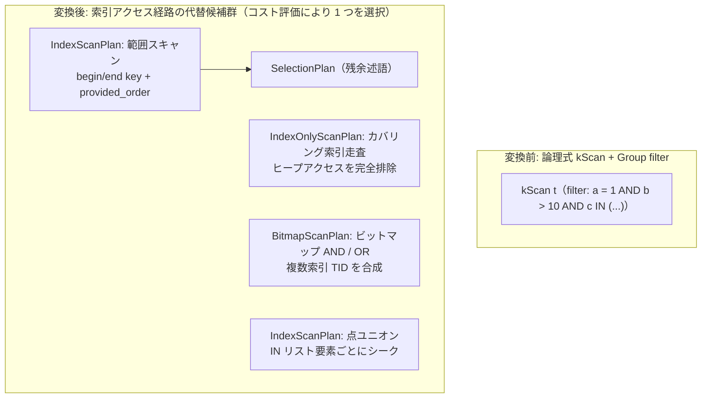

# index_scan

- 状態: draft   /   執筆基準リビジョン: `3880673` (2026-09-12)
- 定義位置: `plan/implementation_rules.cpp` の `DefaultImplementationRules()` 内の登録 `"index_scan"`（パターンは `cascades::dsl::Scan()`、実装は共有ヘルパー `ScanAlternatives(..., include_indexes=true, include_full_scan=false)` に委譲）

## 概要

論理テーブルスキャン演算子 `kScan` に対し、B+Tree 索引を活用した物理実行計画の代替候補群（範囲スキャン `IndexScanPlan`、カバリング索引のみを走査する `IndexOnlyScanPlan`、複数索引のビットマップ合成 `BitmapScanPlan`、IN リストの点検索ユニオン、非一意索引のスキップスキャン等）を生成する物理実装 Rule です。

単一の論理スキャン式から利用可能なすべての索引アクセスパスを網羅的に生成して Memo へ登録し、後続のコストベース最適化において `full_scan` との比較に委ねます。

## 変換前後の関係



## 適用条件

パターンは `Scan()` です。カタログ上にテーブル実体が存在しない場合（マテリアライズド CTE の一時 Group 等）は空リストを返して棄却します。各索引に対するスキャン候補の構築においては以下の条件が検査されます。

1. **SARGable 述語の抽出**:
   フィルタ条件を連言に分解し、等号・不等号比較（`=`、`<`、`<=`、`>`、`>=`）を `Range` に、`IN (定数リスト)` を `point_sets` に、前方一致文字列 `LIKE 'abc%'` を `LikePrefixBounds` の半開区間境界に変換します。変換不能な連言は「残余述語（residual predicate）」としてマークされます。
2. **有効なシーク開始点の存在**:
   先頭キーに対する等号条件または下限境界が存在せず、スキャン開始位置が確定できない索引はスキップされます。
   ```cpp
   if (begin_key.empty()) {
     continue;
   }
   ```
3. **物理要求プロパティの伝播**:
   更新系クエリ等により `PhysicalProperties` から要求される行位置フラグ（`require_row_position`）や書き込みインテント待機フラグ（`wait_for_write_intent`）が整合していること。

## 意味論的根拠と境界整合性

### 1. 索引キー構築と残余述語の二重防壁
B+Tree 探索キーの境界決定において、等号プレフィックスを超える範囲条件では開始キーと終了キーのベクトル長が異なる場合があります。

```cpp
      // Key construction contract: begin/end vectors may differ in length
      // beyond an equality prefix. EncodeParts encodes begin verbatim while
      // EncodeEndParts appends 0xff to a SHORT end vector, turning it into a
      // prefix ceiling; the scan predicate re-checks every conjunct either
      // way, so boundary inclusivity is always corrected per row.
```

エンコーダは終了キーの末尾に `0xff` を付与して接頭辞天井（prefix ceiling）を構成します。スキャン境界によるタプルの過剰取得を防ぎ、境界の開閉（including/excluding）の厳密な意味論を保証するため、等号で固定されていない範囲スロットに触れるすべての述語は、スキャンノードの上位に配置される `SelectionPlan` で必ず再評価されます。

```cpp
        const bool covered =
            !filter ||
            std::ranges::all_of(
                filter->TouchedColumns(), [&](const ColumnName& column) {
                  const int offset = schema.Offset(column);
                  return offset >= 0 &&
                         equality_slots.contains(static_cast<slot_t>(offset));
                });
        if (!covered) {
          candidate =
              std::make_shared<SelectionPlan>(candidate, filter, statistics);
        }
```

### 2. Index-Only Scan の成立条件
テーブルのヒープページを一切読み出さずに B+Tree リーフノードのデータのみでクエリを完結させる `IndexOnlyScanPlan` は、以下の厳格な条件下でのみ採用されます。
- クエリが行の物理位置（RID）を要求しないこと（`!require_row_position`）。
- 索引が削除済みタプルのゴーストエントリを保持しないこと（`!index.RetainsDeletedEntries()`）。
- 射影および述語で参照されるすべての列が、索引のキー列または付加列（Covered Columns）に完全に包含されていること。

## 実装の詳細

アクセスパス生成の中核は `BuildIndexScan` が担います。

```cpp
  if (!require_row_position && !index.RetainsDeletedEntries() &&
      Covered(index.CoveredColumns(), touched_offsets)) {
    return std::make_shared<IndexOnlyScanPlan>(...);
  }

  Plan scan = std::make_shared<IndexScanPlan>(...);
  if (!index.IsUnique()) {
    return std::make_shared<IndexSkipScanPlan>(std::move(scan));
  }
  return scan;
```

非一意索引に対する範囲スキャンは、同一キーの重複走査を効率化する `IndexSkipScanPlan` でラップされます。

### コストモデルの計算
- **範囲スキャン**:
  アクセス行数を `AccessRowCount()` から見積もり、複合索引の等号プレフィックス行数 `EqualityPrefixRows` との最小値を取ります。
  ```cpp
  auto local_cost = static_cast<double>(candidate->AccessRowCount());
  local_cost = std::min(
      local_cost,
      EqualityPrefixRows(statistics, index, equality_prefix_values));
  ```
- **制約なし索引フルスキャン**:
  フィルターが存在せず、かつ出力順序要求や集約を満たすための走査です。Index-Only Scan の場合はヒープアクセスを伴わないため、テーブル行数 $\times 0.5$ の優遇コストが与えられます。
- **ビットマップスキャン（Bitmap AND/OR）**:
  複数索引の条件に一致するタプル ID（TID）をインメモリビットマップ上で論理積・論理和合成し、単一回のヒープアクセス（`BitmapHeapScan`）を実行します。

## 最適化効果

- **I/O 量の削減**: 不要なページ読み込みを回避し、条件に一致するタプルのみを B+Tree シークによって直接取得します。
- **ヒープアクセスの排除**: カバリング索引によりテーブル本体へのランダムアクセスを完全にゼロ化します。
- **ソート処理の省略**: 索引が提供する順序（`provided_order`）が親演算子の要求順序と合致する場合、後続の明示的ソート（`SortPlan`）のコストを 0 に抑えることができます。

## 関連 Rule との相互作用

- `full_scan`: 同一グループ内で競合する代替 Rule です。選択率が低くテーブルの大半を走査する場合はフルスキャンが有利となります。
- `push_selection_into_scan`: WHERE 節の述語をスキャンノードの直上へ集約し、本 Rule が解釈可能な Range 境界を供給します。
- `skip_scan_distinct`: 生成された `IndexOnlyScanPlan` を検知し、DISTINCT 処理を B+Tree のキー先頭スキップ処理へと最適化します。
- `sort`: 索引が提供する出力順序（`provided_order`）を参照し、ソート演算子の挿入を省略します。

## 検証テスト

`plan/optimizer_test.cpp` における以下のテストケースで検証されています。

- `OptimizerTest.IndexScan` / `OptimizerTest.IndexOnlyScan`:
  インデックススキャンおよびインデックスオンリースキャンの基本生成動作を確認します。
- `OptimizerTest.CompositeIndexUsesEqualityPrefix`:
  複合索引における等号プレフィックスの認識と行数見積もりの正当性を検証します。
- `OptimizerTest.ResidualPredicateWrapsIndexScanInSelection`:
  範囲条件でカバーしきれない残余述語が `SelectionPlan` で保護されることを確認します。
- `OptimizerTest.InListDrivesPointUnionIndexAccess` / `IndependentIndexPredicatesUseBitmapAnd`:
  IN リスト展開およびビットマップ結合アクセスの生成を確認します。
- `OptimizerTest.UnboundedIndexProvidesAscendingAndDescendingOrder`:
  索引が提供する昇順・降順プロパティの伝播を検証します。
