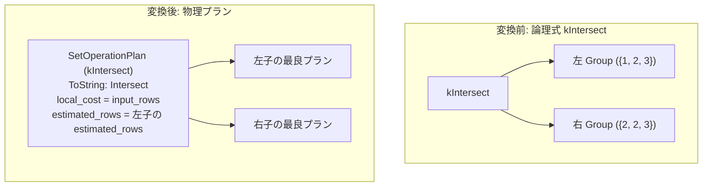

# intersect

- 状態: done   /   執筆基準リビジョン: `3880673` (2026-09-12)
- 定義位置: `plan/implementation_rules.cpp` の `DefaultImplementationRules()` 内の登録 `"intersect"`（パターン: `cascades::dsl::Intersect()`、実装ラムダ: 6 種の集合演算で共有される `implement_set_operation`）

## 概要

論理演算子 `kIntersect`（SQL の `INTERSECT` に対応する重複排除つき集合積）を物理プラン `SetOperationPlan`（演算種別 `SetOperationKind::kIntersect`）へ実装する規則です。すべての入力リレーションに共通して存在するタプルを抽出し、出力結果から重複行を排除します。本規則は 6 種の集合演算で共有される `implement_set_operation` ラムダを通じて提供されます。

## 変換前後の関係



上記例の出力は `{2, 3}` です（右入力に 2 が 2 行存在しても重複排除が行われ 1 行のみ出力されます）。

## 適用条件

パターンは 2 以上の任意のアリティを持つ `kIntersect` です。共有実装ラムダにおけるガード条件は以下の通りです。

```cpp
if (children.size() < 2) {
  return std::vector<PlanAlternative>{};
}
```

共有ラムダ内の switch 文によって `SetOperationKind::kIntersect` がマッピングされます。整序付き結合（`MergeAppend`）経路は `kUnionAll` 専用であるため、上流から順序要求（`required.ordering`）が提示された場合でも本規則は整序を行わず、通常形態の代替案を 1 件返します。順序要求の充足は上流のエンスフォースメント（ソート演算子の挿入）に委ねられます。

## 意味論的根拠と物理実行の契約

本規則の意味論保存の核心は、共通行判定における重複排除の保証です。

`SetOperationPlan::EnforcesDistinct()` は `kIntersect` に対して真を返します（`plan/set_operation_plan.hpp`）。物理実行器 `SetOperationExecutor::AppendIntersection`（`executor/set_operation.cpp`）は、入力行の頻度マップを構築して全入力に共通する要素を抽出し、フラグ `all = false` に基づいて重複行を削ぎ落とします。

もし入力が左 `{2, 2}`、右 `{2, 2}` である場合、多重度を保持する `INTERSECT ALL` は `{2, 2}` を出力しますが、`INTERSECT` は重複を排除して `{2}` を出力します。このように演算種別により出力行数および多重度が根本的に異なるため、ALL の有無による物理演算種別の峻別が必須となります。

また、論理規則 `intersect_to_semijoin` が適用された論理式は `kSemiJoin` へ書き換えられるため、半結合（SemiJoin）の物理実装と本集合演算実装がコスト基準で競合します。

## 実装の詳細

`plan/implementation_rules.cpp` の共有ラムダ `implement_set_operation` による実装部は以下の通りです。

```cpp
Plan set_operation = std::make_shared<SetOperationPlan>(
    std::move(plans), operation, std::move(order_keys));
const double output_rows = operation == SetOperationKind::kUnionAll
                               ? input_rows
                               : children.front().estimated_rows;
return std::vector<PlanAlternative>{
    PlanAlternative{.plan = std::move(set_operation),
                    .local_cost = input_rows,
                    .estimated_rows = output_rows}};
```

- **`local_cost = input_rows`**: 全入力リレーションの行数の総和です。集合積の計算は全入力を走査して出現頻度を計上するため、局所コストは入力総行数に比例します。
- **`estimated_rows = children.front().estimated_rows`**: 積集合の出力行数はどの入力リレーションの行数をも超えません。したがって、先頭の子の推定行数 `children.front().estimated_rows` が厳密な上界となります。
- **文字列表現**: 生成された物理演算子は `SetOperationPlan::ToString` により `Intersect` と出力されます。

## 最適化効果

論理式 `kIntersect` から単一の物理演算子 `SetOperationPlan`（`Intersect`）を生成します。論理等値規則 `intersect_to_semijoin` およびコストベース選択 `intersect_except_cost_based_lowering` により、半結合（`semi_hash_join` 等）へ落とすべきか、素直な集合演算として実行すべきかがコスト比較によって最適に決定されます。

## 関連 Rule との相互作用

- `intersect_all`, `union`, `union_all`, `except`, `except_all`: 同一の `implement_set_operation` ラムダを共有する集合演算実装規則群です。
- `intersect_to_semijoin`: `kIntersect` を `kSemiJoin` へ変換する論理規則です。
- `intersect_except_cost_based_lowering`: 集合積を物理集合演算とするか半結合とするかをコスト判定する論理変換規則です。
- `push_filter_past_setop`, `setop_empty_simplification`: フィルタの先行適用や、空リレーションを含む場合の `kEmpty` への簡約を行う論理規則群です。
- `semi_hash_join`, `semi_nested_loop_join`: 半結合に変換された場合に選択される物理結合規則群です。

## 検証テスト

- `plan/cascades_test.cpp`:
  - `CascadesTest.SetOperationValidatesArityRelationsAndDropsProperties`: 集合演算の子ノード数検証およびプロパティ伝播抑制を検証します。
  - `CascadesTest.IntersectWithEmptyBranchBecomesEmpty`: 入力の一方が空である場合の論理簡約を検証します。
  - `CascadesTest.IntersectToSemiJoinRewrite`: INTERSECT から SemiJoin への論理変換を検証します。
  - `CascadesTest.IntersectExceptCostBasedLowering`: コストに基づく実装形態の選択を検証します。

