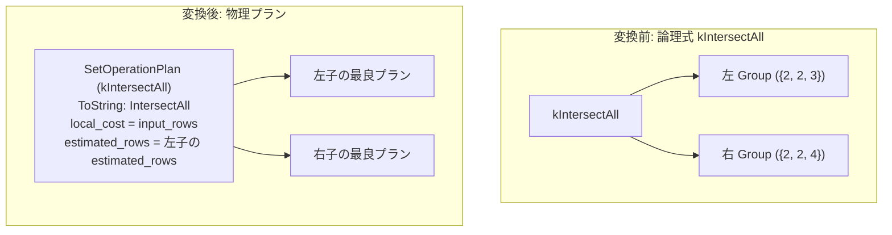

# intersect_all

- 状態: done   /   執筆基準リビジョン: `3880673` (2026-09-12)
- 定義位置: `plan/implementation_rules.cpp` の `DefaultImplementationRules()` 内の登録 `"intersect_all"`（パターン: `cascades::dsl::IntersectAll()`、実装ラムダ: 6 種の集合演算で共有される `implement_set_operation`）

## 概要

論理演算子 `kIntersectAll`（SQL の `INTERSECT ALL` に対応する重複度を保持するマルチセット積）を物理プラン `SetOperationPlan`（演算種別 `SetOperationKind::kIntersectAll`）へ実装する規則です。すべての入力リレーションに共通して存在するタプルを抽出し、各入力における出現回数の最小値（$\min(\text{cnt}_L, \text{cnt}_R)$）を出力多重度として出力します。共有ラムダ `implement_set_operation` を利用し、重複排除を行わない点が兄弟規則 `intersect` と異なります。

## 変換前後の関係



上記例の出力は `{2, 2}` です（共通要素 2 の最小出現回数が 2 であるため、2 行出力されます。重複を排除する `intersect` の場合は `{2}` となります）。

## 適用条件

パターンは 2 以上の任意のアリティを持つ `kIntersectAll` です。共有実装ラムダにおけるガード条件は以下の通りです。

```cpp
if (children.size() < 2) {
  return std::vector<PlanAlternative>{};
}
```

`MergeAppend` 経路は `kUnionAll` 専用であるため、上流から順序要求（`required.ordering`）が提示されても整序キーの伝播は行われず、通常形態の代替案を 1 件返します。

## 意味論的根拠と物理実行の契約

本規則の意味論保存の核心は、マルチセット演算としての多重度（重複度）の厳密な保持です。

`SetOperationPlan::EnforcesDistinct()` は `kIntersectAll` に対して偽を返します（`plan/set_operation_plan.hpp`）。`kUnion`, `kIntersect`, `kExcept` のみ重複排除フラグを真とし、ALL つき集合演算では重複排除を提供しないことを明示します。物理実行器 `SetOperationExecutor::AppendIntersection`（`executor/set_operation.cpp`）は、フラグ `all = true` に基づいて各行の出現頻度の最小値を算出し、その回数分だけタプルを反復出力します。

仮に `kIntersectAll` に対して重複排除を行う `kIntersect` の物理実行器を割り当てた場合、多重度が削がれてしまい結果の行数が減少します（例えば左 `{2, 2}` と右 `{2, 2}` の積において `{2, 2}` ではなく `{2}` が返される誤謬が発生します）。多重度保存の契約を遵守するため、物理演算種別の完全な分離が必要です。

## 実装の詳細

`plan/implementation_rules.cpp` の共有ラムダ `implement_set_operation` による実装部は以下の通りです。

```cpp
Plan set_operation = std::make_shared<SetOperationPlan>(
    std::move(plans), operation, std::move(order_keys));
const double output_rows = operation == SetOperationKind::kUnionAll
                               ? input_rows
                               : children.front().estimated_rows;
return std::vector<PlanAlternative>{
    PlanAlternative{.plan = std::move(set_operation),
                    .local_cost = input_rows,
                    .estimated_rows = output_rows}};
```

- **`local_cost = input_rows`**: 全入力リレーションの行数の総和です。マルチセット積の計算では全入力行を走査して頻度マップを作成・照合するため、入力総行数に応じた線形コストを支払います。
- **`estimated_rows = children.front().estimated_rows`**: マルチセット共通部分の行数はどの入力の行数をも超えません（$\sum \min(\text{cnt}_L(x), \text{cnt}_R(x)) \le \sum \text{cnt}_L(x)$）。したがって、先頭の子の行数が厳密な上界となります。
- **物理表現**: 生成された物理演算子は `SetOperationPlan::ToString` により `IntersectAll` と出力されます。

## 最適化効果

論理式 `kIntersectAll` から単一の物理演算子 `SetOperationPlan`（`IntersectAll`）を生成します。半結合（SemiJoin）は右側の多重度を計上せず単一存在判定のみを行うため、`INTERSECT ALL` を安全に半結合へ書き換えることはできません。したがって、本規則による物理化が `INTERSECT ALL` における唯一の確定的実行経路となります。

## 関連 Rule との相互作用

- `intersect`, `union`, `union_all`, `except`, `except_all`: 同一の `implement_set_operation` ラムダを共有する集合演算実装規則群です。
- `intersect_to_semijoin`: **`kIntersectAll` には適用されません**。半結合への変換は重複排除を伴う `kIntersect` にのみ安全であり、本規則の多重度契約を守るために除外されています。
- `push_filter_past_setop`, `setop_empty_simplification`: フィルタのプッシュダウンや、枝の一方が空の場合の簡約を行う論理規則群です。

## 検証テスト

- `plan/cascades_test.cpp`:
  - `CascadesTest.SetOperationValidatesArityRelationsAndDropsProperties`: 集合演算の子ノード数検証およびプロパティ伝播抑制を検証します。

