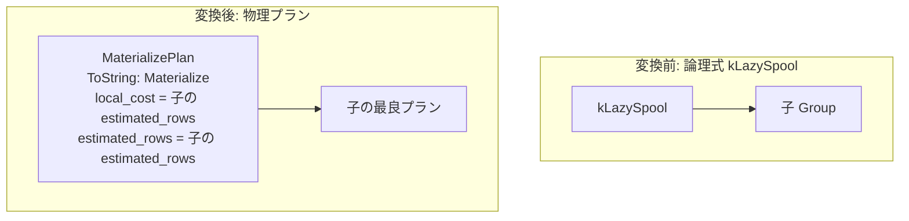

# lazy_spool

- 状態: done   /   執筆基準リビジョン: `3880673` (2026-09-12)
- 定義位置: `plan/implementation_rules.cpp` の `DefaultImplementationRules()` 内の登録 `"lazy_spool"`（パターン: `cascades::dsl::LazySpool()`、実装ラムダ: `materialize`, `eager_spool`, `lazy_spool` の 3 規則で共有される `materialize_child`）

## 概要

論理演算子 `kLazySpool`（下流のイテレータから行要求が発生した時点で初めてオンデマンドに子出力を中間バッファへ蓄積する遅延スプール演算）を物理プラン `MaterializePlan` へ実装する規則です。現行エンジンでは `materialize`, `eager_spool`, `lazy_spool` の 3 規則が共有ラムダ `materialize_child` を通じて単一の `MaterializePlan` を生成します。物理実行器は初回読み出し時に全行をバッファリングするため、Eager と Lazy の分離は将来の実行器拡張およびオプティマイザヒントとしての識別子の個別化を意図した設計となっています。

## 変換前後の関係



## 適用条件

パターンは子を 1 つ持つ `kLazySpool` です。共有実装ラムダ `materialize_child` におけるガード条件は以下の通りです。

```cpp
if (children.size() != 1 || required.require_row_position) {
  return std::vector<PlanAlternative>{};
}
```

共有ラムダ内の switch 文において `kLazySpool` が許可された 3 つの演算子の 1 つとして照合されます。

## 意味論的根拠と物理実行の契約

スプール演算の目的は、共通テーブル式（CTE）の複数回参照や再帰クエリの worktable 走査において、反復評価による重複計算を回避して結果セットをキャッシュすることです。

本規則における意味論保存およびガードの根拠は以下の 2 点です。

1. **行識別子（Row Position）の喪失防止**: ガード条件 `required.require_row_position` は、物理行位置やカーソル位置の維持を要求するコンテキストでのスプール適用を厳格に拒否します。`MaterializePlan` はインメモリバッファへの順次格納・再生を行うため、元テーブルの物理スロット位置との対応関係が破綻し、更新系クエリ等で不正なタプル操作を招くリスクを防止します。
2. **順序保存の委譲**: `MaterializePlan::IsOrderedBy` は子プランの整序判定にそのまま委譲します（`plan/materialize_plan.hpp`）。バッファへの挿入順序と再生順序が完全に一致（FIFO）するため、子が保証する整序性はスプール後も厳密に保たれます。

## 実装の詳細

`plan/implementation_rules.cpp` の共有ラムダ `materialize_child` における実装部は以下の通りです。

```cpp
Plan plan = std::make_shared<MaterializePlan>(children[0].plan);
return std::vector<PlanAlternative>{
    PlanAlternative{.plan = std::move(plan),
                    .local_cost = children[0].estimated_rows,
                    .estimated_rows = children[0].estimated_rows}};
```

- **`local_cost = children[0].estimated_rows`**: 子リレーションの全行をバッファに書き出す 1 パス分のコストとして、子の推定行数を計上します。
- **`estimated_rows = children[0].estimated_rows`**: 物質化バッファは行のフィルタリングや重複排除を行わないため、行数は子の値をそのまま維持します。
- **物理表現**: `MaterializePlan::ToString` は `Materialize` を出力し、物理ノードレベルでは共通の実行表現となります。

## 最適化効果

論理式 `kLazySpool` から単一の物理演算子 `MaterializePlan` を生成します。実行器（`MaterializeExecutor`）により中間結果がメモリ上に固定されるため、複数回走査されるサブプランの再計算コストが排除されます。現行のコストモデル上は Eager スプールと Lazy スプールに差異はありませんが、オンデマンド駆動の独立実行器が導入された際に局所コストの精緻化が行われる拡張基盤となっています。

## 関連 Rule との相互作用

- `materialize`, `eager_spool`: 同一の `materialize_child` ラムダを共有する兄弟規則群です。
- 再帰 CTE ドライバ（`executor/` 配下の再帰実行機構）: 再帰結合や worktable スキャンにおいて複数回走査を必要とするため、スプール実装の主たる消費者となります。

## 検証テスト

- `plan/cascades_test.cpp`:
  - `CascadesTest.MaterializeAndSpoolHaveImplementationRules`: `kLazySpool`, `kEagerSpool`, `kMaterialize` の論理演算子から `MaterializePlan` が正しく生成されることを検証します。
  - `CascadesTest.WindowAndSpoolAreUnaryLogicalOperators`: `kLazySpool` が単項演算子として Cascades Memo に正しく統合されることを検証します。

