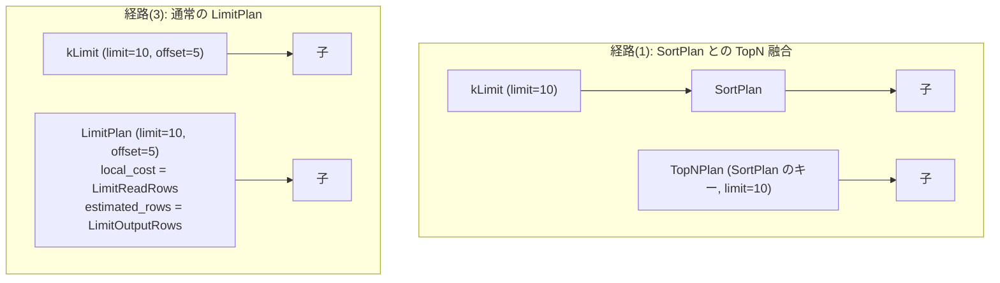

# limit

- 状態: done   /   執筆基準リビジョン: `3880673` (2026-09-12)
- 定義位置: `plan/implementation_rules.cpp` の `DefaultImplementationRules()` 内の登録 `"limit"`（パターン: `cascades::dsl::Limit()`）

## 概要

論理演算子 `kLimit`（LIMIT / OFFSET による行数制限）を物理プラン `LimitPlan` または `TopNPlan` へ実装する規則です。本規則は 3 つの分岐経路を持ちます。(1) 子プランが `SortPlan` かつ正の LIMIT を持つ場合は両者を融合して `TopNPlan` を生成する経路、(2) クエリが整序を要求しているにもかかわらず子プランが整序を未確定な場合はソート前の行切り詰めを避けるために子プランをそのまま透過させる健全性ガード経路、(3) 通常の `LimitPlan` を構築する経路です。

## 変換前後の関係



## 適用条件

パターンは子を 1 つ持つ `kLimit` です。ガード条件は子ノード数のみです。

```cpp
if (children.size() != 1) {
  return std::vector<PlanAlternative>{};
}
```

論理式 `kLimit` は、`query/sql_engine.cpp` において ORDER BY を伴わない単純 LIMIT や、TopN に直接還元されない LIMIT / OFFSET を表現する際に Memo に登録されます。

## 意味論的根拠と物理実行の契約

本規則における最も重要な健全性保証は、経路 (2) のガード機構です。

```cpp
// Soundness guard: folding LIMIT below an engine-side sort would
// truncate before ordering, yielding wrong top-N rows. When a
// required ordering is not delivered by the child, pass the child
// through unchanged; the engine's LimitExecutor above its
// SortExecutor remains responsible (D6).
```

クエリが `ORDER BY` を要求しているにもかかわらず、子プランがインデックス順序を提供しておらず明示的な `SortPlan` も物理化されていない段階で `LimitPlan` を子ノード直上に配置すると、整序前の任意の N 行で打ち切る誤ったプランが形成されます。整序が確定する前の打ち切りは真の Top-N 結果を不可逆的に破壊するため、この局面では `LimitPlan` の生成を抑止し、子プランをゼロコストでそのまま透過させます。最終的な行制限は、実行エンジン側で `SortExecutor` の上流に配置される `LimitExecutor` のセーフティネットに委ねられます（D6 規律）。

## 実装の詳細

`plan/implementation_rules.cpp` の実装は、前述の 3 経路を順次評価します。

### 1. TopN 融合経路

子プランが `SortPlan` であり、かつ `limit_count != 0` の場合、ソートキーを継承して `TopNPlan` を構築します。

```cpp
if (logical.limit_count != 0) {
  if (const auto sort =
          std::dynamic_pointer_cast<SortPlan>(children[0].plan)) {
    std::vector<TopNKey> keys;
    keys.reserve(sort->Keys().size());
    for (const SortKey& key : sort->Keys()) {
      keys.push_back(TopNKey{.expression = key.expression,
                             .ascending = key.ascending,
                             .nulls_first = key.nulls_first});
    }
    Plan topn = std::make_shared<TopNPlan>(
        sort->Child(), std::move(keys), logical.limit_count,
        logical.limit_offset);
    return std::vector<PlanAlternative>{PlanAlternative{
        .plan = std::move(topn),
        .local_cost = children[0].estimated_rows,
        .estimated_rows = static_cast<double>(
            std::min(children[0].estimated_rows,
                     static_cast<double>(logical.limit_count)))}};
  }
}
```

### 2. 順序未確定時の健全性ガード（透過）

```cpp
const bool explicit_sort =
    std::dynamic_pointer_cast<SortPlan>(children[0].plan) != nullptr;
if (needs_ordering && !explicit_sort &&
    !children[0].plan->IsOrderedBy(context.query->order_expressions_,
                                   context.query->order_ascending_)) {
  return std::vector<PlanAlternative>{
      PlanAlternative{.plan = children[0].plan,
                      .local_cost = 0,
                      .estimated_rows = children[0].estimated_rows}};
}
```

### 3. 通常の LimitPlan 経路

```cpp
const double rows =
    LimitReadRows(children[0].estimated_rows, logical.limit_count,
                  logical.limit_offset);
const double emitted =
    LimitOutputRows(children[0].estimated_rows, logical.limit_count,
                    logical.limit_offset);
Plan limit = std::make_shared<LimitPlan>(
    children[0].plan, logical.limit_count, logical.limit_offset);
return std::vector<PlanAlternative>{
    PlanAlternative{.plan = std::move(limit),
                    .local_cost = rows,
                    .estimated_rows = emitted}};
```

- **`LimitReadRows`**: 先読み打ち止めにより、実際に子が読み出す最大行数 $\min(N, \text{offset} + \text{limit})$ を算出します。
- **`LimitOutputRows`**: OFFSET を控除した実出力行数 $\min(\max(0, N - \text{offset}), \text{limit})$ を推定値として返します。

## 最適化効果

`LimitPlan` の先読み打ち止め効果（Early-out）により、下流のスキャンや結合の読み取り走査行数を $\text{OFFSET} + \text{LIMIT}$ に抑え込み、クエリ実行コストを劇的に削減します。また、子ノードが `SortPlan` である場合は優先度付きヒープを用いた `TopNPlan` へ融合され、全件ソートに必要な $O(N \log N)$ の計算量とメモリ消費を $O(N \log K)$ に圧縮します。

## 関連 Rule との相互作用

- `topn`: 論理演算子 `kTopN` を物理化する規則であり、本規則の経路 (1) と同一の `TopNPlan` を生成します。
- `limit_push_through_sort`: `Limit(Sort(X))` を論理段階で `TopN(X)` に融合する論理規則です。物理段階の経路 (1) は論理探索の過渡状態に対するセーフガードとしても機能します。
- `merge_limits`, `push_limit_through_projection`: LIMIT 演算子の位置を最適化する論理規則群です。
- `index_scan`: 索引順序を提供するスキャンと本規則が組み合わさることで、ソートなしの Top-N プローブが可能になります。

## 検証テスト

- `plan/optimizer_test.cpp`:
  - `OptimizerTest.LimitEstimateAccountsForOffset`: OFFSET を考慮した行数推定の精度を検証します。
  - `OptimizerTest.UnorderedLimitPushesRowCapIntoFullScan`: 順序なし LIMIT が全表走査に対して読み取り行数上限（Early-out）を伝播させることを検証します。
  - `OptimizerTest.LimitWithOrderedIndexStreamsOnlyTopKRows`: 順序付き索引スキャンと LIMIT の連携により上位 K 行のみがストリーミングされることを検証します。
  - `OptimizerTest.PhysicalRuleSubsetsPreserveOrderedLimitResults`: 物理規則の適用サブセットを変調させた環境下でも順序付き LIMIT の結果整合性が保たれることを検証します。
- `executor/executor_test.cpp`:
  - `ExecutorTest.LimitOffsetSkipsLeadingRows`: 実行時における OFFSET スキップと行制限の正確性を検証します。

