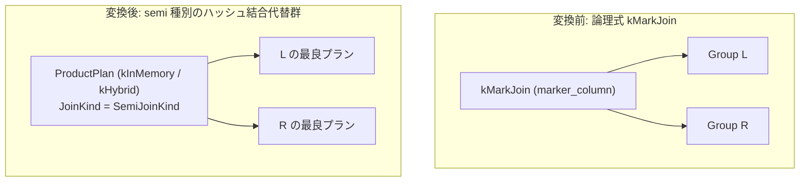

# mark_hash_join

- 状態: done   /   執筆基準リビジョン: `3880673` (2026-09-12)
- 定義位置: `plan/implementation_rules.cpp` の `DefaultImplementationRules()` 内の登録 `"mark_hash_join"`（パターンは `cascades::dsl::MarkJoin()`）

## 概要

論理マーク結合演算子 `kMarkJoin` に対し、ハッシュ結合基盤を用いた物理実行計画の代替候補群を生成する物理実装 Rule です。

マーク結合は、左辺の各行に対して右辺との結合条件を満たす行が存在するか否かを判定し、その真偽値をマーカー列として出力する論理演算です。本 Rule は内部的に `JoinAlternativeKind::kSemi` として `JoinAlternatives` を呼び出し、セミハッシュ結合と同一のインメモリおよびハイブリッドハッシュ結合の代替計画を生成します。

## 変換前後の関係



## 適用条件

パターンは `MarkJoin()`（子を 2 つ持つ `kMarkJoin`）です。実装ラムダでは他のハッシュ結合 Rule と共通の前提条件を検査します。

```cpp
          if (children.size() != 2 || required.require_row_position) {
            return std::vector<PlanAlternative>{};
          }
          return JoinAlternatives(memo, logical.children[1], logical.predicate,
                                  children[0], children[1], context, true,
                                  false, false, JoinAlternativeKind::kSemi);
```

1. **入力関係数**: 子式が左右 2 つであること。
2. **行位置要求の排除**: `PhysicalProperties` に行位置要求（`require_row_position`）が含まれないこと。ハッシュ走査は物理行位置（RID）の同一性を保持しません。
3. **等値結合キーの存在**: `JoinAlternatives` 内で述語から 1 組以上の等値キー対が抽出できること。
4. **残余述語の完全不在**: 非 inner 結合（セミ／アンチ／マーク）ではプローブ側（左辺）のみを出力するため、右辺の列を参照する残余述語（residual predicate）が存在する場合は候補生成を拒否します。

```cpp
  // A semi/anti hash join emits only the probe side. A residual predicate
  // mentioning the build side cannot be evaluated after that reduction, so
  // leave such shapes for the existing relational fallback until a
  // residual-aware mark join is available.
  if (kind != JoinAlternativeKind::kInner && residual) {
    return {};
  }
```

## 意味論的根拠と物理実行の契約

### 1. セミ結合への縮退とマーカー列の制約
`kMarkJoin` 論理演算子は本来 `marker_column`（真偽値マーカーを格納する属性名）をペイロードとして保持します。しかし、`DefaultImplementationRules()` の現行実装において `JoinAlternatives` は `logical.marker_column` を参照せず、物理種別 `JoinAlternativeKind::kSemi` として処理します。

真偽値マーカーを上流の式評価で参照する一般的なマーク結合の意味論を物理層で直接完結させることはできません。残余述語を持たず、存在判定の結果のみで左辺を絞り込む純粋なセミ結合と同値な形状に限り、意味論を損なうことなく物理ハッシュ実行へとマッピングされます。

### 2. 残余述語の排除
セミ結合のハッシュ実行器はプローブ側タプルのみをストリーム出力します。ビルド側（右辺）の属性を参照する残余述語が存在する場合、結合タプルを構成した後に述語を判定することが構造上不可能です。したがって、残余述語が存在するマーク結合は本 Rule から排除され、関係代数フォールバック経路に委ねられます。

## 実装の詳細

本 Rule は `JoinAlternatives` 共有関数を経由して代替候補を構築します。

- **物理計画ノード**: `ProductPlan` に `SemiJoinKind()` と実行モード（`kInMemory` または `kHybrid`）を指定して構築されます。
- **局所コスト計算**:
  ```cpp
  local_cost = l_rows + r_rows;
  ```
  ビルド側バッファリングとプローブ走査の線形コストを基本とし、`PreferHybridHashJoin` が真を返す大容量ケースではインメモリ代替側に `r_rows * 3` のスピルペナルティが加算されます。
- **カーディナリティ推定**:
  ```cpp
  estimated_rows = std::min(l_rows, equi_estimate);
  ```
  等値キーの相異値数（NDV）に基づく `JoinCardinality` とプローブ側行数 `l_rows` の最小値が採用されます。

探索エンジンにおいて本 Rule に渡る `kMarkJoin` 式は、通常 `mark_join_to_filter` 等の論理 Rule によって事前に `kSemiJoin` や `kAntiJoin` へ解体されます。論理書き換えで還元されなかった孤立マーク結合に対するフォールバック保護として本 Rule が機能します。

## 最適化効果

`kMarkJoin` が Memo に残存した場合、ネステッドループによる二次計算（$O(|L| \times |R|)$）を回避し、線形計算量（$O(|L| + |R|)$）のハッシュ結合代替を生成します。インメモリとハイブリッド（パーティショニング）の 2 候補が生成され、メモリバジェット制約下で最適な物理オペレータが選定されます。

## 関連 Rule との相互作用

- `semi_hash_join` / `anti_hash_join`: `JoinAlternatives` を共有する同一ファミリの物理実装 Rule です。
- `mark_join_to_filter`: `kMarkJoin` をマーカー列の使途に応じて `kSemiJoin` または `kAntiJoin` に書き換える論理 Rule です。
- `single_hash_join`: スカラーサブクエリ由来の単一行結合を実装する Rule であり、マーク結合と同様に未解体演算子の受け皿として設計されています。

## 検証テスト

- `plan/cascades_test.cpp`:
  - `CascadesTest.SingleJoinAndMarkJoinAreBinaryLogicalOperators`: `kMarkJoin` が 2 入力の二項論理演算子として Memo に正しく登録できることを確認。
  - `CascadesTest.MarkJoinToFilterProducesSemiJoin`: 論理層におけるマーク結合からセミ結合への書き換え検証。

