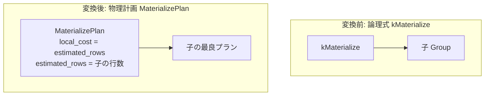

# materialize

- 状態: done   /   執筆基準リビジョン: `3880673` (2026-09-12)
- 定義位置: `plan/implementation_rules.cpp` の `DefaultImplementationRules()` 内の登録 `"materialize"`（パターンは `cascades::dsl::Materialize()`、実装ラムダは `materialize_child`）

## 概要

論理物質化演算子 `kMaterialize` に対し、入力関係のタプル列をメモリまたは一時領域に実体化してキャッシュする物理実行計画 `MaterializePlan` を生成する物理実装 Rule です。

CTE（共通テーブル式）の複数箇所参照や再帰クエリの worktable 再走査など、同一の中間結果を反復して走査する実行パターンにおいて、子サブツリーの重複再実行を防止するバッファリング境界を提供します。同一の実装ラムダ `materialize_child` は、`eager_spool` および `lazy_spool` の実装 Rule でも共有されます。

## 変換前後の関係



## 適用条件

パターンは単一入力を保持する `Materialize()` です。共有ラムダ `materialize_child` 内で以下のガード条件を判定します。

```cpp
          if (children.size() != 1 || required.require_row_position) {
            return std::vector<PlanAlternative>{};
          }
          switch (logical.operation) {
            case c::LogicalOperator::kMaterialize:
            case c::LogicalOperator::kEagerSpool:
            case c::LogicalOperator::kLazySpool:
              break;
            default:
              return std::vector<PlanAlternative>{};
          }
```

1. **子式数の制約**: 入力関係が単一（1 つ）であること。
2. **行位置要求の排除**: `PhysicalProperties` に行位置要求（`require_row_position`）が含まれないこと。
3. **対象論理演算子の合致**: 演算子が `kMaterialize`、`kEagerSpool`、`kLazySpool` のいずれかであること。

## 意味論的根拠と物理実行の契約

### 1. タプル物理位置（RID）の破棄と順序保証
`MaterializeExecutor` は子の出力を初回到来時にバッファへ書き出し、後続の走査要求に対して挿入順（FIFO）序順でタプルを再生します。

```cpp
    // materialize / spool: cache the child for multi-pass consumers (CTE
    // references read twice, recurring work-table scans). The executor
    // replays rows in insertion order, so ordering and row counts pass
    // through; the local cost is the single caching pass. Eager and lazy
    // spools share the implementation (the executor materializes on first
    // read) and stay separately addressable for hints.
```

タプルの出力順序は保存されるため、ソート順序プロパティ（`IsOrderedBy`）は子計画からそのまま引き継がれます。しかし、実体化されたタプルはストレージ上の元ページ位置（`RowPosition`）を失います。`UPDATE ... WHERE CURRENT OF` 等のカーソル位置依存クエリが行位置を要求する場合、物質化を適用すると誤った行を特定・更新する致命的エラーを招くため、`require_row_position` ガードにより適用を完全に拒絶します。

### 2. 多重走査の意味論的等価性
物質化演算は入力をフィルタリング・変換せずそのまま蓄積・再生するため、タプルの多重度や属性値、NULL の取り扱いは厳密に保存されます。副作用のない純粋なリレーショナル式に対して安全にキャッシュを導入できます。

## 実装の詳細

本 Rule は 1 パスの書き出しコストを局所コストとして計上します。

```cpp
          Plan plan = std::make_shared<MaterializePlan>(children[0].plan);
          return std::vector<PlanAlternative>{
              PlanAlternative{.plan = std::move(plan),
                              .local_cost = children[0].estimated_rows,
                              .estimated_rows = children[0].estimated_rows}};
```

- **物理計画ノード**: `MaterializePlan`（`ToString()` 名は `"Materialize"`）を生成し、子最良プランを包持します。実行時は `executor/relational_factory.cpp` において `MaterializeExecutor` がインスタンス化されます。
- **局所コスト計算**:
  ```cpp
  local_cost = children[0].estimated_rows;
  ```
  初回キャッシュ書き出しの 1 パス分に要する行スキャンコストのみを計上します。複数回走査によるトータル実行コストの削減は、共有 Group への参照構造を通じて Cascades 探索空間全体のコスト合算により自然に評価されます。
- **カーディナリティ推定**:
  ```cpp
  estimated_rows = children[0].estimated_rows;
  ```
  物質化演算は行数を増減させないため、子の推定行数をそのまま伝播します。

## 最適化効果

単一の走査しか行われないサブツリーに適用された場合、書き出しのオーバーヘッドにより純粋なコスト増加となります。一方、同一の Group が複数の消費者から参照される計画（自己結合を含む CTE 参照等）では、子サブツリーの二重実行コストを排除し、全体の実行時間を大幅に短縮します。

## 関連 Rule との相互作用

- `eager_spool` / `lazy_spool`: 同一の実装ラムダを共有する物理実装 Rule 群です。ヒントや将来の実行時スプール戦略の個別指定のために Rule エントリが分離されています。
- CTE 構築処理（`query/sql_engine.cpp` / `plan/optimizer.cpp`）: 複数回参照される WITH 句のサブクエリ式に対し、Memo 内で `kMaterialize` 論理式を供給します。
- `empty`: 行を消去する単項演算子であり、行数を保持する本 Rule とは対極の物理特性を持ちます。

## 検証テスト

- `plan/cascades_test.cpp`:
  - `CascadesTest.MaterializeAndSpoolHaveImplementationRules`: `kMaterialize`、`kEagerSpool`、`kLazySpool` の各演算子が `MaterializePlan` として物理実装されることを確認。
  - `CascadesTest.WindowAndSpoolAreUnaryLogicalOperators`: 単項論理演算子としての構造的不変条件を検証。
- `executor/executor_test.cpp`:
  - `ExecutorTest.RelationalWithClauseMaterializesCte`: CTE 参照クエリにおける実体化実行器の動作を検証。

