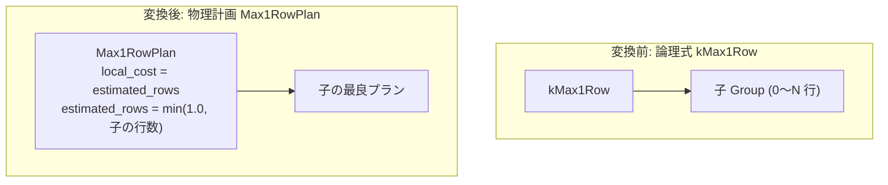

# max1_row

- 状態: done   /   執筆基準リビジョン: `3880673` (2026-09-12)
- 定義位置: `plan/implementation_rules.cpp` の `DefaultImplementationRules()` 内の登録 `"max1_row"`（パターンは `cascades::dsl::Max1Row()`）

## 概要

論理最大一行アサーション演算子 `kMax1Row` に対し、物理実行計画 `Max1RowPlan` を生成する物理実装 Rule です。

スカラーサブクエリ等において、実行時に入力関係が 2 行以上を出力した場合に例外エラーを送出する契約を物理層で保証します。また、オプティマイザのコストモデルに対して出力行数が高々 1 行（$\le 1$）である事実を確定的に伝達します。

## 変換前後の関係



## 適用条件

パターンは単一入力を保持する `Max1Row()` です。検査されるガード条件は子式のアリティのみです。

```cpp
          if (children.size() != 1) {
            return std::vector<PlanAlternative>{};
          }
```

1. **子式数の制約**: 入力関係が厳密に 1 つであること。
2. **要求プロパティの透過**: 本演算子はタプル順序や行位置を変更しないため、親ノードからの `PhysicalProperties`（順序要求・行位置要求）はそのまま子式へと透過伝播されます。

## 意味論的根拠と物理実行の契約

### 1. スカラーサブクエリの実行時アサーション契約
SQL 標準において、スカラーサブクエリ `(SELECT x FROM t WHERE ...)` は結果行数が高々 1 行であることを前提とします。2 行以上のタプルが返却された場合、最初の 1 行目を暗黙に採用することは許されず、実行時例外を送出する必要があります。

`Max1RowPlan` に対応する `Max1RowExecutor`（`executor/max1_row.cpp`）は、2 行目のフェッチを試みた時点で即座に実行時エラーを発生させます。本演算子はタプルを削減するフィルタではなく、意味論的妥当性を検証する物理ガードレールとして機能します。

### 2. 重複排除プロパティ（Distinct）の自明な充足
出力行数が高々 1 行である関係は、定義上重複タプルを含み得ません。このため、`Max1RowPlan::EnforcesDistinct()` は無条件に真を返します。上位オペレータが重複排除（`require_distinct`）を要求している場合、余分な Distinct ソートやハッシュ集約の挿入を未然に防止します。

## 実装の詳細

本 Rule は子式の最良プランを `Max1RowPlan` でラップし、行数上限を反映した代替計画を構築します。

```cpp
          Plan max1 = std::make_shared<Max1RowPlan>(children[0].plan);
          return std::vector<PlanAlternative>{PlanAlternative{
              .plan = std::move(max1),
              .local_cost = children[0].estimated_rows,
              .estimated_rows = std::min(1.0, children[0].estimated_rows)}};
```

- **物理計画ノード**: `Max1RowPlan`（`plan/max1_row_plan.hpp`）を生成します。実行時には `executor/relational_factory.cpp` の `EmitExecutor` を経由して `Max1RowExecutor` が組み立てられます。
- **局所コスト計算**:
  ```cpp
  local_cost = children[0].estimated_rows;
  ```
  子ストリームを最大 2 行（または終端）まで検査する 1 パス分の走査コストを計上します。
- **カーディナリティ推定**:
  ```cpp
  estimated_rows = std::min(1.0, children[0].estimated_rows);
  ```
  子の推定行数が 0 の場合は 0 を維持し、それ以外は上限 1.0 行へとクランプします。

## 最適化効果

本 Rule の適用により、上位の結合（Nested Loop Join や Hash Join）に対するカーディナリティ推定値が最大 1.0 行へと抑制されます。スカラーサブクエリをビルド側に配置するハッシュ結合や、外側ループとする結合計画において、探索空間内での推定コストが適正化され、最適な結合順序が選択されます。

## 関連 Rule との相互作用

- `LogicalProperties::max_1_row`: 論理プロパティ導出において `kMax1Row` は `max_1_row = true` を設定します。結合多重度（`JoinMultiplicity`）の縮退やキー一意性の推論に寄与します。
- 単項透過 Rule 群（`selection`、`projection`）: 要求プロパティを透過伝播する点で同一カテゴリの物理的挙動を示します。
- `apply_to_join`: スカラー相関サブクエリのデコリレーションにおいて、高々 1 行の保証を前提として内部結合や左外部結合への書き換えを可能にします。

## 検証テスト

- `plan/cascades_test.cpp`:
  - `CascadesTest.Max1RowIsAUnaryLogicalOperator`: `kMax1Row` が単項演算子として機能し、順序要求を子へ透過することを確認。
- `executor/executor_extra_test.cpp`:
  - `Max1RowExecutorTest.PassThroughEmptyAndMultiRow`: 0 行および 1 行の正常透過と、2 行検出時の例外送出動作を検証。

