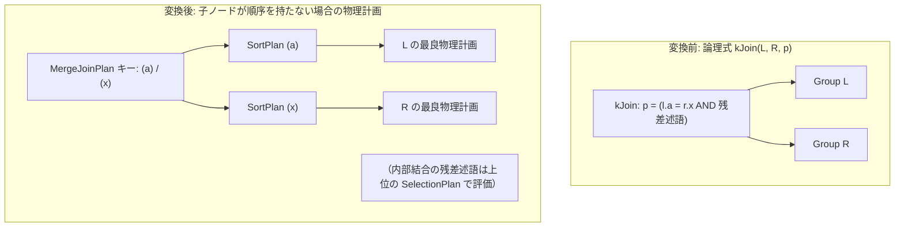

# merge_join

- 状態: draft / 執筆基準リビジョン: `3880673` (2026-09-12)
- 定義位置: `plan/implementation_rules.cpp` の `DefaultImplementationRules()` 内（登録名 `"merge_join"`、共有ヘルパー `MergeJoinAlternative(...)` に委譲）

## 概要

`merge_join` は、論理結合演算 `kJoin` を、両オペランドのタプルを等値結合キーの昇順に走査・照合する物理計画 `MergeJoinPlan`（ソートマージ結合）へと変換する実装Ruleです。入力子ノードがすでに要求キー順でソートされている場合はその順序を無償で活用し、ソートされていない子ノードに対しては局所的な `SortPlan` を挿入して物理整合性を担保します。

## 変換前後の関係

等値結合条件を持つ論理式から、ソート済み入力を前提とする物理結合ノード `MergeJoinPlan` を生成します。



子ノードがすでに結合キー順を提供している場合、対応する側の `SortPlan` は挿入されません。

## 適用条件

パターンは `Join()`（2つの子ノードを持つ `kJoin`）です。適用条件は以下のとおりです（`plan/implementation_rules.cpp`）。

```cpp
          if (children.size() != 2 || required.require_row_position) {
            return std::vector<PlanAlternative>{};
          }
```

1. **行位置要求の非存在**: 物理要求プロパティとして行位置（`require_row_position`）が要求されていないこと。
2. **等値結合キーの存在**: 述語内に列参照同士の厳密な等値比較（`=`）が1対以上存在すること。ハッシュ結合と異なり、NULL安全等値比較（`IS NOT DISTINCT FROM`）は対象外です。

```cpp
    if (binary.Op() != BinaryOperation::kEquals ||
        binary.Left()->Type() != TypeTag::kColumnValue ||
        binary.Right()->Type() != TypeTag::kColumnValue) {
      continue;
    }
```

等値キーが存在しない場合、本Ruleは空の候補リストを返却して適用を中断します。

## 意味論的根拠と順序の健全性

ソートマージ結合アルゴリズムの健全性は、両入力が同一の結合キー順（昇順）序で整列していることに依存します。

```cpp
// A merge join is only sound when both children deliver the equality keys in
// the same ascending order.  Existing ordering is reused; an unordered child
// is made sound by inserting a local SortPlan below the merge join.  The
// alternative's cost includes that sort, so a cheaper hash/index alternative
// can still win the Cascades search.
```

入力の順序が崩れている場合、マッチングすべきタプルを見落とし、結果行の欠落（意味論の破壊）を招きます。そのため、本Ruleは各子計画に対して `IsOrderedBy` を呼び出し、順序要件を満たしていない側にのみ明示的な `SortPlan` を挿入して安全性を保証します。

```cpp
  const std::vector<bool> ascending(left_columns.size(), true);
  const bool left_ordered = left.plan->IsOrderedBy(ordering_left, ascending);
  const bool right_ordered = right.plan->IsOrderedBy(ordering_right, ascending);
```

## 実装の詳細

ソートが要求される場合、ソートコスト（$N \log_2 N$）を算出して局所コストに加算します。

```cpp
  const auto sort_cost = [](double rows) {
    return rows * std::log2(std::max(2.0, rows));
  };
  Plan left_plan = left.plan;
  Plan right_plan = right.plan;
  double local_cost = left.estimated_rows + right.estimated_rows;
  if (!left_ordered) {
    left_plan =
        std::make_shared<SortPlan>(std::move(left_plan), std::move(keys));
    local_cost += sort_cost(left.estimated_rows);
  }
```

右オペランドに対しても同様の判定とソート挿入を行います。内部結合ノードを構築した後、等値キー以外の残差述語が存在する場合は上位に `SelectionPlan` を配置します。

```cpp
  Plan merge = std::make_shared<MergeJoinPlan>(
      std::move(left_plan), left_columns, std::move(right_plan), right_columns,
      physical_kind, std::move(merge_residual));

  if (!residual_conjuncts.empty()) {
    const TableStatistics merge_stats = merge->GetStats();
    merge = std::make_shared<SelectionPlan>(
        std::move(merge), CombineConjuncts(residual_conjuncts), merge_stats);
    estimated_rows =
        std::min(estimated_rows, static_cast<double>(merge->EmitRowCount()));
  }
```

## 最適化効果

インデックススキャンや先行するソート処理によって両入力がすでにソートされている場合、追加のソートやハッシュテーブル構築が不要となり、メモリ消費を最小限に抑えた高速な1パス結合が実現します。一方、双方の入力にソートを要する場合はソートコストが加算されるため、コストベース探索器は通常ハッシュ結合を優先します。

## 関連Ruleとの相互作用

- `hash_join` / `index_join` / `nested_loop_join`: 競合する結合実装Rule群。
- `sort_merge_of_compatible_orders`: ソート順序の互換性を整え、ソートマージ結合が採用されやすい環境を整備する論理Rule。
- `outer_hash_join` / `semi_merge_join` / `anti_merge_join`: 同一の `MergeJoinAlternative` ヘルパーを共有し、異なる結合種別を実装するRule群。
- 物理プロパティの提供: `MergeJoinPlan::IsOrderedBy` により、マージ結合の出力は左結合キーの順序を保持していると宣言されます。これにより、後続の集約やORDER BYにおいてソート処理を省略可能です。

## 検証テスト

- `plan/optimizer_test.cpp`:
  - `OptimizerTest.MergeJoinRuleUsesChildrenThatAlreadyProvideKeyOrder`: ソート済みの入力に対して追加ソートなしでマージ結合が構築されることを検証。
  - `OptimizerTest.MergeJoinRuleSortsUnorderedChildren`: ソートされていない入力に対して `SortPlan` が正しく挿入されることを検証。
- `plan/plan_test.cpp`:
  - `PlanTest.MergeJoinPlanCarriesSortedKeyContractAndOutputSchema`: 生成された計画ノードがソート契約および出力スキーマを正しく満たしていることを検証。
