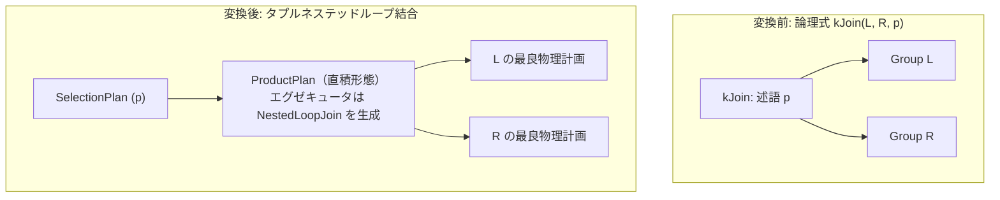

# nested_loop_join

- 状態: draft / 執筆基準リビジョン: `3880673` (2026-09-12)
- 定義位置: `plan/implementation_rules.cpp` の `DefaultImplementationRules()` 内（登録名 `"nested_loop_join"`、共有ヘルパー `JoinAlternatives(..., hash=false, index=false, cross=true)` に委譲）

## 概要

`nested_loop_join` は、論理結合演算 `kJoin` を、すべてのタプルペアを走査して結合述語を評価するタプル単位のネステッドループ結合（`ProductPlan` + 述語用 `SelectionPlan`）へと変換する実装Ruleです。等値結合キーの有無に依存せず常に物理計画候補を生成できるため、非等値結合や統計情報が欠落した環境における基底計画（フォールバック）として機能します。

## 変換前後の関係

論理式から直積形態の `ProductPlan` を構築し、その直上に結合述語全体を評価する `SelectionPlan` を配置します。



## 適用条件

パターンは `Join()`（2子ノードを持つ `kJoin`）です。適用条件は以下のとおりです（`plan/implementation_rules.cpp`）。

```cpp
          if (children.size() != 2 || required.require_row_position) {
            return std::vector<PlanAlternative>{};
          }
```

1. **子ノード数**: 子ノードがちょうど2つであること。
2. **行位置要求の非存在**: 物理プロパティとして `require_row_position` が要求されていないこと。

本Ruleは等値キー対の存在を要求しません。したがって、非等値条件のみを持つ結合であっても常に候補計画を返却します。

## 意味論的根拠と述語の完全評価

直積オペレータを基盤とするネステッドループ結合では、結合述語の全評価責任がプランノードに委ねられます。

```cpp
    // The cross-product executor does not consume join keys.  A nested-loop
    // implementation must therefore evaluate the complete join predicate,
    // including equality conjuncts; `with_residual` is only valid for hash
    // and index joins that already enforce those equalities themselves.
    if (predicate) {
      // A cross product that filters every pair by the join predicate IS a
      // nested-loop join: carry the predicate into the plan node so the
      // executor lowers to NestedLoopJoin.
      std::static_pointer_cast<ProductPlan>(product)->SetJoinNotes({},
                                                                   predicate);
      product = std::make_shared<SelectionPlan>(product, predicate,
                                                product->GetStats());
    }
```

ハッシュ結合やインデックス結合では等値キーの照合をアルゴリズム内部で完結させるため残差述語のみを上位フィルタに分離できますが、ネステッドループ結合では等値条件も含めた全述語を評価しなければ結合結果のタプル数が過剰に生成されてしまいます。そのため、`SetJoinNotes` によって述語全体をプランノードに付与し、エグゼキュータがタプルペアごとに述語を確実に判定するよう構成します。

## 実装の詳細

物理計画候補の生成とコスト評価は以下のとおり行われます（`plan/implementation_rules.cpp`）。

```cpp
  std::vector<PlanAlternative> candidates;
  if (cross) {
    auto product_plan = std::make_shared<ProductPlan>(left.plan, right.plan);
    Plan product = std::move(product_plan);
    const double cross_estimate =
        equi_conjuncts.empty() ? l_rows * r_rows : equi_estimate;
    // ...(述語をノードに設定し SelectionPlan を被せる処理)...
    const double local_cost = (l_rows * r_rows) + l_rows + r_rows;
    candidates.push_back(PlanAlternative{.plan = std::move(product),
                                         .local_cost = local_cost,
                                         .estimated_rows = cross_estimate});
  }
```

- **局所コスト計算**: $(|L| \times |R|) + |L| + |R|$。両入力の全件走査コストに加え、直積サイズに比例するタプルペア評価コストを加算します。
- **ブロック化ネステッドループとの優先関係**: ブロック単位で処理を行う `batch_nested_loop` Ruleとコストおよび行数見積もりが同点となりますが、RuleSetへの登録順において本Rule（タプル版）が先に配置されているため、同点判定では本Ruleが優先されます。

## 最適化効果

本Ruleの価値はコスト削減ではなく、結合計画生成の完全性（ロバスト性）を保証する点にあります。等値条件を持たない非等値結合（`l.a < r.b` など）ではハッシュ結合やマージ結合が候補を返却できないため、本Ruleが存在することでクエリ実行不能エラーを回避し、常に有効な実行計画を提供します。一方、等値条件が存在するクエリではハッシュ結合等の $O(|L| + |R|)$ コストが大幅に有利となるため、コストベース探索器によって自然に淘汰されます。

## 関連Ruleとの相互作用

- `hash_join` / `merge_join` / `index_join`: 等値条件を前提とする高効率な結合実装Rule群。
- `batch_nested_loop`: タプルネステッドループと同一形状を生成するブロック化版の実装Rule。本Ruleが無効化された場合のフォールバックとして機能します。
- `join_to_cross_if_no_predicate` / `cross_to_inner_with_predicate`: 結合述語の有無に応じて論理演算子の種別を変換し、本Ruleと直積Rule（`cross_join`）の責務分界を整理します。

## 検証テスト

- `plan/optimizer_test.cpp`:
  - `OptimizerTest.BatchNestedLoopExecutesNonEquiInnerJoin`: `nested_loop_join` を無効化した際にブロック化版へ正常に切り替わることを検証。
  - `OptimizerTest.BatchNestedLoopGateKeepsEquiJoins`: 等値結合において他の全結合Ruleが無効化された場合の挙動を検証。
  - `OptimizerTest.CrossTableResidualPredicateIsAppliedByTheJoin`: 表間にまたがる述語が結合オペレータによって確実に評価されることを検証。

