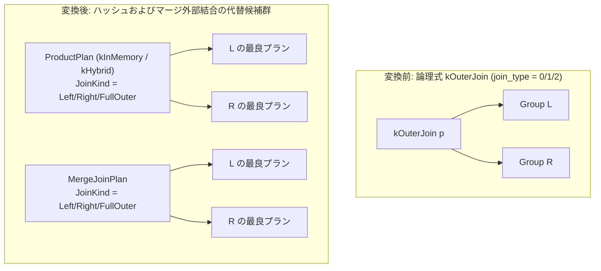

# outer_hash_join

- 状態: done   /   執筆基準リビジョン: `3880673` (2026-09-12)
- 定義位置: `plan/implementation_rules.cpp` の `DefaultImplementationRules()` 内の登録 `"outer_hash_join"`（パターンは `cascades::dsl::OuterJoin()`）

## 概要

論理外部結合演算子 `kOuterJoin`（LEFT、RIGHT、FULL）に対し、ハッシュ結合およびソートマージ結合の物理実行計画代替群を生成する物理実装 Rule です。

論理式の結合種別符号（0 = LEFT、1 = RIGHT、2 = FULL）を物理 `JoinAlternativeKind` に変換し、等値キーに基づくハッシュ外部結合（インメモリ／ハイブリッド）およびマージ外部結合の候補を同時に Memo へ追加します。等値条件で合致しない不一致行に対しては、相手側属性に NULL 値を埋め込む（NULL パディング）物理実行契約を保証します。

## 変換前後の関係



## 適用条件

パターンは 2 つの子式を持つ `OuterJoin()` です。実装ラムダでは以下の条件を検査します。

```cpp
          if (children.size() != 2 || required.require_row_position) {
            return std::vector<PlanAlternative>{};
          }
          JoinAlternativeKind kind = JoinAlternativeKind::kLeftOuter;
          if (logical.join_type == 1) {
            kind = JoinAlternativeKind::kRightOuter;
          } else if (logical.join_type == 2) {
            kind = JoinAlternativeKind::kFullOuter;
          }
```

1. **子式数の制約**: 入力関係が左右 2 つであること。
2. **行位置要求の排除**: `PhysicalProperties` に行位置要求（`require_row_position`）が含まれないこと。外部結合で生成される NULL パディング行は物理ストレージ上のタプル位置を持たないため、行位置の保証は不可能です。
3. **等値キー対の存在**: 述語 `logical.predicate` から 1 組以上の等値結合キー対を抽出できること。
4. **残余述語の完全不在**: 非 inner 結合（外部結合を含む）において、等値条件以外の残余述語（residual predicate）が存在する場合は代替候補の生成を拒絶します。

```cpp
  // A semi/anti hash join emits only the probe side. A residual predicate
  // mentioning the build side cannot be evaluated after that reduction, so
  // leave such shapes for the existing relational fallback until a
  // residual-aware mark join is available.
  if (kind != JoinAlternativeKind::kInner && residual) {
    return {};
  }
```

## 意味論的根拠と物理実行の契約

### 1. NULL パディング行の例外保護と残余述語の排除
外部結合の意味論の核心は、結合条件を満たさない行を相手側 NULL で補完して出力することにあります。

もし残余述語を含む外部結合に対し、ハッシュ結合ノードの上位へ `SelectionPlan` を配置して残余述語を事後評価した場合、相手側が NULL パディングされた行は述語評価で偽または UNKNOWN（NULL）となり、すべて除外されてしまいます。これにより外部結合が事実上内部結合へと縮退し、重大な意味論の破綻を招きます。したがって、残余述語が存在する外部結合は本 Rule から除外され、プランノード内でペアごとに残余述語を評価する `outer_nested_loop` または `batch_nested_loop_outer` に委ねられます。

### 2. 物理行位置（RowPosition）の喪失
外部結合により補完生成されたタプルは、ページ内の実レコードではなく実行時に合成された揮発的値です。`UPDATE ... WHERE CURRENT OF` などのカーソル位置保証が要求されるコンテキストでは適用できません。

## 実装の詳細

本 Rule は `JoinAlternatives` と `MergeJoinAlternative` の双方を呼び出し、得られた候補リストを連結して返却します。

```cpp
          std::vector<PlanAlternative> alternatives = JoinAlternatives(
              memo, logical.children[1], logical.predicate, children[0],
              children[1], context, true, false, false, kind);
          std::vector<PlanAlternative> merge =
              MergeJoinAlternative(memo, logical.children[1], logical.predicate,
                                   children[0], children[1], context, kind);
          alternatives.insert(alternatives.end(),
                              std::make_move_iterator(merge.begin()),
                              std::make_move_iterator(merge.end()));
          return alternatives;
```

- **ハッシュ外部結合代替**:
  - `ProductPlan` に `LeftOuterJoinKind()`、`RightOuterJoinKind()`、または `FullOuterJoinKind()` を設定します。
  - インメモリ（`kInMemory`）およびハイブリッド（`kHybrid`）の 2 系統が生成されます。
  - 局所コストは `l_rows + r_rows` を基本とし、ハイブリッド優先判定時はインメモリ側に `r_rows * 3` のスピルペナルティが加算されます。
  - ハッシュ結合の推定行数は下限保証として `std::max(l_rows, r_rows)` を採用します。
- **マージ外部結合代替**:
  - `MergeJoinPlan` に対応する結合種別を設定します。入力子ノードに対してソート順序プロパティ（等値キー順）が要求されます。
  - マージ外部結合の推定行数は、等値キーの NDV に基づく `JoinCardinality` をそのまま採用します。

## 最適化効果

等値結合条件を持つ外部結合に対し、$O(|L| + |R|)$ の計算量で実行可能なハッシュ結合およびマージ結合の物理選択肢を提供します。特に FULL OUTER JOIN において、左右双方の未合致行の追跡をハッシュテーブルの未走査バケット検出により効率的に行い、二次計算のネステッドループによる性能劣化を回避します。

## 関連 Rule との相互作用

- `outer_nested_loop`: 非等値結合条件を持つ LEFT OUTER JOIN を処理する物理実装 Rule です。
- `batch_nested_loop_outer`: 残余述語を含む RIGHT および FULL OUTER JOIN に対するブロックネステッドループ実装 Rule です。
- `right_to_left_outer_join`: 論理層において RIGHT OUTER JOIN を LEFT OUTER JOIN へ正規化し、物理オペレータの選定を単純化します。
- `outer_to_inner_join_on_null_rejecting_filter`: 上位フィルタの Null-rejection 特性に基づき、外部結合を内部結合へ昇格させて `hash_join` へのマッピングを可能にします。

## 検証テスト

- `plan/optimizer_test.cpp`:
  - `OptimizerTest.OuterJoinRuleAddsMergeJoinAlternative`: 本 Rule が外部結合に対してマージ結合代替を追加することを検証。
- `plan/cascades_test.cpp`:
  - `CascadesTest.OuterNestedLoopPlansNonEquiLeftJoin`: 非等値 LEFT 結合において `outer_hash_join` が除外され、正しくネステッドループが選択される責務分担を検証。
- `plan/plan_test.cpp`:
  - `PlanTest.ProductOuterJoinPreservesBothSchemasAndOuterCardinalityBound`: LEFT/RIGHT/FULL の `ProductPlan` が双方のスキーマおよびカーディナリティ下限を維持することを確認。
- `executor/executor_test.cpp`:
  - `ExecutorTest.RelationalRightOuterJoinSpillMatchesUnbudgeted` / `ExecutorTest.RelationalFullOuterJoinSpillMatchesUnbudgeted`: ハイブリッドハッシュ外部結合のスピル実行時の意味論的正確性を検証。

