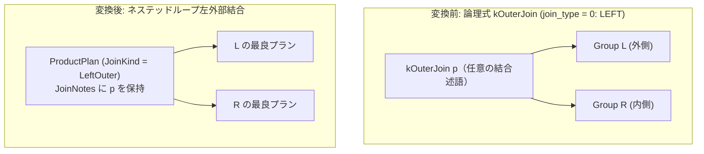

# outer_nested_loop

- 状態: done   /   執筆基準リビジョン: `3880673` (2026-09-12)
- 定義位置: `plan/implementation_rules.cpp` の `DefaultImplementationRules()` 内の登録 `"outer_nested_loop"`（パターンは `cascades::dsl::LeftOuterJoin()`）

## 概要

論理左外部結合演算子（`kOuterJoin` かつ `join_type = 0`）に対し、結合述語全体をノード内部で評価するネステッドループ物理実行計画（`ProductPlan` + `LeftOuterJoinKind`）を生成する物理実装 Rule です。

等値キーが存在しない非等値外部結合や小規模関係の左外部結合に対し、関係代数のヒューリスティックフォールバックに依存せず、コストベース探索に参加可能な物理実行計画を提供します。不一致行に対する NULL パディングは実行器内部で直接行われます。

## 変換前後の関係



上位に `SelectionPlan` は配置されず、結合ノード自身が述語評価と NULL パディングを不可分に実行します。

## 適用条件

パターンは `LeftOuterJoin()` であり、Pattern DSL 側で `operation == kOuterJoin` かつ `join_type == 0`（LEFT）に限定されます。実装ラムダでは以下の条件を厳格に検査します。

```cpp
          if (children.size() != 2 || required.require_row_position ||
            logical.operation != c::LogicalOperator::kOuterJoin ||
            logical.join_type != 0 || !logical.predicate ||
            !*logical.predicate) {
          return std::vector<PlanAlternative>{};
        }
```

さらに、定数ブール式に対して以下の除外ガードを設けています。

```cpp
          if (!constant.IsNull() && constant.Truthy()) {
            // ON TRUE over an empty inner side must still pad; the plain
            // cross shape cannot prove non-emptiness, so leave it out.
            return std::vector<PlanAlternative>{};
          }
          if (constant.IsNull() ||
              (!constant.IsNull() && !constant.Truthy())) {
            // ON FALSE / NULL never matches: every outer row pads. That is
            // a scan-wide projection, not a join worth nesting; the logical
            // layer already short-circuits it.
            return std::vector<PlanAlternative>{};
          }
```

1. **子式数の制約**: 入力関係が左右 2 つであること。
2. **行位置要求の排除**: `PhysicalProperties` に `require_row_position` が含まれないこと。
3. **左外部結合の特定**: `logical.join_type == 0` であること。RIGHT や FULL は対象外です。
4. **非自明な結合述語**: 述語が非 null かつ定数ブール（TRUE、FALSE、NULL）でないこと。

## 意味論的根拠と物理実行の契約

### 1. SelectionPlan 挿入の禁止と例外保護
内部結合のネステッドループ（`nested_loop_join`）では、結合ノードの上位に述語を持つ `SelectionPlan` を配置する構成が可能です。しかし外部結合において同様のラッパーを配置した場合、不一致によって生成された NULL パディング行が上位のフィルタ評価で FALSE または UNKNOWN と判定され、すべて除去されてしまいます。

```cpp
        // The executor evaluates the full predicate while pairing and
        // null-pads unmatched outer rows, so unlike the inner nested loop
        // no Selection wrapper may be added: it would filter the padded
        // rows back out (same reason JoinAlternatives refuses residuals
        // for non-inner hash joins).
```

これにより外部結合が内部結合へと事実上変質するため、本 Rule では結合述語を物理ノードの `JoinNotes` に直接格納し、`LeftOuterJoin` 実行器がタプル走査中にインラインで述語を評価してパディングを行う契約を強制します。

### 2. 定数述語（ON TRUE / FALSE / NULL）の除外根拠
- **`ON TRUE` の除外**: 内側（右辺）関係が空（0 行）の場合、左辺の全タプルに対して NULL パディング行を生成する必要があります。単なる直積（Cross Join）形状では内側関係が空でないことを静的に証明できないため、誤った交差計画への縮退を防止するために除外します。
- **`ON FALSE / NULL` の除外**: 結合条件が常に不成立となるため、結果は「左辺全行に右辺属性の NULL を連結した射影」と完全に等価です。ネステッドループによる二次計算走査を実行する意義はなく、論理層での短絡除去（`outer_join_to_projection` 等）に委ねます。

## 実装の詳細

本 Rule は `ProductPlan` を左外部結合種別でインスタンス化します。

```cpp
          Plan join = std::make_shared<ProductPlan>(
              children[0].plan, children[1].plan, LeftOuterJoinKind());
          SetJoinNotes(join, *logical.predicate);
          const double estimate =
              std::max(children[0].estimated_rows, children[1].estimated_rows);
          const double local_cost =
              children[0].estimated_rows * children[1].estimated_rows;
          return std::vector<PlanAlternative>{
              PlanAlternative{.plan = std::move(join),
                              .local_cost = local_cost,
                              .estimated_rows = estimate}};
```

- **物理計画ノード**: `ProductPlan(left, right, LeftOuterJoinKind())` を生成します。`SetJoinNotes` により述語を物理ノードへ保持させます。実行時は `executor/relational_factory.cpp` において `LeftOuter` 判定により NULL パディング付きネステッドループ実行器が生成されます。
- **局所コスト計算**:
  ```cpp
  local_cost = children[0].estimated_rows * children[1].estimated_rows;
  ```
  外側行ごとに内側関係をフル走査する直積相当の二次コストを計上します。
- **カーディナリティ推定**:
  ```cpp
  estimated_rows = std::max(children[0].estimated_rows, children[1].estimated_rows);
  ```
  左外部結合の最小出力行数は外側行数以上となるため、安全な下限値を採用します。

## 最適化効果

非等値結合条件を含む LEFT OUTER JOIN に対し、Cascades コスト最適化下で明示的な物理実行パスを提供します。等値キーが存在するケースでは `outer_hash_join`（コスト $O(|L| + |R|)$）がコスト比較で優位となりますが、非等値条件や極小カーディナリティ（外側が数行程度）の環境では、本 Rule のネステッドループ結合が最適なプランとして採択されます。

## 関連 Rule との相互作用

- `outer_hash_join`: 等値キーを持つ外部結合を処理する物理実装 Rule です。等値結合において本 Rule と競合し、通常ハッシュ側が低コストとして採択されます。
- `batch_nested_loop_outer`: ブロック化実行器により RIGHT および FULL 外部結合を処理する実装 Rule です。LEFT 結合については本 Rule との競合（tie）を避けるため、本 Rule に委ねる設計となっています。
- `right_to_left_outer_join`: 論理層で RIGHT 外部結合を LEFT 外部結合へ反転し、本 Rule の適用対象へと導きます。
- `outer_to_anti_join`: 述語の特性に基づいて外部結合をアンチ結合へと変換する論理 Rule です。

## 検証テスト

- `plan/cascades_test.cpp`:
  - `CascadesTest.OuterNestedLoopPlansNonEquiLeftJoin`: `outer_hash_join` が適用できない非等値 LEFT 外部結合に対し、本 Rule が `"Left Outer Join"` 物理計画を選択することを検証。
- `plan/optimizer_test.cpp`:
  - `OptimizerTest.OuterJoinRuleAddsMergeJoinAlternative`: 等値条件が存在する場合にマージ結合・ハッシュ結合が優先される動作を確認。
