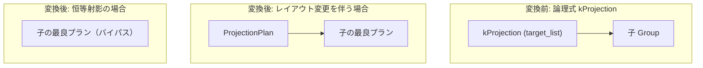

# projection

- 状態: done   /   執筆基準リビジョン: `3880673` (2026-09-12)
- 定義位置: `plan/implementation_rules.cpp` の `DefaultImplementationRules()` 内の登録 `"projection"`（パターンは `cascades::dsl::Projection()`）

## 概要

論理射影演算子 `kProjection` に対し、物理実行計画 `ProjectionPlan`（属性選択・スカラー式評価・列名変更）を生成する物理実装 Rule です。

出力スキーマの属性レイアウトが入力子式と完全に一致する「恒等射影（Identity Projection）」を検出し、その場合は余剰な物理ノードを生成せず子式の物理計画をそのまま返却してパススルーします。

## 変換前後の関係



## 適用条件

パターンは単一入力を保持する `Projection()` です。ガード条件として子式数の整合性を検査し、ヘルパー関数 `RemoveIdentityProjection` により恒等性の判定を行います。

```cpp
          if (children.size() != 1) {
            return std::vector<PlanAlternative>{};
          }
          Plan projection =
              RemoveIdentityProjection(children[0].plan, logical.target_list);
```

恒等射影の判定ロジックは以下の通りです。

```cpp
Plan RemoveIdentityProjection(Plan child,
                              const std::vector<NamedExpression>& columns) {
  Plan projection = std::make_shared<ProjectionPlan>(child, columns);
  return SameColumnLayout(projection->GetSchema(), child->GetSchema())
             ? std::move(child)
             : std::move(projection);
}
```

1. **子式数の制約**: 入力関係が厳密に 1 つであること。
2. **スキーマ比較**: `SameColumnLayout` により、射影後スキーマと子スキーマの属性数および各属性名の一致を検証します。

## 意味論的根拠と物理実行の契約

### 1. 恒等射影の除去と計算オーバヘッドの排除
属性順序・属性名が完全に同一の射影演算に対し物理 `ProjectionPlan` を割り当てると、実行時に不要なタプルコピーとタプルスロット再構築が毎行発生します。`SameColumnLayout` による一致判定を行うことで、純粋な恒等射影を無害に消去し、実行時オーバーヘッドを排除します。

一方、列の別名付け（`SELECT c1 AS x`）は属性名を変更するため、`SameColumnLayout` は不一致と判定して `ProjectionPlan` を維持します。これにより、上位オペレータにおける属性解決の一貫性が厳密に保護されます。

### 2. タプル順序プロパティの透過伝播
射影演算はタプル間の相対順序を変更せず、行のフィルタリングや重複生成も行いません。したがって、`ProjectionPlan::IsOrderedBy` は子プランのソート順序判定に直接委譲されます。上位ノードが要求するソート順序プロパティ（`ordering`）を破綻させることなく透過させます。

## 実装の詳細

本 Rule は 1 行あたりの式評価・属性再配置コストを局所コストとして計上します。

```cpp
          return std::vector<PlanAlternative>{
              PlanAlternative{.plan = std::move(projection),
                              .local_cost = children[0].estimated_rows,
                              .estimated_rows = children[0].estimated_rows}};
```

- **物理計画ノード**: `RemoveIdentityProjection` が返却した `ProjectionPlan` または子最良プランを採用します。実行時は `executor/relational_factory.cpp` において `ProjectionExecutor` が生成されます。
- **局所コスト計算**:
  ```cpp
  local_cost = children[0].estimated_rows;
  ```
  全入力タプルに対して射影式を評価する 1 パス分のコストを計上します。
- **カーディナリティ推定**:
  ```cpp
  estimated_rows = children[0].estimated_rows;
  ```
  射影はタプル数を増減させないため、子の推定行数をそのまま維持します。

## 最適化効果

恒等射影のバイパスにより、中間タプル生成の CPU オーバーヘッドを削減します。また、論理層での列枝刈り（column pruning）により絞り込まれた最小限の属性セットを物理層へ確定させ、後続のソートやハッシュ結合におけるバッファ消費とコピーコストを抑制します。

## 関連 Rule との相互作用

- `eliminate_identity_projection`: 論理層において恒等射影を事前に除去する Rule です。本 Rule の `RemoveIdentityProjection` は、論理最適化を通過した残存ノードに対する防壁として機能します。
- `merge_projections` / `merge_adjacent_projections`: 連続する射影を 1 つに合成し、物理層での `ProjectionPlan` 重複生成を未然に防止します。
- `push_projection_through_join` / `projection_cse_and_pruning`: 射影を走査ノード近傍へ押し下げ、スキャン時の要求列指定（`context.scan_projections`）を縮小させます。

## 検証テスト

- `plan/plan_test.cpp`:
  - `PlanTest.ProjectionEmitExecutorProjectsValues`: 物理射影実行器による属性抽出と式評価の正確性を検証。
  - `PlanTest.ProjectionPlanIsOrderedByDelegatesToChild`: 射影ノードが子ノードのソート順序判定をそのまま透過することを検証。
- `plan/cascades_test.cpp`:
  - `CascadesTest.ProjectionIsPushedThroughInnerJoinWithRequiredColumns`: 射影のプッシュダウンと要求属性セットの伝播動作を検証。

