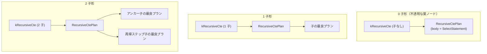

# recursive_cte

- 状態: done   /   執筆基準リビジョン: `3880673` (2026-09-12)
- 定義位置: `plan/implementation_rules.cpp` の `DefaultImplementationRules()` 内の登録 `"recursive_cte"`（パターンは `c::Pattern::Op(c::LogicalOperator::kRecursiveCte, {})`）

## 概要

論理再帰共通テーブル式演算子 `kRecursiveCte` に対し、不動点計算を司る物理実行計画 `RecursiveCtePlan` を生成する物理実装 Rule です。

再帰クエリ（`WITH RECURSIVE`）における初期アンカー関係と再帰ステップ関係を結合し、探索深さ制約仕様（`RecursiveDepthSpec`）を実行エンジンへ伝達します。アリティに応じた 3 形態（0 子形・1 子形・2 子形）をサポートし、Cascades 最適化と実行器の worktable ドライバを調停します。

## 変換前後の関係



## 適用条件

パターンは任意項数一致の `Pattern::Op(kRecursiveCte, {})` です。実装ラムダにおいて入力関係数のアリティ検査を実施します。

```cpp
          if (children.empty()) {
            plan = std::make_shared<RecursiveCtePlan>(
                nullptr, logical.cte_name, logical.relational_statement,
                std::move(depth_spec), logical.output_schema);
          } else if (children.size() == 1) {
            plan = std::make_shared<RecursiveCtePlan>(
                children[0].plan, logical.cte_name,
                logical.relational_statement, std::move(depth_spec),
                logical.output_schema);
          } else if (children.size() == 2) {
            plan = std::make_shared<RecursiveCtePlan>(
                children[0].plan, children[1].plan, logical.cte_name,
                logical.relational_statement, std::move(depth_spec),
                logical.output_schema);
          } else {
            return std::vector<PlanAlternative>{};
          }
```

1. **子式数の制限**: 子式数が 0、1、または 2 であること（3 子以上は即座に拒絶）。
2. **深さ制約仕様の抽出**: `logical.depth_spec` が設定されていればそれを採用し、存在せず `logical.depth_limit > 0` の場合は `depth` 属性を基準とする `RecursiveDepthSpec{0, depth_limit}` を構築します。

```cpp
          std::optional<RecursiveDepthSpec> depth_spec;
          if (logical.depth_spec.has_value()) {
            depth_spec = logical.depth_spec;
          } else if (logical.depth_limit > 0) {
            depth_spec = RecursiveDepthSpec{
                .column = "depth",
                .lower = 0,
                .upper = static_cast<int64_t>(logical.depth_limit),
            };
          }
```

## 意味論的根拠と物理実行の契約

### 1. 不動点計算の整合性と有限ループ保護
再帰クエリの本質は、再帰ステップが新たなタプルを生成しなくなるまでループ評価を反復する不動点セマンティクスです。閉路を持つ有向グラフの探索では、有限回の自己結合への展開や安易なインライン化を行うと、循環による無限ループまたは途中データの欠落を引き起こします。

本 Rule は不動点反復ドライバを持つ専用物理ノード `RecursiveCtePlan` へ一意に委譲し、論理的な意味論を完全に保証します。また、深さ制限仕様（`RecursiveDepthSpec`）を物理ノードへ確実に付与することで、循環データに対する探索上限（iterations bound）を実行時レベルで契約します。

### 2. 要求プロパティ伝播（RequiredChildProperties）の契約
`SearchEngine::RequiredChildProperties` において、`kRecursiveCte` は以下のように要求プロパティを割り当てます。

```cpp
    case LogicalOperator::kRecursiveCte:
      if (expression.children.empty()) {
        return {};
      }
      if (expression.children.size() == 1) {
        return {required};
      }
      return {PhysicalProperties{}, PhysicalProperties{}};
```

0 子形は要求なし、1 子形は親の要求を透過、2 子形ではアンカーおよび再帰ステップの双方に対して順序要求等を破棄した空の `PhysicalProperties{}` を要求します。不動点反復において中間 worktable の読み書きが反復されるため、親のソート順序を子サブツリー単体で保証できないためです。

## 実装の詳細

アリティに応じたコスト付けを行い、単一の代替計画を返却します。

```cpp
          const double rows =
              children.empty() ? 10.0 : children[0].estimated_rows * 10.0;
          return std::vector<PlanAlternative>{PlanAlternative{
              .plan = std::move(plan),
              .local_cost =
                  children.empty() ? 10.0 : children[0].estimated_rows * 2.0,
              .estimated_rows = rows}};
```

- **物理計画ノード**: `RecursiveCtePlan`（`plan/recursive_cte_plan.hpp`）を構築します。実行時は `executor/relational_factory.cpp` の `EmitExecutor` が worktable 制御を伴う再帰実行器を生成します。
- **局所コスト計算**:
  - 0 子形: 固定コスト 10.0。
  - 1 子形・2 子形: `children[0].estimated_rows * 2.0`。アンカー行数に基づく 2 パス走査相当の概算コストを計上します。
- **カーディナリティ推定**:
  - 0 子形: 固定 10.0 行。
  - 1 子形・2 子形: `children[0].estimated_rows * 10.0`。反復に伴うタプル膨張を保守的に固定倍率 10 倍と仮定して推定します。

0 子形（子なし）は、リフトされた再帰シングルトンノード（M4 設計）を表します。Memo 内部ではコスト計算と合成の単位として保持され、内部の不動点実行自体は実行器側の worktable ドライバへ丸ごと委任されます。

## 最適化効果

複雑な不動点再帰クエリを Cascades 最適化ツリー内に安全に統合し、外側のクエリ（アンカー入力や後続の射影・フィルタ）と連携させたコスト計算を可能にします。再帰ステップ内部に配置される `UNION`（重複排除）や個別の結合・フィルタは、子 Group 側で独立して最適な物理プランが選定されます。

## 関連 Rule との相互作用

- `recursive_termination_predicate_pushdown`: 再帰の停止条件述語（例: `depth < 10`）を再帰ステップ内部へ安全にプッシュダウンする論理 Rule です。
- `union` / `union_all`: 再帰ステップにおけるアンカーと再帰段の結合に用いられる集合演算を物理実装します。
- `kWorkTableScan`: 実行エンジンが再帰ステップに対して供給する直前の作業テーブル走査ノードです。

## 検証テスト

- `query/query_test.cpp`:
  - `QueryTest.SqlEngineRecursiveCtePlansOuterThroughCascades`: 再帰 CTE を含む外部クエリが Cascades 探索を経て正常に実行計画化されることを検証。
  - `SqlEngineRecursiveCteCountsToLimit`: 深さ上限までの反復回数の正確性を確認。
  - `SqlEngineRecursiveCteTransitiveClosureWithUnionDistinct`: `UNION` による重複排除を伴う推移閉包計算の検証。
  - `SqlEngineRecursiveCteDepthModifierBoundsIterations`: 深さ修飾子による反復停止の検証。
- `plan/cascades_test.cpp`:
  - `CascadesTest.RecursiveTerminationPredicatePushdown`: 再帰停止述語の押し込み最適化を検証。

