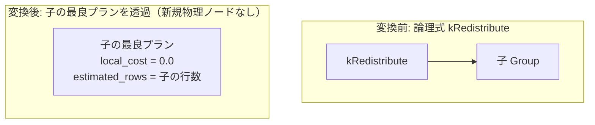

# redistribute_noop

- 状態: done   /   執筆基準リビジョン: `3880673` (2026-09-12)
- 定義位置: `plan/implementation_rules.cpp` の `DefaultImplementationRules()` 内の登録 `"redistribute_noop"`（パターンは `cascades::dsl::Redistribute()`、実装ラムダは `exchange_passthrough`）

## 概要

論理データ再配置演算子 `kRedistribute` に対し、物理オペレータを挟まず入力関係をそのまま透過（no-op）させる物理実装 Rule です。

分散クエリ実行におけるキー再ハッシュ・シャッフル演算を、単一ノード実行環境下において無害にバイパスします。同一の共有ラムダ `exchange_passthrough` は、`exchange_noop`、`gather_noop`、`broadcast_noop` と共通して用いられます。

## 変換前後の関係



## 適用条件

パターンは単一入力を保持する `Redistribute()` です。共有ラムダ `exchange_passthrough` 内でアリティおよび演算子種別を判定します。

```cpp
          if (children.size() != 1) {
            return std::vector<PlanAlternative>{};
          }
          switch (logical.operation) {
            case c::LogicalOperator::kExchange:
            case c::LogicalOperator::kGather:
            case c::LogicalOperator::kBroadcast:
            case c::LogicalOperator::kRedistribute:
              break;
            default:
              return std::vector<PlanAlternative>{};
          }
```

1. **子式数の制約**: 入力関係が厳密に 1 つであること。
2. **対象論理演算子の合致**: 演算子が `kRedistribute`（または共通ラムダ対象の Exchange 系演算子）であること。

## 意味論的根拠と物理実行の契約

### 1. 単一ノード実行環境における分布等価性
`kRedistribute` の本来の意味論は、指定されたハッシュキーに基づいてクラスタ内の複数ノード間へタプルをパーティショニング・再配置することです。しかし、単一ノード実行エンジンにおいては、すべてのタプルが同一インスタンス上に局在しているため、ノード間転送を行う必要が物理的に存在しません。

したがって、物理プランノードを追加せず入力プランを直接返却するパススルー実行は、タプル多重度や属性値を厳密に保存し、意味論的に完全に健全です。

### 2. 未実装エラー（kNotImplemented）の防止
分散演算子を含む論理式が Memo 内に存在する場合、対応する物理実装 Rule が存在しなければ、当該 Group に対する物理プラン導出が失敗し、`Status::kNotImplemented` エラーが発生します。局所コスト 0.0 のパススルー代替を提供することで、単一ノード上での探索および実行の完走を保証します。

## 実装の詳細

本 Rule は子式の物理計画をラップせず、追加コスト 0.0 で透過返却します。

```cpp
          return std::vector<PlanAlternative>{
              PlanAlternative{.plan = children[0].plan,
                              .local_cost = 0.0,
                              .estimated_rows = children[0].estimated_rows}};
```

- **物理計画ノード**: 新規物理ノードを一切生成せず、`children[0].plan` をそのまま採用します。
- **局所コスト計算**:
  ```cpp
  local_cost = 0.0;
  ```
  物理的なデータ移動やコピーを行わないため、追加コストは厳密に 0 です。
- **カーディナリティ推定**:
  ```cpp
  estimated_rows = children[0].estimated_rows;
  ```
  タプルの増減は発生しないため、子の推定行数をそのまま維持します。
- **要求プロパティの透過**: `SearchEngine::RequiredChildProperties` において `kRedistribute` は素通しグループに属しており、親からのソート順序等の要求は子ノードへそのまま伝播されます。

## 最適化効果

単一ノード DBMS において、分散再配置ノードの挿入による余剰なメモリ割り当てやタプル再構築コストを完全に排除します。

## 関連 Rule との相互作用

- `exchange_noop` / `gather_noop` / `broadcast_noop`: 同一の `exchange_passthrough` ラムダを共有する物理実装 Rule 群です。
- `PhysicalProperties::distribution`: 分布要求（`Distribution::kAny`、`Distribution::kSingleNode` 等）を表すプロパティです。プロパティキー（`Key()`）に含まれており、将来の分散実行サポート時に分布ごとの代替選定を可能にします。

## 検証テスト

- `plan/cascades_test.cpp`:
  - `CascadesTest.ExchangeNoopPassesChildThrough`: 共有ラムダ `exchange_passthrough` が子計画をそのまま透過し、局所コスト 0.0 を返却することを代表検証。
  - `CascadesTest.PropertyKeysIncludeAccessMethodLimitHintAndDistribution`: 分布プロパティがプロパティキーに組み込まれていることを確認。

