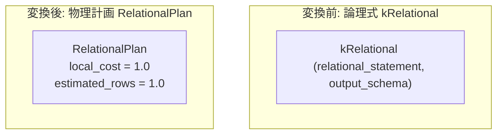

# relational_ir

- 状態: done   /   執筆基準リビジョン: `3880673` (2026-09-12)
- 定義位置: `plan/implementation_rules.cpp` の `DefaultImplementationRules()` 内の登録 `"relational_ir"`（パターンは `c::Pattern::Op(c::LogicalOperator::kRelational, {})`）

## 概要

論理関係代数文ノード `kRelational` に対し、パース済みの `SelectStatement` をそのまま内包して従来の関係代数エンジンで直接実行する物理実行計画 `RelationalPlan` を生成する物理実装 Rule です。

Cascades 最適化ツリーにおいて未サポートの構文や特殊クエリ構造に遭遇した際、最適化エンジンが処理不能（`kNotImplemented`）として失敗するのを防ぎ、縮退実行（degradation path）としてクエリの完走を担保する最終フォールバックの受け皿として機能します。

## 変換前後の関係



## 適用条件

パターンは子式を持たない葉ノード `Pattern::Op(kRelational, {})` です。実装ラムダでは、文実体の存在のみを検証します。

```cpp
        "relational_ir", c::Pattern::Op(c::LogicalOperator::kRelational, {}),
        [](c::GroupId, const c::Memo&, const c::Bindings&,
           const c::LogicalExpression& logical, const std::vector<BestPlan>&,
           const PhysicalProperties&, const c::RuleContext&) {
          if (!logical.relational_statement) {
            return std::vector<PlanAlternative>{};
          }
```

1. **子式数の制約**: 入力関係を持たない葉ノード（0 子）であること。
2. **関係代数文ポインタの存在**: `logical.relational_statement` が有効な `SelectStatement` を保持していること。

## 意味論的根拠と物理実行の契約

### 1. 縮退実行による正しさの保証
`RelationalPlan` の唯一の責務は、保持する `std::shared_ptr<const SelectStatement>` を関係代数実行系（`query/sql_engine.cpp` のレガシーパイプライン）へ引き渡し、解釈実行させることです。

```cpp
  cascades::LogicalExpression logical;
  logical.operation = cascades::LogicalOperator::kRelational;
  logical.relational_statement = std::move(statement);
  logical.output_schema = std::move(output_schema);
  memo.AddExpression(root, std::move(logical));
```

Cascades 探索エンジンが最適化ルールを適用できない構文であっても、関係代数実行系が正しく解釈可能であればクエリは正常終了します。「誤った最適化を行うより、最適化をバイパスして正確に実行する」という設計原則に基づく防護壁です。

### 2. コスト合成の非干渉性
`RelationalPlan`（`plan/relational_plan.hpp`）は子計画を持たない独立ノードであり、統計情報としては空の `TableStatistics` を保持します。探索器内部で他のオペレータとコスト比較されることはなく、単一の確定的な物理計画として Memo を解決させます。

## 実装の詳細

名目的な固定コストを設定した単一の代替計画を生成します。

```cpp
          Plan plan = std::make_shared<RelationalPlan>(
              logical.relational_statement, logical.output_schema);
          return std::vector<PlanAlternative>{
              PlanAlternative{.plan = std::move(plan),
                              .local_cost = 1.0,
                              .estimated_rows = 1.0}};
        },
        c::LogicalOperator::kRelational));
```

- **物理計画ノード**: `RelationalPlan` を生成します。実行時には関係代数ファクトリを介して直接評価されます。
- **局所コスト計算**:
  ```cpp
  local_cost = 1.0;
  ```
  探索を速やかに収束させるための名目コストです。
- **カーディナリティ推定**:
  ```cpp
  estimated_rows = 1.0;
  ```
  子ノードを持たないため、名目値 1.0 行を設定します。

## 最適化効果

Cascades 最適化パイプラインにおける致命的エラーを回避し、システムの堅牢性を維持します。本ノード配下のクエリ実行では Cascades による結合順序最適化やインデックス選択は行われませんが、未実装機能に対する安全な縮退フォールバックを提供します。

## 関連 Rule との相互作用

- `Optimizer::OptimizeRelational`: `query/sql_engine.cpp` において Cascades 本体の最適化が失敗（`kNotImplemented`）した際、単一の `kRelational` 式を持つ Memo を構成して本 Rule を駆動します。
- 他の探索 Rule 群: 通常のクエリ探索プロセスでは `kRelational` 式は生成されないため、論理書き換え Rule や結合 Rule との直接的な相互作用はありません。

## 検証テスト

- `plan/plan_extra_test.cpp`:
  - `RelationalPlanExtraTest.DumpToStringAndRowCounts`: `RelationalPlan` の文字列表現、行数アクセス（`AccessRowCount` / `EmitRowCount` が 0）、走査ソースの非存在を検証。

