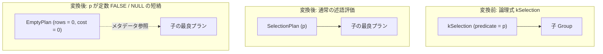

# selection

- 状態: done   /   執筆基準リビジョン: `3880673` (2026-09-12)
- 定義位置: `plan/implementation_rules.cpp` の `DefaultImplementationRules()` 内の登録 `"selection"`（パターンは `cascades::dsl::Selection()`）

## 概要

論理選択演算子 `kSelection`（フィルタ）に対し、タプルを 1 パスで順次走査して述語を評価する物理実行計画 `SelectionPlan` を生成する物理実装 Rule です。

述語が定数評価可能であり、三値論理における偽または UNKNOWN（NULL）と判定される場合は、子サブツリーの走査を完全に省略する `EmptyPlan` への短絡実装を生成します。

## 変換前後の関係



## 適用条件

パターンは単一入力を保持する `Selection()` です。実装ラムダにおいて以下のガード条件を判定します。

```cpp
          if (children.size() != 1 || !logical.predicate) {
            return std::vector<PlanAlternative>{};
          }
```

述語が定数値式（`kConstantValue`）である場合、値の真偽判定を行います。

```cpp
          if ((*logical.predicate)->Type() == TypeTag::kConstantValue) {
            const Value value =
                (*logical.predicate)->AsConstantValue().GetValue();
            if (value.IsNull() || !value.Truthy()) {
              Plan empty = std::make_shared<EmptyPlan>(children[0].plan);
              return std::vector<PlanAlternative>{
                  PlanAlternative{.plan = std::move(empty),
                                  .local_cost = 0,
                                  .estimated_rows = 0}};
            }
          }
```

1. **子式数の制約**: 入力関係が厳密に 1 つであること。
2. **述語の存在**: `logical.predicate` が有効な式ポインタを保持していること。
3. **定数短絡判定**: 述語が `kConstantValue` であり、`value.IsNull()` または `!value.Truthy()` の場合は `EmptyPlan` を生成。

## 意味論的根拠と三値論理の保証

### 1. 三値論理（SQL 3-Valued Logic）と NULL / FALSE の等価性
SQL 標準において、`WHERE` 句等の選択述語は真（TRUE）と評価された行のみを通過させます。評価結果が偽（FALSE）または未定（UNKNOWN / NULL）となった行はすべて破棄されます。

したがって、述語が定数 NULL または定数偽値である場合、子ノードがいかなるタプルを返却しようとも出力行数は厳密に 0 行となります。本 Rule は `value.IsNull() || !value.Truthy()` を検出した時点で `EmptyPlan` へ短絡させ、不要な子関係のテーブルスキャンや式評価を完全に抑止します。

### 2. 定数 TRUE の非短絡性
述語が定数 TRUE の場合、すべての行が通過するため `EmptyPlan` へ短絡してはなりません。また、`SelectionPlan` 自体の除去（削除）は論理書き換え Rule である `eliminate_true_selection` の責務です。実装層である本 Rule は、定数 TRUE であっても `SelectionPlan` を忠実に生成し、オプティマイザの責任分担を明確に保ちます。

### 3. タプル順序プロパティの透過伝播
選択演算はタプルの並び順序を変更しません。`SelectionPlan::IsOrderedBy` は `src_->IsOrderedBy(...)` を呼び出して子ノードの順序判定へ委譲するため、上位オペレータから要求されたソート順序プロパティ（`ordering`）を破壊することなく維持します。

## 実装の詳細

通常時は `SelectionPlan` を構築し、統計情報に基づいて選択後の行数を推定します。

```cpp
          Plan selection = std::make_shared<SelectionPlan>(
              children[0].plan, *logical.predicate,
              children[0].plan->GetStats());
          const double input = children[0].estimated_rows;
          const auto emitted = static_cast<double>(selection->EmitRowCount());
          return std::vector<PlanAlternative>{
              PlanAlternative{.plan = std::move(selection),
                              .local_cost = input,
                              .estimated_rows = emitted}};
        },
        c::LogicalOperator::kSelection));
```

- **物理計画ノード**: `SelectionPlan`（`plan/selection_plan.hpp`）を生成します。実行時は `SelectionExecutor` が各タプルに対して述語を評価します。
- **局所コスト計算**:
  ```cpp
  local_cost = input; // children[0].estimated_rows
  ```
  全入力タプルを走査して述語判定を行う 1 パス分のコストを計上します。`EmptyPlan` への短絡時はコスト 0.0 です。
- **カーディナリティ推定**:
  ```cpp
  estimated_rows = selection->EmitRowCount();
  ```
  `SelectionPlan` の構築時に `stats_.Filter(src_->GetSchema(), exp_)` が呼び出され、述語の選択度（selectivity）を反映した推移行数が算出されます。

## 最適化効果

`SelectionPlan` によりフィルタリングされた行数が上位ノード（Join、Aggregate、Sort）へ伝播されることで、後続オペレータのコスト見積もりが抑制されます。また、定数偽値・NULL に対する短絡が適用された場合、下位テーブルの全件スキャンやディスク I/O が完全に回避されます。

## 関連 Rule との相互作用

- `merge_selections` / `merge_adjacent_filters`: 複数の選択条件を連言（AND）で合成し、物理層での多重 `SelectionPlan` 生成を防止します。
- `push_selection_into_scan`: 単一リレーションに対する述語を走査ノード（Scan）へ押し下げ、`SelectionPlan` 自体の生成を不要化します。
- `eliminate_false_selection` / `eliminate_true_selection`: 定数述語を論理層で事前に除去・短絡する Rule 群です。本 Rule の `EmptyPlan` 枝は論理層を通過した定数式に対するフォールバックとして機能します。
- `empty`: 論理空演算子 `kEmpty` に対し同一の `EmptyPlan` を生成する物理実装 Rule です。

## 検証テスト

- `plan/optimizer_test.cpp`:
  - `OptimizerTest.ConstantFalseSelectionBecomesEmptyPlan`: 定数 0 の述語が `EmptyPlan`（実行時 `EmptyResult`）となり、テーブル走査が実行されないことを検証。
  - `OptimizerTest.ContradictoryConjunctsBecomeEmptyResult`: `c1 = 10 AND c1 = 11` などの矛盾連言が 0 行短絡されることを確認。

