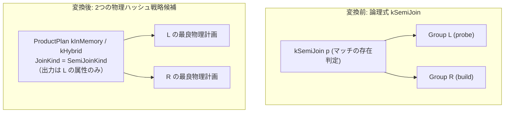

# semi_hash_join

- 状態: draft / 執筆基準リビジョン: `3880673` (2026-09-12)
- 定義位置: `plan/implementation_rules.cpp` の `DefaultImplementationRules()` 内（登録名 `"semi_hash_join"`、パターンは `cascades::dsl::SemiJoin()`、実装は共有ヘルパー `JoinAlternatives(..., hash=true, kind=JoinAlternativeKind::kSemi)` に委譲）

## 概要

`semi_hash_join` は、論理存在半結合演算 `kSemiJoin`（右側リレーションに結合条件を満たす行が存在する左側行のみを出力する演算）を、`SemiJoinKind` を備えた物理ハッシュ結合計画 `ProductPlan` へと変換する実装 Rule です。`EXISTS` サブクエリや `IN` サブクエリが論理層で半結合へと変形された後、インメモリおよびハイブリッドスピルの物理ハッシュ結合戦略を生成してコスト評価の対象とします。

## 変換前後の関係

論理式 `kSemiJoin` から等値キーを抽出し、右側入力（ビルド側）でハッシュ表を構築して左側入力（プローブ側）を走査する `ProductPlan` を生成します。出力スキーマは左側リレーションの属性のみで構成され、右側の属性は一切含まれません。



## 適用条件

パターンは 2 つの子ノードを持つ `SemiJoin()` です。適用条件のガード判定は `plan/implementation_rules.cpp` の登録ラムダおよび `JoinAlternatives` 内で評価されます。

```cpp
          if (children.size() != 2 || required.require_row_position) {
            return std::vector<PlanAlternative>{};
          }
          return JoinAlternatives(memo, logical.children[1], logical.predicate,
                                  children[0], children[1], context, true,
                                  false, false, JoinAlternativeKind::kSemi);
```

1. **子ノード数と物理要求**: 子ノードが正確に 2 つであり、かつ `required.require_row_position`（RID または物理行位置の保持要求）が課されていないこと。
2. **等値キー対の存在**: 述語内に列参照同士の等値比較（`=` または NULL 安全な `IS NOT DISTINCT FROM`）が 1 対以上抽出できること。
3. **残余述語の非存在**: 半結合（非 inner 種別）では、等値キー以外の残余述語（residual）が存在しないこと。

```cpp
  // A semi/anti hash join emits only the probe side. A residual predicate
  // mentioning the build side cannot be evaluated after that reduction, so
  // leave such shapes for the existing relational fallback until a
  // residual-aware mark join is available.
  if (kind != JoinAlternativeKind::kInner && residual) {
    return {};
  }
```

残余述語が存在する場合、本 Rule は候補計画を返却しません。

## 意味論的根拠と多重度保存（D6）

半結合の実行意味論は、左側（プローブ側）の各行に対し、右側（ビルド側）に一致する行が「少なくとも 1 行存在するか」のみを判定することです。右側に複数行の一致が存在しても、左側行の出力多重度は 1 であり、複製されてはなりません。

通常のハッシュ内部結合では、等値キー以外の非等値述語を残余述語として結合ノードの直上に配置される `SelectionPlan` で事後評価できます。しかし半結合では、結合ノードの出力時点でビルド側の属性がすべて破棄されます。ビルド側の列を参照する残余述語を上流の `SelectionPlan` で評価することは構造的に不可能です。もし残余述語を無視して半結合を適用すれば述語評価が脱落し、上流に配置すれば未束縛列参照エラーや誤ったフィルタリングを引き起こします。そのため、残余述語を伴う形状をガードで明示的に排除し、関係代数フォールバックへと委ねることで意味論的一致を保証します。

また、右側テーブルの結合キーに NULL が含まれる場合、三値論理に基づき通常の等値比較（`=`）は UNKNOWN となり一致とはみなされません。NULL 安全等値比較（`IS NOT DISTINCT FROM`）が指定された場合は NULL 同士の一致が許容され、この差異は `ProductPlan` に保持される `equality_null_safe` フラグを通じて実行エンジンへ伝達されます。

## 実装の詳細

`JoinAlternatives` は `kind == JoinAlternativeKind::kSemi` を受けると、物理ノードへ `SemiJoinKind()` を設定して `ProductPlan` を構築します。

```cpp
        JoinKind physical_kind = AntiJoinKind();
        if (kind == JoinAlternativeKind::kSemi) {
          physical_kind = SemiJoinKind();
        } else if (kind == JoinAlternativeKind::kLeftOuter) {
```

インメモリ戦略（`kInMemory`）とハイブリッド戦略（`kHybrid`）の双方が生成されます。局所コスト（`local_cost`）は走査コスト $|L| + |R|$ を基本とし、インメモリ戦略においてビルド側の推定フットプリントがメモリ予算を超過する場合はスピルペナルティ（$|R| 	imes 3$）が加算されます。

推定出力行数は、左側行数 $|L|$ と等値キーのカーディナリティ推定値の最小値として算出されます。

```cpp
      const double estimate =
          kind == JoinAlternativeKind::kAnti
              ? l_rows
              : (kind == JoinAlternativeKind::kLeftOuter ||
                         kind == JoinAlternativeKind::kRightOuter ||
                         kind == JoinAlternativeKind::kFullOuter
                     ? std::max(l_rows, r_rows)
                     : std::min(l_rows, equi_estimate));
```

右側の一致件数がいかに多くとも左側の入力行数 $|L|$ を超えることはないため、`std::min(l_rows, equi_estimate)` によって出力行数に上限をかけます。

物理特性の伝播において、`ProductPlan::IsOrderedBy` は semi/anti 結合の場合にプローブ側（左子）の順序プロパティをそのまま継承します（`plan/product_plan.cpp` の `IsSemiOrAnti` 分岐）。右側の結合処理によって左側の順序が破壊されないため、上流のソート要求を満たすための追加コストを抑制できます。

## 最適化効果

相関サブクエリ（左側 1 行ごとに右側をスキャン・探索するネステッドループ処理）を、1 回のハッシュテーブル構築と 1 パスのプローブ処理へと変換します。計算量は $O(|L| 	imes |R|)$ から $O(|L| + |R|)$ へと大幅に低減されます。また、右側に同一キーの重複行が大量に存在する場合でもハッシュ探索で最初の 1 件が一致した時点でプローブ側タプルを出力できるため、不要な走査が早期打ち切りされます。

## 関連 Rule との相互作用

- `semi_merge_join`: 同一の `kSemiJoin` 論理式に対する競合物理実装 Rule。入力がすでにキー順序を持つ場合や、非等値残余述語を含む場合に優位となります。
- `anti_hash_join`: 否定存在判定（一致しない行を出力）を行う対称的な実装 Rule。
- `in_list_to_semi_join` / `apply_to_join` / `intersect_to_semijoin`: サブクエリや IN 述語を論理 `kSemiJoin` へと引き上げる論理変換 Rule。本 Rule はこれらによって生成された論理ノードの受け皿となります。
- `mark_join_to_filter`: マーク結合をセミ結合またはアンチ結合へと簡約化する論理 Rule。

## 検証テスト

- `plan/optimizer_test.cpp`:
  - `OptimizerTest.CascadesSemiAndAntiJoinImplementationsUseHashJoinKind`: `kSemiJoin` 式が `SemiJoinKind` を持つ `ProductPlan` に実装され、出力スキーマ幅が左側テーブルと完全に一致することを検証。
  - `OptimizerTest.InSubqueryBecomesSemiJoin`: IN サブクエリがオプティマイザ全体を通じてハッシュセミ結合へと正しく落とし込まれることを検証。
  - `OptimizerTest.CorrelatedExistsBecomesSemiJoin`: 相関 EXISTS サブクエリがセミ結合として最適化されることを検証。
  - `HashJoinKindTest.SemiJoinEmitsProbeRowOnceAndNullNeverMatches`: 右側に重複行が存在しても左側行が 1 度だけ出力されること、および NULL 同士が等値比較で一致しない実行時意味論を検証。
