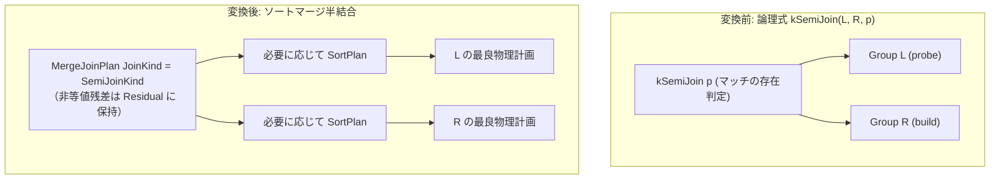

# semi_merge_join

- 状態: draft / 執筆基準リビジョン: `3880673` (2026-09-12)
- 定義位置: `plan/implementation_rules.cpp` の `DefaultImplementationRules()` 内（登録名 `"semi_merge_join"`、パターンは `cascades::dsl::SemiJoin()`、実装は共有ヘルパー `MergeJoinAlternative(..., kind=JoinAlternativeKind::kSemi)` に委譲）

## 概要

`semi_merge_join` は、論理存在半結合演算 `kSemiJoin`（右側に入力が存在する左側行のみを出力する演算）を、両入力を結合キー順序で走査・マージ照合する物理計画 `MergeJoinPlan`（`SemiJoinKind`）へと変換する実装 Rule です。ハッシュテーブルを構築せず、ソート済み入力に対してストリーミング処理で存在判定を実行します。

## 変換前後の関係

論理式 `kSemiJoin` を `MergeJoinPlan` に実装します。両入力が要求されるキー順序を持たない場合は、子ノードの上に `SortPlan` を挿入して順序を満たします。非等値述語などの残余条件はノード内部の `Residual` に保持されます。



## 適用条件

パターンは 2 子ノードを持つ `SemiJoin()` です。適用条件のガード判定は `MergeJoinAlternative`（`plan/implementation_rules.cpp`）で評価されます。

```cpp
          if (children.size() != 2 || required.require_row_position) {
            return std::vector<PlanAlternative>{};
          }
          return MergeJoinAlternative(
              memo, logical.children[1], logical.predicate, children[0],
              children[1], context, JoinAlternativeKind::kSemi);
```

1. **子ノード数と物理要求**: 子ノードが正確に 2 つであり、かつ `required.require_row_position`（行位置保持要求）がないこと。
2. **等値キー対の存在**: 結合述語から 1 対以上の等値結合キー（`=`）が抽出できること。
3. **残余述語内のサブクエリ禁止**: 半結合（非 inner 種別）では残余述語を `MergeJoinPlan` の内部残差式（`merge_residual`）として保持しますが、残余述語内にサブクエリ式（`ResidualContainsQuery`）が含まれる場合は代替計画を返却しません。

```cpp
  // Non-inner merge joins carry the residual inside the plan node so the
  // executor can apply it while pairing (outer NULL-padding and semi/anti
  // matching respect it). Inner keeps the plain merge + Selection shape.
  Expression merge_residual;
  if (kind != JoinAlternativeKind::kInner && !residual_conjuncts.empty()) {
    if (std::ranges::any_of(residual_conjuncts, [](const Expression& conjunct) {
          return ResidualContainsQuery(conjunct);
        })) {
      return {};
    }
    merge_residual = CombineConjuncts(residual_conjuncts);
    residual_conjuncts.clear();
  }
```

## 意味論的根拠と実行時契約

ハッシュ半結合では出力スキーマから右側属性が破棄されるため、右側列を参照する非等値残余述語を外部の `SelectionPlan` で事後評価することが不可能でした。これに対しマージ半結合では、実行エンジン（`MergeJoinExecutor`）が左右の行をペアリング（照合）しているまさにその瞬間に、照合対象タプルに対して残差述語を直接評価できます。したがって、不等値述語を `MergeJoinPlan::Residual` に格納することで、意味論を損なうことなく残差付き半結合を実行可能です。

ただし、マージ結合エンジンの残差評価器はインメモリのスカラー式評価のみをサポートしており、サブクエリの実行経路（関係代数エンジンの再帰呼出し）を持っていません。そのため、`ResidualContainsQuery` によってサブクエリを含む残余述語を検出し、未定義動作を防ぐために適用を禁止しています。

また、マージ走査の前提として左右の入力ストリームが同一のキー順序でソートされている必要があります。順序が保証されない場合は `SortPlan` を挿入して物理契約を強制します。

## 実装の詳細

推定出力行数は、等値キーによる `JoinCardinality` の計算結果と、左側（プローブ側）の推定行数 $|L|$ の最小値として算出されます。

```cpp
  if (kind == JoinAlternativeKind::kAnti) {
    estimated_rows = left.estimated_rows;
  } else if (kind == JoinAlternativeKind::kSemi) {
    estimated_rows = std::min(left.estimated_rows, estimated_rows);
  }
```

局所コスト（`local_cost`）は、左右の走査コスト $|L| + |R|$ に加え、入力ノードがキー順序を満たしていない場合に挿入される `SortPlan` のソート費用（$N \log_2 N$）を加算した値となります。

```cpp
  double local_cost = left.estimated_rows + right.estimated_rows;
  if (!left_ordered) {
    local_cost += left.estimated_rows *
                  std::log2(std::max(2.0, left.estimated_rows));
  }
  if (!right_ordered) {
    local_cost += right.estimated_rows *
                  std::log2(std::max(2.0, right.estimated_rows));
  }
```

生成される物理計画 `MergeJoinPlan` は `physical_kind = SemiJoinKind()` を持ち、出力スキーマは左側リレーションの属性のみで構成されます。

## 最適化効果

左右の入力がインデックススキャンや先行するソート処理などによってあらかじめ結合キー順に並んでいる場合、追加のソートやハッシュテーブルのメモリ確保を一切行わず、固定メモリ量かつ $O(|L| + |R|)$ のストリーミング処理で半結合を完了できます。大量データを扱う場合でもメモリフットプリントを最小化できる利点があります。

## 関連 Rule との相互作用

- `semi_hash_join`: 同一の `kSemiJoin` に対するハッシュ実装。残余述語を持たない一般的な等値半結合では、入力が無順序のときにハッシュ版が低コストとなり選定されます。非等値残余述語が存在する場合はハッシュ版がガードで弾かれるため、本 Rule が唯一の結合代替となります。
- `merge_join` / `anti_merge_join`: `MergeJoinAlternative` を共有する内部結合およびアンチ結合の実装 Rule。
- `sort_merge_of_compatible_orders`: ソート順序要求を標準化し、マージ結合が採択されやすいプラン木を形成する論理 Rule。

## 検証テスト

- `plan/optimizer_test.cpp`:
  - `OptimizerTest.MergeSemiJoinRuleBuildsSortedProbeOnlyPlan`: プローブ側の属性のみを出力スキーマに持ち、適切なソート順序を要求する計画が生成されることを検証。
  - `OptimizerTest.MergeSemiJoinRuleCarriesInequalityResidual`: 等値結合キーと不等値残余述語が共存する場合、残差が `MergeJoinPlan` の内部残差式へと正しく格納されることを検証。
- `plan/plan_test.cpp`:
  - `PlanTest.MergeSemiAndAntiJoinPlansExposeProbeSchema`: `MergeSemiJoin` 物理計画がプローブ側のスキーマのみを外部へ公開することを検証。
