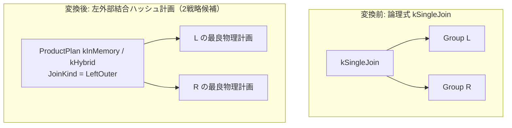

# single_hash_join

- 状態: draft / 執筆基準リビジョン: `3880673` (2026-09-12)
- 定義位置: `plan/implementation_rules.cpp` の `DefaultImplementationRules()` 内（登録名 `"single_hash_join"`、パターンは `cascades::dsl::SingleJoin()`、実装は共有ヘルパー `JoinAlternatives(..., hash=true, kind=JoinAlternativeKind::kLeftOuter)` に委譲）

## 概要

`single_hash_join` は、論理単一行結合演算 `kSingleJoin`（右側入力が高々 1 行であることを前提とし、左側各行に対して一致行を結合するか NULL 拡張を行う単一行外部結合）を、左外部結合（`LeftOuterJoinKind`）としての物理ハッシュ結合計画 `ProductPlan` へと変換する実装 Rule です。スカラサブクエリの平坦化に伴って現れる単一行保証付きの結合演算を物理実行計画へと落とし込みます。

## 変換前後の関係

論理式 `kSingleJoin` から等値キーを抽出し、左外部結合として動作する `ProductPlan`（インメモリ `kInMemory` およびハイブリッドスピル `kHybrid`）を生成します。



## 適用条件

パターンは 2 つの子ノードを持つ `SingleJoin()`（`plan/cascades.hpp`）です。ガード条件は `JoinAlternatives`（`plan/implementation_rules.cpp`）で評価されます。

```cpp
          if (children.size() != 2 || required.require_row_position) {
            return std::vector<PlanAlternative>{};
          }
          return JoinAlternatives(memo, logical.children[1], logical.predicate,
                                  children[0], children[1], context, true,
                                  false, false,
                                  JoinAlternativeKind::kLeftOuter);
```

1. **子ノード数と行位置要求**: 子ノードが 2 つであり、かつ `required.require_row_position`（RID または行位置の保持要求）が指定されていないこと。
2. **等値結合キーの存在**: 述語から 1 対以上の等値キーが抽出できること。
3. **残余述語の非存在**: 左外部結合（非 inner 種別）では、等値キー以外の残余述語（residual）が存在しないこと。

```cpp
  // A semi/anti hash join emits only the probe side. A residual predicate
  // mentioning the build side cannot be evaluated after that reduction, so
  // leave such shapes for the existing relational fallback until a
  // residual-aware mark join is available.
  if (kind != JoinAlternativeKind::kInner && residual) {
    return {};
  }
```

残余述語が存在する場合、本 Rule は代替計画を返却しません。

## 意味論的根拠と外部結合の整合性

左外部結合（LEFT OUTER JOIN）では、右側に一致行が存在しないプローブ側行に対して、右側の全属性を NULL でパディングして出力する必要があります。もし等値結合ノードの上位に配置された `SelectionPlan` で非等値の残余述語を評価すると、NULL パディングされた行が述語の三値論理評価（UNKNOWN）によってフィルタリングされ、左側行が意図せず脱落してしまいます。これは外部結合の意味論（左側行の完全保存）を破壊するため、残余述語を伴う形状は本 Rule から排除されています。

また、`kSingleJoin` は右側の入力が各プローブ行に対して「高々 1 行」であることを意味論的契約とします。本 Rule は物理ノードとして左外部結合（`LeftOuterJoinKind`）を割り当て、右側の多重度制約の担保は上流のサブクエリ変換や `max1_row` ノードに委ねています。

## 実装の詳細

`JoinAlternatives` において `kind == JoinAlternativeKind::kLeftOuter` として処理され、物理ノードには `LeftOuterJoinKind()` が渡されます。

```cpp
        join =
            std::make_shared<ProductPlan>(left.plan, left_columns, right.plan,
                                          right_columns, mode, physical_kind);
```

推定出力行数は、外部結合の一般規則に従い、左右の推定行数の最大値 `std::max(l_rows, r_rows)` として算出されます。

```cpp
      const double estimate =
          kind == JoinAlternativeKind::kAnti
              ? l_rows
              : (kind == JoinAlternativeKind::kLeftOuter ||
                         kind == JoinAlternativeKind::kRightOuter ||
                         kind == JoinAlternativeKind::kFullOuter
                     ? std::max(l_rows, r_rows)
                     : std::min(l_rows, equi_estimate));
```

局所コスト（`local_cost`）は $|L| + |R|$ であり、インメモリ戦略においてビルド側サイズがソフトメモリ予算を超過した場合はスピルペナルティが加算されます。

## 最適化効果

スカラサブクエリを含む式において、相関ループによる毎行再評価を解消し、1 回のビルドとプローブによる $O(|L| + |R|)$ の一括結合処理を実現します。

## 関連 Rule との相互作用

- `hash_join`: 内部結合（`kInner`）を対象とする基礎 Rule。
- `outer_hash_join`: 論理 `kOuterJoin` を同様に左外部結合として実装する兄弟 Rule。
- `max1_row`: スカラサブクエリにおいて右側が 1 行以下であることを実行時に検証・強制する物理ノード。

## 検証テスト

- `plan/cascades_test.cpp`:
  - `CascadesTest.SingleJoinAndMarkJoinAreBinaryLogicalOperators`: `kSingleJoin` が 2 子ノードを持つ論理演算子として Memo 内で正しく管理されることを検証。
