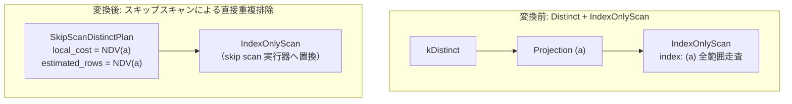

# skip_scan_distinct

- 状態: draft / 執筆基準リビジョン: `3880673` (2026-09-12)
- 定義位置: `plan/implementation_rules.cpp` の `DefaultImplementationRules()` 内（登録名 `"skip_scan_distinct"`、パターンは `cascades::dsl::Distinct()`）

## 概要

`skip_scan_distinct` は、単一列カバリングインデックスに対する重複排除演算 `kDistinct` を、インデックス走査器のスキップスキャン（同一キーのエントリ群を一括してシークで読み飛ばす走査）物理計画 `SkipScanDistinctPlan` へと変換する実装 Rule です。各タプルごとにハッシュテーブルへ登録・判定を行う代わりに、異なり数（NDV）の回数だけインデックスツリーのシークを行い、極めて低コストかつインデックス順序を保ったまま重複排除を実行します。

## 変換前後の関係

直下の走査計画が単一列の全範囲カバリング `IndexOnlyScanPlan`（間に単純な `ProjectionPlan` が挟まれている場合を含む）である場合、スキャンノードそのものを `SkipScanDistinctPlan` へと置換します。



## 適用条件

パターンは 1 つの子ノードを持つ `Distinct()` です。適用条件のガード判定は `plan/implementation_rules.cpp` の登録ラムダ内で厳格に評価されます。

```cpp
          std::vector<PlanAlternative> alternatives;
          if (children.size() != 1 || required.require_row_position) {
            return alternatives;
          }
          Plan scan_plan = children[0].plan;
          if (const auto* projection =
                  dynamic_cast<const ProjectionPlan*>(scan_plan.get())) {
            scan_plan = projection->GetSource();
          }
          const auto* index_only =
              dynamic_cast<const IndexOnlyScanPlan*>(scan_plan.get());
          if (index_only == nullptr) {
            return alternatives;
          }
```

1. **子ノード数と行位置要求**: 子ノードが 1 つであり、かつ `required.require_row_position`（RID または行位置の保持要求）が存在しないこと。
2. **対象スキャンの種別**: 子プラン（射影 1 層の透過を許容）が `IndexOnlyScanPlan` であること。
3. **インデックス構造と走査範囲**:
   - インデックスが削除エントリを保持しないこと（`!index.RetainsDeletedEntries()`）。
   - インデックスキーが単一列であること（`index.sc_.key_.size() == 1`）。
   - スキャン範囲が全範囲走査であること（`BeginKey()` および `EndKey()` が空）。
4. **対象列の一致**: スキャンの出力スキーマが 1 列のみであり、その列がテーブル本体の先頭インデックスキー列とオフセット一致すること。

```cpp
          const Index& index = index_only->GetIndex();
          if (index.RetainsDeletedEntries() || index.sc_.key_.size() != 1 ||
              !index_only->BeginKey().empty() ||
              !index_only->EndKey().empty()) {
            return alternatives;
          }
          const Schema& scan_schema = index_only->GetSchema();
          if (scan_schema.ColumnCount() != 1) {
            return alternatives;
          }
          const ColumnName distinct_column = scan_schema.GetColumn(0).Name();
          const Table* table = index_only->ScanSource();
          const int offset = table->GetSchema().Offset(distinct_column);
          if (offset < 0 ||
              index.sc_.key_.front() != static_cast<slot_t>(offset)) {
            return alternatives;
          }
```

## 意味論的根拠と物理走査の契約

スキップスキャンは、B+Tree などの索引構造において同一キーの重複葉エントリをシーケンシャル走査せず、現在キーの次のキー値へと直接シーク移動する物理走査アルゴリズムです。

ガード条件の根拠は以下の物理実行契約に基づきます。

1. **削除エントリ保持（`RetainsDeletedEntries`）の排除**: MVCC 等の都合で論理削除されたエントリがインデックスツリー上に残存している場合、テーブル本体を検証しないスキップスキャンを実行すると、すでにコミット済み行が存在しない「死んだキー値」を DISTINCT 結果として出力してしまう誤謬が生じます。
2. **全範囲走査・単一列キー**: `SkipScanDistinctExecutor` の現在の実行時契約は、境界キーなしの全キー走査かつ単一列の昇順走査に特化しています。境界条件付きスキャンに誤って適用すると、指定範囲外のキーまでシーク走査してしまう危険があります。
3. **行位置保持要求の排除**: スキップスキャンは重複行の走査そのものをスキップするため、スキップされた行の物理行位置（RID）は取得不能となります。カーソル操作等の文脈では結果を損なうため禁止されます。

## 実装の詳細

条件を満たした場合、`SkipScanDistinctPlan` を構築します。

```cpp
          std::vector<NamedExpression> select_items = index_only->SelectItems();
          if (select_items.empty()) {
            select_items.emplace_back(distinct_column.name,
                                      ColumnValueExp(distinct_column));
          }
          Plan skip_scan = std::make_shared<SkipScanDistinctPlan>(
              *table, index, index_only->GetStats(), index_only->IsAscending(),
              std::move(select_items), scan_schema);
          const double rows = std::max<double>(
              1.0,
              static_cast<double>(index_only->GetStats().Column(0).Distinct()));
          return std::vector<PlanAlternative>{
              PlanAlternative{.plan = std::move(skip_scan),
                              .local_cost = rows,
                              .estimated_rows = rows}};
```

局所コスト（`local_cost`）および推定行数（`estimated_rows`）には、入力行数 $N$ ではなく、対象列の統計情報における異なり数（NDV: Number of Distinct Values）を採用します（統計欠落時は下限値 1.0）。各キー値につき 1 回のツリーシークが発生するため、コストを NDV に比例させるモデルとなっています。

さらに、`SkipScanDistinctPlan::IsOrderedBy` は昇順スキャンの場合に「対象列の昇順順序」を物理プロパティとして申告します。これにより、上位の `ORDER BY a` クエリに対して追加のソートノード挿入を不要とします。

## 最適化効果

全行数 $N$ に対して異なり数 $V$ が非常に小さい（重複度が高い）データセットにおいて、計算量を全行ハッシュ判定の $O(N)$ やソートの $O(N \log N)$ から、シーク走査の $O(V \log N)$ へと劇的に低減します。さらにハッシュテーブル用のメモリ確保が不要となり、出力順序として昇順がそのまま保証されます。

## 関連 Rule との相互作用

- `distinct` / `sort_distinct`: 同一の `kDistinct` に対する競合実装。一般テーブルスキャンや複合列重複排除ではこれらが採択されますが、単一列カバリングインデックスが存在する場合は本 Rule が最低コストで勝利します。
- `index_scan`: 本 Rule の適用前提となる `IndexOnlyScanPlan` を供給する物理スキャン Rule。
- `push_filter_through_distinct`: 述語を DISTINCT の下位に押し込む論理 Rule。ただしフィルタの押し込みによってスキャンに範囲制約が付与された場合、本 Rule の全範囲走査ガードによりスキップスキャンは適用対象外となります。

## 検証テスト

- `plan/plan_extra_test.cpp`:
  - `SkipScanDistinctPlanExtraTest.StatsDrivenRowCountsAndOrdering`: `SkipScanDistinctPlan` が統計に基づく NDV 行数見積もりと昇順順序プロパティを正しく申告することを検証。
