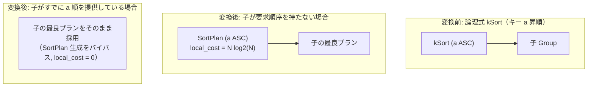

# sort

- 状態: draft   /   執筆基準リビジョン: `3880673` (2026-09-12)
- 定義位置: `plan/implementation_rules.cpp` の `DefaultImplementationRules()` 内の登録 `"sort"`（パターンは `cascades::dsl::Sort()`）

## 概要

論理ソート演算子 `kSort`（ORDER BY 句に対応）を物理実行計画 `SortPlan` へ具現化する物理実装 Rule です。

入力子ノードがすでに要求されたソート順序を満たしている場合（`IsOrderedBy` による順序プロパティの事前成立）、ソート演算子の挿入を完全に省略して子ノードをそのまま返却します（ローカルコスト 0）。Cascades フレームワークにおける物理要求（Physical Properties）と enforcement の協調動作を象徴する実装です。

## 変換前後の関係



## 適用条件

パターンは単一の子を持つ `kSort` ノードです（`plan/implementation_rules.cpp`）。

```cpp
          if (children.size() != 1 ||
              logical.target_list.size() != logical.sort_ascending.size()) {
            return std::vector<PlanAlternative>{};
          }
```

適用判定（guard）は以下の整合性を確認します。
1. **単一入力**: 子ノード数が厳密に 1 であること。
2. **キーと方向ベクトルの整合**: ソート対象属性配列（`target_list`）と昇順・降順指定フラグ配列（`sort_ascending`）の要素数が完全に一致していること。

## 意味論的根拠と順序充足判定

### 1. 順序充足時のバイパス（Zero-Cost Alternative）
親ノードが要求する整序関係が、子ノードの物理出力特性（例: B+Tree 索引スキャンによるインオーダー出力や、事前ソート済みマージ結合の出力）によって既に満たされている場合、同一属性に対する再ソートは純粋に冗長な計算となります。

```cpp
          if (children[0].plan->IsOrderedBy(expressions,
                                            logical.sort_ascending)) {
            return std::vector<PlanAlternative>{
                PlanAlternative{.plan = children[0].plan,
                                .local_cost = 0,
                                .estimated_rows = children[0].estimated_rows}};
          }
```

`IsOrderedBy` が真を返す場合、追加の演算子ノードを配置せずに入力プランをそのまま返すことで、ローカルコスト 0 かつ追加メモリ消費ゼロの最適解を生成します。

### 2. コストモデルと安全網
順序が保証されていない場合は `SortPlan` を生成し、全件ソートの理論計算量に基づくコストを計上します。

$$\text{cost} = N \cdot \log_2(\max(2.0, N))$$

実行時パイプラインにおいても、プラン上に `SortPlan`（`SortExecutor`）が明示的に存在しない限りソート処理は行われないため、`IsOrderedBy` の判定は保守的（満たされていることが確実な場合のみ真を返す）に設計されています。

## 実装の詳細

ソートキー構造体 `SortKey` の配列を構築し、NULL の配置方針（`sort_nulls_first`）を含めて物理プランへ引き渡します。

```cpp
          std::vector<SortKey> keys;
          std::vector<Expression> expressions;
          for (size_t i = 0; i < logical.target_list.size(); ++i) {
            expressions.push_back(logical.target_list[i].expression);
            keys.push_back(
                SortKey{.expression = logical.target_list[i].expression,
                        .ascending = logical.sort_ascending[i],
                        .nulls_first = i < logical.sort_nulls_first.size()
                                           ? logical.sort_nulls_first[i]
                                           : std::nullopt});
          }
```

論理 `kSort` は探索過程において子ノードに対して順序要求を強制しません（`SearchEngine::RequiredChildProperties` では子に対する順序要求をリセットします）。したがって、本 Rule のバイパス判定は「子ノードが自発的に提供した順序（索引スキャン等）」を効率的に検知・活用する役割を果たします。

## 最適化効果

- **ソートコストの完全削減**: 索引スキャン等から得られる自然なキー順序を活用し、$O(N \log N)$ の外部ソート/インメモリソートの CPU・I/O 負荷を完全にゼロ化します。
- **パイプラインストリーミングの維持**: ソート演算子（パイプラインブレーカー）の介在を防ぎ、タプルが生成され次第即座にクライアントへ送出されるストリーミング実行を保護します。

## 関連 Rule との相互作用

- `index_scan`: キー順序の提供者（`provided_order`）として機能し、本 Rule のバイパス判定を誘発します。
- `topn`: ORDER BY と LIMIT が併存する場合に用いられる複合 Rule であり、全ソートを伴わない有界ヒープ処理を担います。
- `eliminate_double_sort` / `eliminate_sort_under_unordered_consumer`: 論理最適化フェーズにおいて冗長な `kSort` ノードを事前に剪定します。

## 検証テスト

`plan/plan_test.cpp` および `plan/optimizer_test.cpp` における以下のテストケースで検証されています。

- `PlanTest.SortAndTopNPlansReportSortedPrefixes`:
  `SortPlan` がソートキーの前方一致に対して正しく順序成立を申告することを確認します。
- `PlanTest.IsOrderedByComparesNullPlacement`:
  NULLS FIRST / LAST の指定を含む順序適合性判定を検証します。
- `OptimizerTest.LimitWithOrderedIndexStreamsOnlyTopKRows`:
  索引スキャンからの順序供給によりソートが省略され、Top-K ストリーミングが成立することを確認します。
