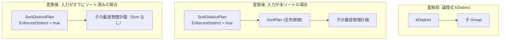

# sort_distinct

- 状態: draft / 執筆基準リビジョン: `3880673` (2026-09-12)
- 定義位置: `plan/implementation_rules.cpp` の `DefaultImplementationRules()` 内（登録名 `"sort_distinct"`、パターンは `cascades::dsl::Distinct()`）

## 概要

`sort_distinct` は、重複排除演算 `kDistinct` を、全列昇順ソートと隣接行ストリーミング比較によって重複を排除する物理計画 `SortDistinctPlan` へと変換する実装 Rule です。ハッシュ重複排除（`distinct`）に対する代替実装であり、入力があらかじめ全列ソートされている場合は追加ソートを省略し、未ソートの場合は全列ソートノード `SortPlan` を挿入して物理契約を満たします。

## 変換前後の関係

論理式 `kDistinct` を受け取り、`SortDistinctPlan` を生成します。入力プランが全列ソートを満たしていない場合、直下に全列昇順の `SortPlan` が挟まれます。



## 適用条件

パターンは 1 つの子ノードを持つ `Distinct()` です（`plan/cascades.hpp`）。

```cpp
          if (children.size() != 1) {
            return std::vector<PlanAlternative>{};
          }
```

ガード条件は子ノード数が 1 であることのみです。入力プランがすでにソートされているかどうかは発火条件ではなく、ノード生成時の分岐およびコスト計算に反映されます。

## 意味論的根拠と多重度保存（D6）

重複排除（DISTINCT）の意味論は、タプルの全属性値が一致する同一タプル群から代表 1 行のみを残し、多重度を 1 に削減することです。全属性をソートキーとして昇順ソートを実行すれば、同一の値を持つ重複タプルは物理ストリーム上で必ず連続して出現します。したがって、実行エンジン（`SortDistinctExecutor`）は直前に出力した 1 行のみをバッファに保持して比較するだけで、ハッシュテーブルを用いずに重複を完全に排除できます。

ソートキーが全列の一部のみであった場合、射影されていない属性も含めて同一行であるかが判定できず、重複判定に誤りが生じます。そのため、本 Rule は入力スキーマの全列を明示的にソートキーとして抽出します。

```cpp
          const Schema& schema = children[0].plan->GetSchema();
          std::vector<Expression> ordering;
          std::vector<SortKey> keys;
          ordering.reserve(schema.ColumnCount());
          keys.reserve(schema.ColumnCount());
          for (size_t i = 0; i < schema.ColumnCount(); ++i) {
            const ColumnName column = schema.GetColumn(i).Name();
            ordering.push_back(ColumnValueExp(column));
            keys.push_back(SortKey{.expression = ColumnValueExp(column),
                                   .ascending = true,
                                   .nulls_first = std::nullopt});
          }
```

## 実装の詳細

子プランが全列ソート順序を満たしているかを `input->IsOrderedBy(ordering, ascending)` で検査します。満たしていない場合のみ `SortPlan` を挿入し、ソート計算コスト（$N \log_2 N$）を `local_cost` に加算します。

```cpp
          Plan input = children[0].plan;
          double cost = children[0].estimated_rows;
          const std::vector<bool> ascending(ordering.size(), true);
          if (!input->IsOrderedBy(ordering, ascending)) {
            const double rows = children[0].estimated_rows;
            cost += rows * std::log2(std::max(2.0, rows));
            input =
                std::make_shared<SortPlan>(std::move(input), std::move(keys));
          }
          Plan distinct = std::make_shared<SortDistinctPlan>(std::move(input));
          return std::vector<PlanAlternative>{
              PlanAlternative{.plan = std::move(distinct),
                              .local_cost = cost,
                              .estimated_rows = children[0].estimated_rows}};
```

- **局所コスト（`local_cost`）**: ストリーミング重複排除自体の走査費用（`children[0].estimated_rows`）に、未ソート時の外部ソート費用 $N \log_2 N$ を加算。
- **推定出力行数（`estimated_rows`）**: 統計からの正確な縮小率が未定であるため、保守的に入力行数 `children[0].estimated_rows` を維持。

`SortDistinctPlan`（`plan/sort_distinct_plan.hpp`）は `EnforcesDistinct() == true` を返し、出力順序特性としては子のソート順序をそのまま保持・公開します。

## 最適化効果

メモリフットプリントが直前 1 行分のみに限定されるため、大量データセットでハッシュテーブルがメモリ予算を超過してスピルするような状況において、ハッシュ DISTINCT（`distinct`）よりも安定した性能を提供します。特に入力があらかじめインデックス走査等でソートされている場合は、ソート処理自体がバイパスされるため最低コストとなります。

## 関連 Rule との相互作用

- `distinct`: ハッシュテーブルを用いた同一論理演算の競合実装。小規模データセットや順序の揃っていない入力ではハッシュ版が低コストとなり選ばれます。
- `skip_scan_distinct`: 単一列インデックスに対するスキップスキャン実装。カバリングインデックスが存在する場合はスキップスキャンが優先されます。
- `index_scan`: ソート済みストリームを供給し、本 Rule におけるソートノード挿入を抑制します。

## 検証テスト

- `plan/optimizer_test.cpp`:
  - `OptimizerTest.SortDistinctRuleAddsSortForUnorderedInput`: 未ソート入力に対して `"sort_distinct"` を適用した際、`SortDistinctPlan` の直下に `SortPlan` が自動挿入されることを検証。
