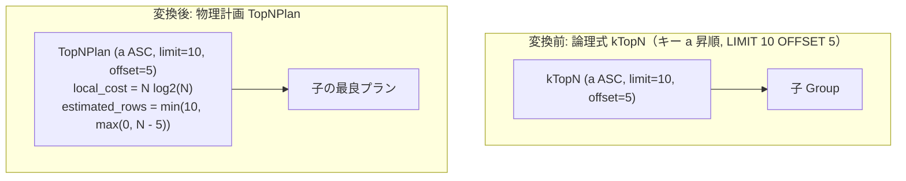

# topn

- 状態: draft   /   執筆基準リビジョン: `3880673` (2026-09-12)
- 定義位置: `plan/implementation_rules.cpp` の `DefaultImplementationRules()` 内の登録 `"topn"`（パターンは `cascades::dsl::TopN()`）

## 概要

論理演算子 `kTopN`（ORDER BY と LIMIT の融合形）を物理実行計画 `TopNPlan` へ具現化する物理実装 Rule です。

全データソートを実行した後に先頭行を切り出す方式に代わり、有界優先度付きキュー（サイズ $k = \text{OFFSET} + \text{LIMIT}$ のインメモリヒープ）を用いて入力ストリームを単一パス走査します。また、下位の子ノードへ `limit_hint`（Top-K ヒント）を伝播させることで、下層スキャンの早期打ち切りを誘発します。

## 変換前後の関係



## 適用条件

パターンは単一の子を持つ `kTopN` ノードです（`plan/implementation_rules.cpp`）。

```cpp
          if (children.size() != 1 ||
              logical.target_list.size() != logical.sort_ascending.size() ||
              logical.limit_count == 0) {
            return std::vector<PlanAlternative>{};
          }
```

適用判定（guard）は以下の 3 条件を確認します。
1. **単一入力**: 子ノード数が厳密に 1 であること。
2. **キー整合性**: ソート属性配列と方向配列の要素数が一致していること。
3. **正の行数制限**: `limit_count != 0` であること。

## 意味論的根拠と安全性制約

### 1. `limit_count == 0` の排除理由
オプティマイザの内部データ表現において、`limit_count == 0` は「LIMIT 指定なし（OFFSET のみ指定）」を意味します。

「先頭 $M$ 行をスキップし、残りの全行を出力する」という操作は、有界ヒープに上位 $K$ 行のみを保持する TopN アルゴリズムでは実現できません（スキップ境界以降の不確定多数行をすべて保持・走査する必要があるため）。したがって、OFFSET のみのクエリを誤って `TopNPlan` に流すと結果の脱落を招くため、これらは `kLimit` 経由で汎用の `LimitPlan` に委譲されます。

### 2. WITH TIES（同順位行の保持）の伝播
`WITH TIES` 句が指定されている場合、境界行と同一のソートキーを持つすべてのタプルを出力に含める必要があります。このフラグは `logical.with_ties` を介して `TopNPlan` に伝達され、`TopNPlan::EnforcesLimit()` を偽に倒すことで、下流エンジンが厳格な件数打ち切りを行わないよう制御されます。

## 実装の詳細

キー定義を `TopNKey` 構造体へ変換し、`TopNPlan` を生成します。

```cpp
          std::vector<TopNKey> keys;
          for (size_t i = 0; i < logical.target_list.size(); ++i) {
            keys.push_back(
                TopNKey{.expression = logical.target_list[i].expression,
                        .ascending = logical.sort_ascending[i],
                        .nulls_first = i < logical.sort_nulls_first.size()
                                           ? logical.sort_nulls_first[i]
                                           : std::nullopt});
          }
          Plan topn = std::make_shared<TopNPlan>(
              children[0].plan, std::move(keys), logical.limit_count,
              logical.limit_offset, logical.with_ties);
          const double rows = children[0].estimated_rows;
          return std::vector<PlanAlternative>{PlanAlternative{
              .plan = std::move(topn),
              .local_cost = rows * std::log2(std::max(2.0, rows)),
              .estimated_rows = LimitOutputRows(rows, logical.limit_count,
                                                logical.limit_offset)}};
```

### コストと行数見積もり
- **ローカルコスト**: コストモデル上は安全側の上界として全ソートと同等の $N \log_2 N$ を計上します。TopN の優位性は、子ノードへプッシュされる `limit_hint` によって入力行数（$N$）そのものが削減される点に現れます。
- **出力行数**: `LimitOutputRows` により、OFFSET 減算後の行数と LIMIT 値の最小値が算出されます。

## 最適化効果

- **メモリ使用量の有界化**: 全タプルを蓄積するソートバッファが不要となり、最大でも $\text{OFFSET} + \text{LIMIT}$ 行分のヒープ領域のみで処理が完了します。
- **Top-K 下位伝播による I/O 削減**: 探索エンジン（`SearchEngine::RequiredChildProperties`）がキー順序と `limit_hint` を子ノードへ引き渡すことで、下流の B+Tree インデックススキャンが先頭 $K$ 件を読み込んだ時点で即座にスキャンを終了できます。

## 関連 Rule との相互作用

- `sort`: LIMIT を伴わない単純な整序処理を担当します。
- `limit_push_through_sort`: 論理最適化フェーズにおいて `Limit(Sort(X))` を `kTopN` へ先行融合します。
- `index_scan`: 親から伝播された `limit_hint` を受け取り、索引スキャンを早期終了させる最大の協調相手です。

## 検証テスト

`plan/cascades_test.cpp` 等における以下のテストケースで検証されています。

- `CascadesTest.TopNPropagatesItsKeysAndLimitToTheChild`:
  ソートキーおよび `limit_hint` が子グループの物理要求へ正しく伝播することを確認します。
- `CascadesTest.TopNLimitHintPropagation`:
  $\text{LIMIT } 3 + \text{OFFSET } 2$ から $\text{limit\_hint} = 5$ が算出されることを確認します。
- `CascadesTest.TopNWithTiesCarriesPayload`:
  `with_ties` フラグがフィンガープリントおよび物理プランへ正しく引き継がれることを確認します。
