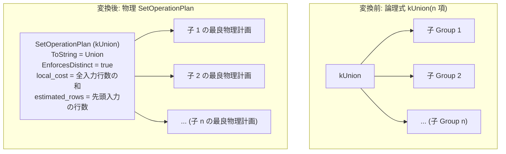

# union

- 状態: draft / 執筆基準リビジョン: `3880673` (2026-09-12)
- 定義位置: `plan/implementation_rules.cpp` の `DefaultImplementationRules()` 内（登録名 `"union"`、パターンは `cascades::dsl::Union()`、実装は集合演算共有ヘルパー `implement_set_operation` に委譲）

## 概要

`union` は、重複排除を伴う論理和集合演算 `kUnion` を、物理集合演算計画 `SetOperationPlan`（演算種別 `SetOperationKind::kUnion`）へと変換する実装 Rule です。SQL の UNION は任意項数（$n \ge 2$）の入力を受け取るため、本 Rule は $n$ 個の子プランを束ねる単一の物理ノードを生成します。

## 変換前後の関係

任意項数の論理式 `kUnion` を、重複排除を行う物理ノード `SetOperationPlan` に変換します。各子ノードの最良物理計画がそのまま入力スロットへと割り当てられます。



## 適用条件

パターンは `plan/cascades.hpp` の `Union()`（子パターン `{}` により任意項数を受け付け）です。ガード条件は `implement_set_operation`（`plan/implementation_rules.cpp`）で判定されます。

```cpp
          if (children.size() < 2) {
            return std::vector<PlanAlternative>{};
          }
          SetOperationKind operation{};
          switch (logical.operation) {
            case LogicalOperator::kUnion:
              operation = SetOperationKind::kUnion;
              break;
            // ...(省略: 他の集合演算分岐)...
            default:
              return std::vector<PlanAlternative>{};
          }
```

1. **項数の下限**: 子ノード数が 2 以上であること。
2. **演算種別の適合**: 論理演算子が `LogicalOperator::kUnion` であること。

## 意味論的根拠と多重度保存（D6）

SQL 標準における `UNION` は bag（多重集合）ではなく set（集合）としての和を定義するため、各入力に現れる重複行および入力間で重複する行をすべて排除し、多重度を 1 に圧縮しなければなりません。

生成される `SetOperationPlan`（`plan/set_operation_plan.hpp`）は `EnforcesDistinct() == true` を返し、実行エンジン（`SetOperationExecutor`）が内部ハッシュテーブルによって重複行を排除することを明示します。

```cpp
  [[nodiscard]] bool EnforcesDistinct() const override {
    return operation_ == SetOperationKind::kUnion ||
           operation_ == SetOperationKind::kIntersect ||
           operation_ == SetOperationKind::kExcept;
  }
```

重複行を残す `UNION ALL`（`kUnionAll`）とは意味論および多重度保存の契約が根本から異なるため、論理演算子および物理ノードの段階で厳密に区分されます。

また、集合演算ノードに対して探索器 `SearchEngine::RequiredChildProperties` は「子の順序プロパティを出力に伝播しない」契約をとるため、子ノードには順序要求を課しません。出力の整序が必要な場合は、本ノードの上位に配置されるエンフォースメント（ソートノード）が担当します。

## 実装の詳細

`implement_set_operation` は全入力プランを集約して `SetOperationPlan` を構築します。

```cpp
          std::vector<Plan> plans;
          plans.reserve(children.size());
          double input_rows = 0;
          for (const BestPlan& child : children) {
            Plan plan = child.plan;
            plans.push_back(std::move(plan));
            input_rows += child.estimated_rows;
          }
          Plan set_operation = std::make_shared<SetOperationPlan>(
              std::move(plans), operation, std::move(order_keys));
          const double output_rows = operation == SetOperationKind::kUnionAll
                                         ? input_rows
                                         : children.front().estimated_rows;
          return std::vector<PlanAlternative>{
              PlanAlternative{.plan = std::move(set_operation),
                              .local_cost = input_rows,
                              .estimated_rows = output_rows}};
```

- **局所コスト（`local_cost`）**: 全入力プランの推定行数の総和 `input_rows`。全入力を走査してハッシュ登録・判定を行う計算コストを表現します。
- **推定出力行数（`estimated_rows`）**: 先頭入力の推定行数 `children.front().estimated_rows`。重複排除の程度に応じた正確な統計値が存在しない場合の保守的概算値として設定されます。

## 最適化効果

任意の $n$ 項の和集合式を 1 個の `SetOperationPlan` ノードに集約して一度に処理します。さらに、論理書き換え Rule `union_to_union_all_plus_distinct` が適用された場合、本 Rule の直接実装と「`union_all` + `distinct`（ハッシュまたはソート）」の 2 段階実装が Memo 内でコスト競争を行い、最適な実行パスが採択されます。

## 関連 Rule との相互作用

- `union_all`: 重複排除を行わない bag 和集合の実装 Rule。
- `intersect` / `except`: 同一のヘルパー関数 `implement_set_operation` を共有する集合演算兄弟 Rule。
- `union_to_union_all_plus_distinct`: 論理層において `UNION` を `UNION ALL + DISTINCT` へと展開する等価変換 Rule。
- `push_filter_past_setop`: 和集合ノードの下位の各大枝へフィルタ述語を押し込む論理 Rule。

## 検証テスト

- `plan/cascades_test.cpp`:
  - `CascadesTest.SetOperationValidatesArityRelationsAndDropsProperties`: 集合演算が項数を検証し、子への不要な物理プロパティ伝播を行わないことを検証。
  - `CascadesTest.UnionDistinctRewriteAddsUnionAllAndDistinctAlternative` / `CascadesTest.UnionDistinctHashSortChoice`: `UNION` に対して直接実装と `UNION ALL + DISTINCT` 展開が競合・選択される挙動を検証。
- `plan/plan_test.cpp`:
  - `PlanTest.SetOperationPlanPublishesNumericCommonSchema`: 複数入力間で共通の出力スキーマが正しく決定・公開されることを検証。
