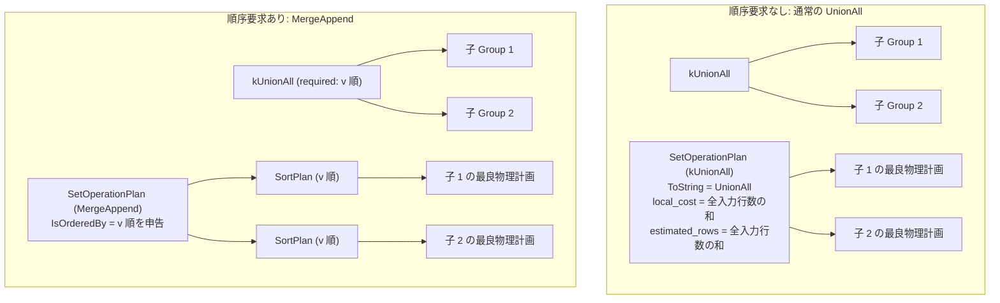

# union_all

- 状態: draft / 執筆基準リビジョン: `3880673` (2026-09-12)
- 定義位置: `plan/implementation_rules.cpp` の `DefaultImplementationRules()` 内（登録名 `"union_all"`、パターンは `cascades::dsl::UnionAll()`、実装は集合演算共有ヘルパー `implement_set_operation` に委譲）

## 概要

`union_all` は、重複を排除しない論理多重和集合演算 `kUnionAll`（bag 連結）を、物理計画 `SetOperationPlan`（演算種別 `SetOperationKind::kUnionAll`）へと変換する実装 Rule です。通常の連結走査（UnionAll）に加え、親ノードから出力順序が要求されている場合には各入力をキー順にソートして多方向マージ連結を行う `MergeAppend` 計画候補を生成する特有の能力を持ちます。

## 変換前後の関係

論理式 `kUnionAll` を `SetOperationPlan` に変換します。順序要求が存在しない場合は単純なストリーム連結を行い、順序要求が存在する場合は各子ノードに必要な `SortPlan` を付与して `MergeAppend` として実装します。



## 適用条件

パターンは `plan/cascades.hpp` の `UnionAll()`（任意項数受け付け）です。ガード条件は `implement_set_operation`（`plan/implementation_rules.cpp`）で評価されます。

```cpp
          if (children.size() < 2) {
            return std::vector<PlanAlternative>{};
          }
```

1. **項数の下限**: 子ノード数が 2 以上であること。
2. **演算種別**: 論理演算子が `LogicalOperator::kUnionAll` であること。

MergeAppend 経路を有効化するための条件は、親ノードの要求プロパティ `required.ordering` が非空であることです。

```cpp
          if (operation == SetOperationKind::kUnionAll &&
              !required.ordering.empty()) {
            order_expressions.reserve(required.ordering.size());
            ascending.assign(required.ordering.size(), true);
            for (const ColumnName& column : required.ordering) {
              order_expressions.push_back(ColumnValueExp(column));
            }
            if (context.query != nullptr &&
                context.query->order_ascending_.size() == ascending.size()) {
              ascending = context.query->order_ascending_;
            }
            // ...(省略: order_keys の構築)...
          }
```

## 意味論的根拠と順序保存（MergeAppend）

`UNION ALL` は重複の排除を行わず、すべての入力行をそのまま保持・出力する bag 和集合です。重複行の破棄や集約を行わないため、入力行数の総和と出力行数が厳密に一致します。

`MergeAppend` への特有の適応が許されるのは `kUnionAll` に限定されます。`UNION` や `EXCEPT` などの重複排除を伴う演算では、行の重複判定と排除が出力ストリームの順序構造に干渉するため単純なマージ整列が成立しません。しかし `UNION ALL` では、各入力ストリームが同一のキー順序で整序されていれば、先頭要素同士を最小値比較しながらストリーミング走査するだけで、全体のソート順序を完全に保証できます。

各子プランが要求順序を満たしていない場合、本 Rule は子プランの直上に明示的に `SortPlan` を挿入します。

```cpp
          for (const BestPlan& child : children) {
            Plan plan = child.plan;
            if (!order_expressions.empty() &&
                !plan->IsOrderedBy(order_expressions, ascending)) {
              std::vector<SortKey> child_keys;
              child_keys.reserve(order_keys.size());
              for (const SortKey& key : order_keys) {
                child_keys.push_back(key);
              }
              plan = std::make_shared<SortPlan>(std::move(plan),
                                                std::move(child_keys));
            }
            plans.push_back(std::move(plan));
            input_rows += child.estimated_rows;
          }
```

もしこのソートノードの挿入を怠れば、整序されていない入力を受け取った `MergeAppendExecutor` が誤った順序でタプルを出力してしまい、上流のソートエンフォースメントを欺く結果となります。したがって各子への順序強制は正確性のための絶対条件です。

## 実装の詳細

`SetOperationPlan` は `order_keys_` が設定されている場合に `ToString()` として `"MergeAppend"` を返し、`IsOrderedBy` でその順序プロパティを外部へ公開します。

```cpp
std::string SetOperationPlan::ToString() const {
  if (operation_ == SetOperationKind::kUnionAll && !order_keys_.empty()) {
    return "MergeAppend";
  }
  // ...(省略)...
}
```

- **局所コスト（`local_cost`）**: 全入力行数の総和 `input_rows`（各子ノードでソートが挿入された場合はそのソートコストが子側の計画コストとして計上されます）。
- **推定出力行数（`estimated_rows`）**: `operation == SetOperationKind::kUnionAll` のため、全入力行数の和 `input_rows` がそのまま出力行数として正確に伝播されます。

```cpp
          const double output_rows = operation == SetOperationKind::kUnionAll
                                         ? input_rows
                                         : children.front().estimated_rows;
```

## 最適化効果

順序要求が存在する場合、全結合結果を一度バッファリングして全体ソート（$N_{\text{total}} \log N_{\text{total}}$）を実行する代わりに、各入力枝の既存インデックス順序を活用した $O(N_{\text{total}})$ のストリーミングマージを実行できます。枝があらかじめソートされている場合はソートコストを完全にゼロにできます。

## 関連 Rule との相互作用

- `union`: 重複排除を行う set 和集合の実装 Rule。順序付きマージ連結経路は持たず、ハッシュ重複排除を実行します。
- `union_all_merge`: ネストした複数の `kUnionAll` ノードを 1 つの多項 `kUnionAll` へと平坦化する論理 Rule。
- `push_limit_through_union_all` / `union_all_push_limit`: LIMIT を `UNION ALL` の各子枝へ押し込んで早期打ち切りを可能にする論理 Rule。
- `sort`: 各子枝の整序が必要な場合に挿入されるソートノード。

## 検証テスト

- `plan/cascades_test.cpp`:
  - `CascadesTest.UnionAllCanChooseMergeAppendForRequiredOrdering`: 順序要求がある場合に `MergeAppend` が物理計画として選ばれ、適切な順序プロパティを申告することを検証。
  - `CascadesTest.UnionAllMergeFlattensNestedBranches`: 入れ子の `kUnionAll` が適切にマージされる論理 Rule との整合性を検証。
  - `CascadesTest.UnionAllLimitCapsEveryChildAndKeepsGlobalLimit`: 子ごとの LIMIT 最適化と `UNION ALL` の相互作用を検証。
