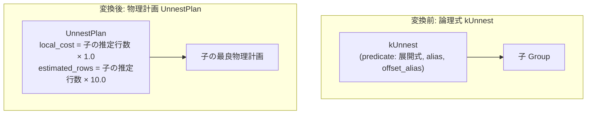

# unnest

- 状態: draft / 執筆基準リビジョン: `3880673` (2026-09-12)
- 定義位置: `plan/implementation_rules.cpp` の `DefaultImplementationRules()` 内（登録名 `"unnest"`、パターンは `cascades::dsl::Unnest()`、対応論理演算子は `LogicalOperator::kUnnest`）

## 概要

`unnest` は、配列や構造体等のコレクションを展開して複数行を生成する論理展開演算 `kUnnest` を、物理計画 `UnnestPlan` へと変換する実装 Rule です。各入力タプルからコレクション要素を 0 行以上の行ストリームへと展開し、要素のインデックスオフセット（`WITH ORDINALITY`）を付与する実行器 `UnnestExecutor` を生成します。

## 変換前後の関係

単項の論理式 `kUnnest`（展開式、展開先列名別名、オフセット列別名、出力スキーマを保持）を受け取り、物理計画 `UnnestPlan` を生成します。



## 適用条件

パターンは 1 つの子ノードを持つ `Unnest()` です（`plan/cascades.hpp`）。

```cpp
          if (children.size() != 1) {
            return std::vector<PlanAlternative>{};
          }
```

適用条件は子ノード数が 1 であることのみです。論理ノードのペイロード（`logical.predicate` に格納された展開対象式、`logical.unnest_alias`、`logical.offset_alias`、`logical.output_schema`）がそのまま物理ノードへ引き渡されます。

## 意味論的根拠とカーディナリティ膨張モデル

`UNNEST` は 1 つの入力タプルに対してコレクションの要素数に応じた 0 行以上のタプルを出力する関係展開演算です。

コレクションの実際の要素数分布は実行時まで不明であるため、オプティマイザは設計方針（`plan/unnest_plan.hpp` の `EmitRowCount` 契約）に基づき、1 入力行あたり平均 10 行の要素が生成されると仮定する固定膨張率（10.0倍）を採用しています。

```cpp
          const double rows = children[0].estimated_rows * 10.0;
```

UNNEST ノードの上流に結合や集約が配置される場合、入力行数が激増する影響をオプティマイザが見積もれるようにすることが不可欠です。もし入力行数をそのまま出力行数として見積もると、上流のコスト評価が過度に楽観的になり、メモリ不足や高コストなネステッドループ結合を誤って選択する原因となります。

なお、`UnnestPlan` は基底クラス `PlanBase` の `IsOrderedBy` をオーバーライドしていません。したがって順序プロパティは上位へ継承されず、順序要求がある場合は上位のエンフォースメントによってソートが手配されます。

## 実装の詳細

`plan/implementation_rules.cpp` の実装コードは以下のとおりです。

```cpp
          Expression unnest_expr =
              logical.predicate ? *logical.predicate : nullptr;
          Plan plan = std::make_shared<UnnestPlan>(
              children[0].plan, std::move(unnest_expr), logical.unnest_alias,
              logical.offset_alias, logical.output_schema);
          const double rows = children[0].estimated_rows * 10.0;
          return std::vector<PlanAlternative>{
              PlanAlternative{.plan = std::move(plan),
                              .local_cost = children[0].estimated_rows * 1.0,
                              .estimated_rows = rows}};
```

- **局所コスト（`local_cost`）**: 子ノードの入力行数に 1.0 を乗じた値（`children[0].estimated_rows * 1.0`）。入力ストリームを 1 パス走査してコレクションを展開・送出する処理コストを表します。
- **推定出力行数（`estimated_rows`）**: 入力行数の 10 倍（`children[0].estimated_rows * 10.0`）。

実行時には `UnnestPlan::EmitExecutor`（`executor/relational_factory.cpp`）が `UnnestExecutor` をインスタンス化し、行ごとのイテレーション処理を行います。

## 最適化効果

`kUnnest` に対する唯一の物理実装を提供し、SQL の FROM 句に現れる UNNEST 構文の物理実行を可能にします。論理 Rule `unnest_filter_pushdown` が事前に適用されていれば、展開前にフィルタリングが行われるため、入力行数および 10 倍に膨張した後の行数がともに最小化されます。

## 関連 Rule との相互作用

- `apply`: サブクエリ展開を行う相関結合実装 Rule。
- `dummy_scan`: FROM 句に他の実テーブルが存在せず、`UNNEST` がクエリの唯一のソースである場合に直下に配置される 1 行ダミースキャン。
- `unnest_filter_pushdown`: UNNEST の直上にあるフィルタ述語を展開前の下位ノードへ押し込む論理 Rule。

## 検証テスト

- `query/query_test.cpp`:
  - `QueryTest.CascadesOptimizesUnnestPlans`: UNNEST 構文を含むクエリが Cascades オプティマイザを通じて物理実行計画へと正常に最適化・実行されることを検証。
- `plan/cascades_test.cpp`:
  - `CascadesTest.UnnestFilterPushdown`: フィルタ述語の押し込み後においても `kUnnest` 式が安定して保持されることを検証。
