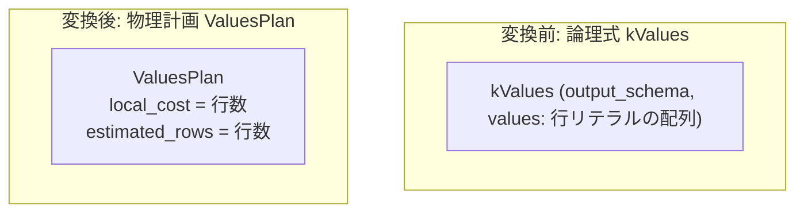

# values

- 状態: draft / 執筆基準リビジョン: `3880673` (2026-09-12)
- 定義位置: `plan/implementation_rules.cpp` の `DefaultImplementationRules()` 内（登録名 `"values"`、パターンは `cascades::dsl::Values()`、対応論理演算子は `LogicalOperator::kValues`）

## 概要

`values` は、クエリ計画時に確定している定数リレーション論理ノード `kValues` を、メモリ上の固定行セットを出力する物理走査計画 `ValuesPlan` へと変換する実装 Rule です。SQL の `VALUES` 句、IN 述語の定数展開テーブル、および実体化 CTE（Materialized Common Table Expression）の共有行セルがこの Rule によって物理計画化されます。

## 変換前後の関係

子ノードを持たない葉の論理式 `kValues`（出力スキーマと行データのリストを保持）を、物理計画 `ValuesPlan` に変換します。



## 適用条件

パターンは葉ノードを表す `Values()` です（`plan/cascades.hpp`）。ガード条件は子ノードが存在しないことのみです。

```cpp
        "values", c::dsl::Values(),
        [](c::GroupId, const c::Memo&, const c::Bindings&,
           const c::LogicalExpression& logical,
           const std::vector<BestPlan>& children, const PhysicalProperties&,
           const c::RuleContext&) {
          if (!children.empty()) {
            return std::vector<PlanAlternative>{};
          }
```

## 意味論的根拠と定数リレーション契約

`kValues` は、計画時にすべての属性値と行が確定している完全な静的リレーションを表します。実行時にストレージエンジンからのページ読み出しや MVCC 可視性チェックを必要としないため、I/O 待ちや並行性異常は発生しません。

一方で、行リテラルには物理ストレージ上のレコード識別子（RID）が存在しないため、物理プロパティ `require_row_position`（行位置保持要求）を満たすことはできません。この検査は呼び出し側の単一リレーション高速パス（`OptimizeSingleRelation`）等で検証され、行位置が要求された場合には `Status::kNotImplemented` が返却されます。

また、行数が 0 または 1 の場合、重複が存在し得ないため `ValuesPlan::EnforcesDistinct()` は真となります。オプティマイザの論理特性推定においても、`values.size() <= 1` の `kValues` には `max_1_row` 特性が付与され、スカラサブクエリの単一行保証ノード（`max1_row`）を省略する最適化が可能となります。

## 実装の詳細

`plan/implementation_rules.cpp` の実装コードは以下のとおりです。

```cpp
          Plan plan = std::make_shared<ValuesPlan>(logical.output_schema,
                                                   logical.values);
          return std::vector<PlanAlternative>{PlanAlternative{
              .plan = std::move(plan),
              .local_cost = static_cast<double>(logical.values.size()),
              .estimated_rows = static_cast<double>(logical.values.size())}};
        },
        c::LogicalOperator::kValues));
```

- **局所コスト（`local_cost`）**: 格納されている行数 `logical.values.size()`。
- **推定出力行数（`estimated_rows`）**: 格納されている行数 `logical.values.size()`。

`ValuesPlan`（`plan/values_plan.hpp`）における行数契約は以下のとおりであり、アクセス行数と出力行数が完全に一致します。

```cpp
  [[nodiscard]] size_t AccessRowCount() const override { return rows_.size(); }
  [[nodiscard]] size_t EmitRowCount() const override { return rows_.size(); }
```

主な利用コンテキストは以下のとおりです。

1. **実体化 CTE（M4）**: 実体化された CTE の行セルを全参照先で共有する葉ノード。
2. **IN リストの半結合化（`in_list_to_semi_join`）**: IN 述語の定数リストを 1 列テーブルへと変換したノード。
3. **UNION 定数統合（`values_fold_into_union`）**: 複数の定数枝を 1 つに折りたたんだノード。

## 最適化効果

静的データをストレージアクセスなしで即座に走査可能とし、行数見積もりも $100\%$ 正確に提供されます。上流の結合や集約において行数の不確実性に起因する誤った計画選択を完全に排除します。

## 関連 Rule との相互作用

- `constant_table`: 論理演算子 `kConstantTable` を処理する兄弟実装 Rule。
- `dummy_scan`: 列を持たず 1 行のみを出力する退化形式の静的スキャン Rule。
- `in_list_to_semi_join`: IN リストから `kValues` を生成する論理 Rule。
- `values_fold_into_union`: 複数の `kValues` 枝を 1 つにマージする論理 Rule。

## 検証テスト

- `plan/cascades_test.cpp`:
  - `CascadesTest.DummyScanAndValuesHavePhysicalImplementationRules`: `kValues` 式が `ValuesPlan` に正常に実装されることを検証。
- `plan/plan_test.cpp`:
  - `PlanTest.ValuesPlanEmitsTypedMultiColumnRowsAndValidatesWidth`: `ValuesPlan` が型付き複数列タプルを正確に出力しスキーマ幅を検証することをテスト。
