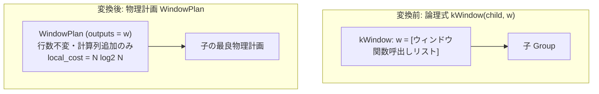

# window

- 状態: draft / 執筆基準リビジョン: `3880673` (2026-09-12)
- 定義位置: `plan/implementation_rules.cpp` の `DefaultImplementationRules()` 内（登録名 `"window"`、パターンは `cascades::dsl::Window()`、対応論理演算子は `LogicalOperator::kWindow`）

## 概要

`window` は、ウィンドウ関数の計算を行う論理演算ノード `kWindow` を、物理計画 `WindowPlan` へと変換する実装 Rule です。ウィンドウ評価は入力行数を変更せず、入力タプルごとに関数計算結果の新規列を追加します。内部のパーティション整列費用を外部ソート（$N \log_2 N$）と同等に見積もり、正規評価器 `WindowExecutor` への委譲を通じて SQL 標準に準拠したウィンドウ計算を実行します。

## 変換前後の関係

単項の論理式 `kWindow`（ターゲットリストに対象ウィンドウ関数を保持）を受け取り、物理計画 `WindowPlan` を生成します。



## 適用条件

パターンは 1 つの子ノードを持つ `Window()` です（`plan/cascades.hpp`）。ガード判定は `plan/implementation_rules.cpp` の登録ラムダで評価されます。

```cpp
          if (children.size() != 1 || required.require_row_position ||
              logical.target_list.empty()) {
            return std::vector<PlanAlternative>{};
          }
          for (const NamedExpression& item : logical.target_list) {
            if (!item.expression ||
                item.expression->Type() != TypeTag::kWindowFunctionExp) {
              return std::vector<PlanAlternative>{};
            }
          }
```

1. **子ノード数と行位置要求**: 子ノードが 1 つであり、かつ `required.require_row_position`（RID または行位置の保持要求）が存在しないこと。
2. **ターゲットリストの非空性**: `logical.target_list` が空でないこと。
3. **全要素の関数種別**: ターゲットリスト内のすべての要素が `TypeTag::kWindowFunctionExp`（ウィンドウ関数式）であること。

通常の射影式（スカラー計算等）が混在している場合、本 Rule は適用されません。これらは先行する論理 Rule（`split_window` 等）によって事前に分離・正規化されている必要があります。

## 意味論的根拠と物理実行の契約

ウィンドウ評価器（`WindowExecutor`）は、入力ストリームに対してウィンドウ関数の計算結果列を 1 呼出しにつき 1 列ずつ追記するストリーミング/バッファリング評価器です。

ガード条件および物理契約の根拠は以下のとおりです。

1. **全出力列がウィンドウ式であること**: `WindowPlan` の実行器はウィンドウ関数の集約・順位付け専用のアルゴリズムであり、一般の射影計算パスを持ちません。通常のスカラー式が混入した場合に正しく評価できないため、純粋なウィンドウ関数呼び出しのみで構成されるノードに限定されます。
2. **行数保存（Row Preservation）**: ウィンドウ関数は集約関数とは異なり、入力行を折りたたまず、入力されたすべての行に対して結果値を返却します。したがって出力行数は入力行数と厳密に等しくなります。
3. **フレーム境界と NULL 順序**: 実行エンジンは関係代数パスと共通の正準評価器（canonical evaluator）を使用するため、`PARTITION BY`、`ORDER BY`、フレーム指定（`ROWS` / `RANGE`）、および NULL の配置順序に関する意味論が完全に保存されます。

## 実装の詳細

`plan/implementation_rules.cpp` の実装コードは以下のとおりです。

```cpp
          Plan window = std::make_shared<WindowPlan>(children[0].plan,
                                                     logical.target_list);
          const double rows = children[0].estimated_rows;
          const double cost = rows * std::log2(std::max(2.0, rows));
          return std::vector<PlanAlternative>{
              PlanAlternative{.plan = std::move(window),
                              .local_cost = cost,
                              .estimated_rows = rows}};
```

- **推定出力行数（`estimated_rows`）**: 入力行数 `children[0].estimated_rows` をそのまま引き継ぎます。
- **局所コスト（`local_cost`）**: パーティション内ソートを前提とし、外部ソート相当の $N \log_2 N$（`rows * std::log2(std::max(2.0, rows))`）を見積もります。`std::max(2.0, rows)` は極小行数におけるゼロ除算や負数コストを防止する下限ガードです。

順序プロパティの伝播に関して、`WindowPlan::IsOrderedBy` は子の順序判定へ素通し（委譲）します。ウィンドウ計算は列の追記のみであり、基礎入力行の順序関係を破壊しないためです。

## 最適化効果

論理層のウィンドウ最適化（パーティション共有や不要ウィンドウ除去）によって再編成された `kWindow` 式を、確実に物理実行可能な `WindowPlan` へと具現化します。コストモデルが $N \log_2 N$ を反映するため、オプティマイザは複数のウィンドウ関数の集約やソート共有の優劣を的確に比較評価できます。

## 関連 Rule との相互作用

- `split_window`: 異なる `PARTITION BY` / `ORDER BY` 仕様を持つ複数のウィンドウ関数を個別の `kWindow` ノードへと分割し、本 Rule の適用前提を整える論理 Rule。
- `merge_adjacent_windows`: 同一のパーティション仕様を持つ連続した `kWindow` ノードを 1 つにマージする論理 Rule。
- `no_op_window_elimination`: 空のウィンドウノードを消去する論理 Rule。
- `window_frame_sort_sharing`: フレーム間のソートを共有して実行負荷を削減する論理 Rule。
- `sort`: 本 Rule と同一の $N \log_2 N$ コスト式を持つ物理ソート実装 Rule。

## 検証テスト

- `query/query_test.cpp`:
  - `QueryTest.SqlEngineWindowRankingPlansThroughCascades`: RANK 等の順位付けウィンドウ関数が Cascades を経由して正常に `WindowPlan` として計画されることを検証。
  - `QueryTest.SqlEngineWindowFunctionsPartitionRankAndCumulativeSum`: パーティション順位および累積和の正確な実行意味論を検証。
- `executor/executor_test.cpp`:
  - `ExecutorTest.RelationalWindowFunctionKeepsSpilledRows`: 一時領域へのスピルが発生する大規模データセットにおけるウィンドウ実行の頑健性を検証。
- `plan/cascades_test.cpp`:
  - `CascadesTest.WindowAndSpoolAreUnaryLogicalOperators`: `kWindow` が単項論理演算子として Memo 内で適切に管理されることを検証。
