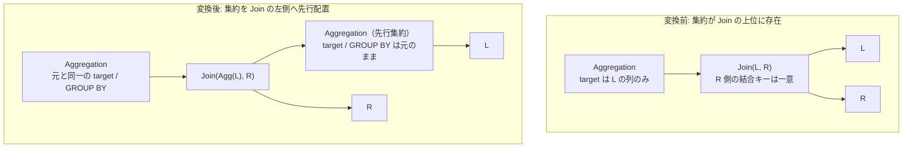

# aggregate_join_transpose

- 状態: draft / 執筆基準リビジョン: `3880673` (2026-09-12)
- 定義位置: `plan/cascades.cpp` の `RuleSet::Default()`（登録名: `"aggregate_join_transpose"`）

## 概要

`Aggregation(Join(L, R))` の論理構造に対し、結合に先立って集約を先行評価する等価式 `Aggregation(Join(Aggregation(L), R))` を Memo に導出・登録する論理探索 Rule です。

結合が外部キー制約に基づき 1:N 関係であり、かつ集約のターゲットリストが「1 側」（左側）の属性のみを参照している場合、行の結合前にグループ化集約を完了させることで結合演算への入力行数を劇的に圧縮します。

## 変換前後の関係



## 適用条件

パターンは `Aggregation(Any("input"))`、ターゲットヒントは `LogicalOperator::kAggregation` です。入力 Group 内の候補式を走査し、以下の guard 条件をすべて満たす `kJoin`（2 分木）に対してのみ発火します。

1. **内部結合の限定**:
   対象が `LogicalOperator::kJoin` であること。外部結合（`kOuterJoin`）は明示的に除外されます。
2. **右側結合キーの一意性証明**:
   結合述語から右側リレーションの列を抽出し、それらが右辺の論理プロパティ上で一意性（ユニーク制約または主キー）を満たすことを証明できること。

   ```cpp
   if (right_join_cols.empty() ||
       !memo.Get(right_id).logical_properties.IsUniqueOn(
           right_join_cols)) {
     continue;
   }
   ```

3. **ターゲットリストの左側属性局所性**:
   集約の全ターゲット式が参照する列集合（`TouchedColumns`）が、左側リレーションの属性のみで構成されていること。

   ```cpp
   bool only_left = true;
   for (const auto& target : expression.target_list) {
     if (!target.expression) {
       continue;
     }
     for (const auto& col : target.expression->TouchedColumns()) {
       if (std::ranges::find(left_rels, col.schema) ==
           left_rels.end()) {
         only_left = false;
         break;
       }
     }
   ```

4. **循環抑止**:
   導出される派生 Group が元の Group や既存の入力 Group と一致しないこと。

## 意味論的根拠と多重度・例外保護

本 Rule の適用条件における最重要事項は、**多重度（cardinality）の不変性と行複製による集約値の汚染防止**です。

```cpp
// D5 (docs/design.md): aggregate_join_transpose is gated OFF until the
// 1:N precondition is proven from constraints; the transposed aggregate
// inflates SUM/COUNT when the join multiplies rows.
```

もし右側の結合キーが一意でない場合、結合演算によって左側の同一行が複数回複製される可能性があります。結合前に行われた集約は「結合によって複製される前の行」を対象に `COUNT` や `SUM` を計算するため、結合後に集約した場合と比較して集約結果が不当に過小評価（または過大評価）され、クエリ結果が破壊されます。したがって、スキーマ制約からの厳格な一意性証明が成立する場合にのみ変換が許可されます。

また、外部結合に対する適用を禁止する理由も同様です。

```cpp
// D5 counterexample: aggregate_join_transpose must NOT push aggregation
// below an outer join. The aggregation would lose NULL-padded rows.
```

外部結合によって生成される NULL 補完行は結合前に左リレーション単独で算出することが不可能です。先行集約を行ってしまうと、マッチしなかった右行に対応する NULL 補完結果が集約から欠落します。

## 実装の詳細

先行集約ノードは、左側 Group を単一の子として、元の集約のターゲットリストおよび `grouping_sets` を引き継いで構築され、新たな Group `agg_left_group` に登録されます。

```cpp
memo.AddExpression(
    agg_left_group,
    LogicalExpression{.operation = LogicalOperator::kAggregation,
                      .children = {left_id},
                      .target_list = expression.target_list,
                      .grouping_sets = expression.grouping_sets});
```

続いて、この先行集約 Group と右側 Group を子とする結合ノードが生成され、最後に最上位の集約ノードが元の Group へと登録されます。元のプラン構造と転置後のプラン構造が同一 Group 内で並行して保持され、コストモデルに基づき物理プランが比較されます。

## 最適化効果

結合前の先行集約により、左側リレーションの行数をグループ数まで事前に絞り込むことができます。

特にディメンション表と大規模ファクト表のスター結合などにおいて、結合パイプラインを通過する中間データ量が激減し、ハッシュ表構築コストおよび結合プローブコストの劇的な低減をもたらします。

## 関連 Rule との相互作用

- `eager_aggregation_over_join`: 同様の先行集約を生成する双子ルールです。本 Rule が「ターゲットリストが左側のみ」を検査するのに対し、あちらは「GROUP BY キーが左側のみ」に着目します。
- `join_commutativity`: 結合の左右を反転させることで、本 Rule の先行集約対象となるリレーションの候補を拡張します。

## 検証テスト

- `plan/cascades_test.cpp` の `CascadesTest.AggregateJoinTranspose`: 制約による一意性証明が得られない形状において、変換が正しく抑止されることの検証。
- `plan/cascades_test.cpp` の `CascadesTest.AggregateJoinTransposeSkipsOuterJoin`: 外部結合に対して誤って発火しないことの検証。
