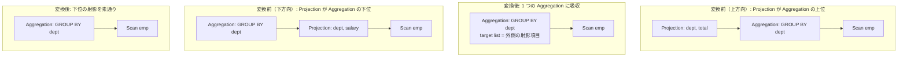

# aggregate_projection_merge

- 状態: draft / 執筆基準リビジョン: `3880673` (2026-09-12)
- 定義位置: `plan/cascades.cpp` の `RuleSet::Default()`（登録名: `"aggregate_projection_merge"`）

## 概要

隣接する `Projection`（射影）と `Aggregation`（集約）の 2 演算を 1 つの `Aggregation` ノードへと統合・吸収する論理最適化 Rule です。

射影が集約の直上に位置する場合（上方向のマージ）と、集約の直下に位置する場合（下方向のマージ）の双方向に対応し、中間の中継演算を排除してプラン構造を簡約化します。

## 変換前後の関係



## 適用条件

パターンは `Pattern::Any()` であり、任意のノードを対象としてラムダ式内部で以下の 2 分岐を判定します。

- **上方向（`kProjection` の式）**:
  1. 子ノードを 1 つだけ持ち、その子 Group（`agg_group_id`）が自分自身の Group ではないこと。
  2. 子 Group 内の `kAggregation` 式が子を 1 つだけ持ち、その子が現在の Group や集約 Group と一致しないこと（循環参照の抑止）。
- **下方向（`kAggregation` の式）**:
  1. 子ノードを 1 つだけ持ち、その子 Group（`proj_group_id`）が自分自身の Group ではないこと。
  2. 子 Group 内の `kProjection` 式が子を 1 つだけ持ち、その子が現在の Group や射影 Group と一致しないこと（循環参照の抑止）。

```cpp
// aggregate_projection_merge: Merge redundant Projection above or below
// Aggregation.
```

## 意味論的根拠と属性マッピングの同一性

本 Rule は、SQL の正規化プロセス（`HAVING` 句の展開や `SELECT` リストの属性エイリアス付与など）において生じる「集約出力に対する単純な射影・列選択」を対象としています。

上方向のマージでは、集約の直上に存在する射影のターゲットリストと出力スキーマをそのまま集約ノード自身に吸収させます。集約自体が出力タプルを生成する能力を備えているため、後続の独立した射影パスを省略しても計算される属性値の同一性が維持されます。

下方向のマージでは、集約ノードが下位の入力から直接必要な列を参照できるため、直下に挟まれた単純な列射影ノードをバイパスして集約の下位入力を直結させます。

循環防止ガード（子が自分自身と同一 Group でないことの検証）により、メモ構造内での自己参照ループの発生を厳格に遮断しています。

## 実装の詳細

上方向の分岐では、射影ノードの `target_list` と `output_schema` を集約ノードへ引き渡し、集約が持つ `partition_by` および `grouping_sets` を保持したまま、集約の子ノードを直結した `LogicalExpression` を現在の Group へ追加します。

```cpp
memo.AddExpression(
    group,
    LogicalExpression{.operation = LogicalOperator::kAggregation,
                      .children = agg.children,
                      .target_list = expression.target_list,
                      .output_schema = expression.output_schema,
                      .partition_by = agg.partition_by,
                      .grouping_sets = agg.grouping_sets});
```

下方向の分岐では、集約自身の `target_list` やプロパティを維持しつつ、子ノードの指定を射影の子（`proj.children`）へと差し替えて Memo に登録します。

## 最適化効果

直列する演算数が 2 から 1 へと削減されます。

タプル単位の不要な列コピー、メモリ再配置、およびエグゼキュータ間の関数呼び出しオーバーヘッドが消去され、メモリ局所性とスループットが向上します。

## 関連 Rule との相互作用

- `push_projection_through_aggregation`: 射影を集約の下位へ押し込む Rule です。本 Rule は隣接する射影の「吸収」を担当し、相補的に機能します。
- `merge_adjacent_projections`: 連続する射影同士の合成を担当します。

## 検証テスト

- `plan/cascades_test.cpp` の `CascadesTest.AggregateProjectionMerge`: 射影が集約ノードへ統合された等価式が Memo 内に正しく生成されることの検証。
