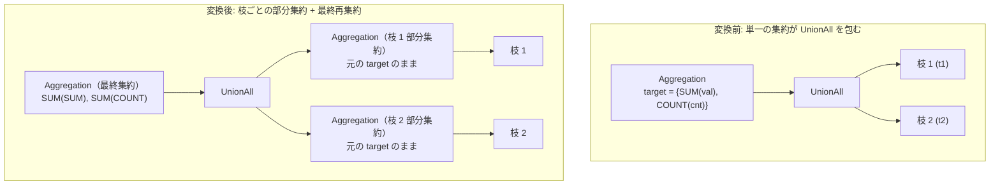

# aggregate_union_transpose

- 状態: draft / 執筆基準リビジョン: `3880673` (2026-09-12)
- 定義位置: `plan/cascades.cpp` の `RuleSet::Default()`（登録名: `"aggregate_union_transpose"`）

## 概要

`Aggregation(UnionAll(B1, B2, ...))` の論理木に対し、`UnionAll` の各入力枝へ部分集約を先行配置し、それらを `UnionAll` で連結した上で最終集約を行う 2 段階の集約構造 `Aggregation(UnionAll(Aggregation(B1), Aggregation(B2), ...))` を Memo に導出・登録する論理探索 Rule です。

代数学的に分配可能（distributive）な集約関数（`SUM`, `COUNT`, `MIN`, `MAX`）を対象とし、`COUNT` の再集約を `SUM` へと適切に読み替えることで、各枝におけるデータ圧縮とパイプラインの局所化を図ります。

## 変換前後の関係



## 適用条件

パターンは `Aggregation(Any("input"))`、ターゲットヒントは `LogicalOperator::kAggregation` です。以下の条件をすべて満たす場合にのみ発火します。

1. 集約ノードが子を 1 つ持ち、ターゲットリストが非空であり、入力 Group が自分自身でないこと。
2. 入力 Group 内の対象式が空でない子リストを持つ `kUnionAll` であること。
3. **集約関数の分配可能性検証**:
   ターゲットリスト内のすべての集約関数が、`DISTINCT` 修飾子、`HAVING` 修飾子、および `FILTER` 述語を持たず、関数の種類が `SUM`, `COUNT`, `MIN`, `MAX` のいずれかであること。

   ```cpp
   if (agg.GetType() != AggregationType::kSum &&
       agg.GetType() != AggregationType::kCount &&
       agg.GetType() != AggregationType::kMin &&
       agg.GetType() != AggregationType::kMax) {
     distributable = false;
     break;
   }
   ```

4. **全枝への適用完全性**:
   各枝に対する部分集約 Group の生成を試み、すべての枝に対して部分集約 Group が正常に作成できた場合（`pushed_aggs.size() == union_expr.children.size()`）に限り処理を続行します。
5. 生成される派生 Group が既存の Group と衝突しないこと（循環抑止）。

## 意味論的根拠と多重度・代数的再集約

集約を結合前に分配できるのは、部分結果の再集約（re-aggregation）によって全体の集約値が恒等的に復元できる代数的性質を満たす関数に限定されます。

- **`SUM`, `MIN`, `MAX`**: $\sum (A \cup B) = \sum A + \sum B$, $\min (A \cup B) = \min(\min A, \min B)$ が厳密に成立します。
- **`COUNT`**: 部分集合に対する `COUNT` の結果を再集約する際、最終段では件数を加算する必要があるため、関数種別を `COUNT` から `SUM` へと置換（読み替え）しなければなりません。
- **`DISTINCT` の排除**: `COUNT(DISTINCT x)` は分配不可能です。複数の枝に同一の値が存在する場合、枝ごとに独立して重複排除を行ってしまうと全体のユニークカウントよりも過大に計上され、結果が破壊されます。
- **全枝適用の必須性**: 一部の枝のみに部分集約を配置すると、未集約の行と集約済みのサマリ行が `UnionAll` に混在し、最終集約のセマンティクスが成立しなくなります。

## 実装の詳細

枝ごとの部分集約ノードは、元のターゲットリスト、出力スキーマ、`partition_by`、`grouping_sets` をそのまま保持して構築されます。

```cpp
memo.AddExpression(
    branch_agg, LogicalExpression{
                    .operation = LogicalOperator::kAggregation,
                    .children = {branch_id},
                    .target_list = expression.target_list,
                    .output_schema = expression.output_schema,
                    .partition_by = expression.partition_by,
                    .grouping_sets = expression.grouping_sets});
```

最終集約ノードでは、`COUNT` 集約を部分結果列に対する `SUM` 集約へと変換します。

```cpp
if (agg.GetType() == AggregationType::kCount) {
  final_targets.emplace_back(
      target.name,
      AggregateExpressionExp(
          AggregationType::kSum,
          ColumnValueExp(ColumnName(target.name))));
```

その他の分配可能関数（`SUM`, `MIN`, `MAX`）は同一の集約種別のまま、引数を部分集約の出力属性名へと差し替えます。

## 最適化効果

`UnionAll` に流入する前に各枝のタプル数がグループ数まで圧縮されるため、`UnionAll` の転送行数および最終集約のバッファリング負荷が大幅に軽減されます。

特に各枝が異なるストレージパーティションやテーブルを走査する場合、スキャン直後の並列部分集約が可能となり、クエリ全体の実行レイテンシが劇的に改善します。

## 関連 Rule との相互作用

- `push_aggregation_through_union_all`: 同様に集約を `UnionAll` の下位へ押し込む Rule ですが、再集約の target_list 読み替えを行わない設計であるため `COUNT` を除外する等の差異があります。
- `count_distinct_expansion`: `DISTINCT` 集約を事前に GROUP BY へと多段展開することで、本 Rule の適用契機を広げます。

## 検証テスト

- `plan/cascades_test.cpp` の `CascadesTest.AggregateUnionTranspose`: `SUM` および `COUNT` を含む集約式が `UnionAll` の各枝へと正しく分配され、最終集約の `COUNT` が `SUM` に変換された等価式が生成されることの検証。
