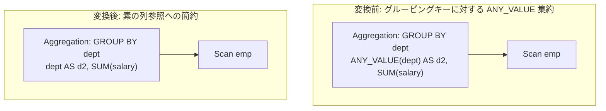

# any_value_elimination

- 状態: draft / 執筆基準リビジョン: `3880673` (2026-09-12)
- 定義位置: `plan/cascades.cpp` の `RuleSet::Default()`（登録名: `"any_value_elimination"`）

## 概要

集約演算 `Aggregation` のターゲットリスト内に含まれる `ANY_VALUE(grouping_key)` を、集約関数を介さない素の列参照 `grouping_key` へと簡約する論理最適化 Rule です。

グルーピングキーの値は同一グループ内において定義上恒等的に一定（invariant）であるため、任意の一行をサンプリングする `ANY_VALUE` 集約を実行する必要はなく、グループ化キーの直接出力へと置換できます。

## 変換前後の関係



## 適用条件

パターンは `Aggregation(Any("input"))` です。以下の条件をすべて満たす場合に発火します。

1. 対象式が `kAggregation` であり、単一の子ノードを持ち、ターゲットリストが非空であること。
2. 子 Group が自分自身の Group ではないこと（循環抑止）。
3. グルーピングキーの集合が非空であること。キー集合は以下の 2 系統から抽出されます。
   - ターゲットリストのうち、集約関数を含まない出力項目（`GroupingOutputs`）。
   - `expression.grouping_sets` 内の列参照式。
4. 対象となる集約式が以下の条件をすべて満たすこと。
   - 関数の種別が `AggregationType::kAnyValue` であること。
   - `DISTINCT` 修飾子、`FILTER`（`WhereFilter`）述語、および `HAVING` 修飾子を持たないこと。
   - 引数が素の列参照（`TypeTag::kColumnValue`）であり、その列が前述のグルーピングキー集合に含まれていること。

```cpp
// any_value_elision: ANY_VALUE(grouping_key) -> grouping_key. The key
// is constant within each group by construction, so picking an arbitrary
// row's value is exactly the key. Only bare grouping-key columns
// rewrite; expressions over keys stay (their per-row values are still
// group-constant, but proving that is functional-dependency work for
// group_by_functional_dependency_reduction, not here).
```

## 意味論的根拠と関数従属性の境界

SQL において、`GROUP BY c` で生成された各タプル集合において属性 `c` の値は唯一に定まります。したがって、`ANY_VALUE(c)` がどのタプルから値を抽出したとしても、その評価結果はグループキー `c` そのものと完全に一致します。非決定性を伴うサンプリング関数を決定的な列参照へと安全に格下げできる数学的根拠がここにあります。

本 Rule は引数が「素の列参照」である場合に限定して適用されます。`ANY_VALUE(LENGTH(dept))` のようにキーに対する式である場合、値自体はグループ内で一定ですが、それを厳密に推論するためには関数従属性の解析が必要となります。そのような複雑な推論は本 Rule の責務ではなく、専門の最適化ルール `group_by_functional_dependency_reduction` に委譲されています。

また、`DISTINCT` や `FILTER` が付与されている場合は、サンプリング対象の母集団が絞り込まれてグループ内の挙動が変化する恐れがあるため、安全側に倒して変換を拒否します。

## 実装の詳細

ターゲットリストを走査し、条件に適合する `ANY_VALUE` 項目のみを引数の列参照式（`agg.Child()`）へ差し替えます。

```cpp
NamedExpression passthrough = target;
passthrough.expression = agg.Child();
rewritten_targets.push_back(std::move(passthrough));
changed = true;
```

元の属性エイリアス（`target.name`）はそのまま保持されるため、出力スキーマや上位ノードの参照整合性は完全に維持されます。1 項目でも書き換えが発生した場合にのみ、新たな `LogicalExpression` を Memo に追加します。

## 最適化効果

物理実行エンジンにおける集約バッファおよびアキュムレータ管理から `ANY_VALUE` の処理が完全に排除されます。

グループ化キーから直接タプルを構築できるようになるため、集約処理の CPU サイクルが節約され、非決定的な挙動が排除されることでクエリ実行の再現性も向上します。

## 関連 Rule との相互作用

- `group_by_functional_dependency_reduction`: キーから関数従属する非キー列に対する冗長性の排除を担当します。
- `aggregate_projection_merge`: 本 Rule によって列参照が整理された結果、集約ノードと前後の射影ノードの統合が容易になります。

## 検証テスト

- `plan/cascades_test.cpp` の `AnyValueEliminationOnGroupingKey`: `GROUP BY` キーに対する `ANY_VALUE` 集約が素の列参照へと置換された等価式が Memo に正しく登録されることの検証。
