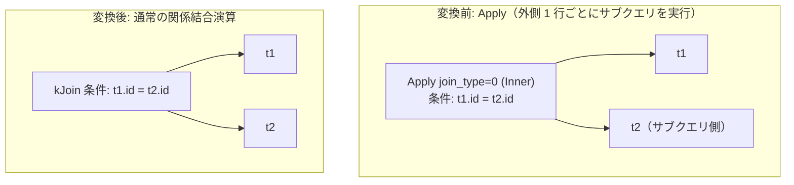

# apply_to_join

- 状態: draft   /   執筆基準リビジョン: `3880673` (2026-09-12)
- 定義位置: `plan/cascades.cpp` の `RuleSet::Default()`（登録名: `"apply_to_join"`）

## 概要

相関サブクエリの実行モデルである `kApply`（入れ子ループ適用演算）を、対応する標準的な結合演算（`kJoin`, `kCrossJoin`, `kOuterJoin`, `kSemiJoin`, `kAntiJoin`）へと具現化・変換する論理最適化 Rule です。

デコリレーションによって外側への依存が解消されたサブクエリ式を関係代数結合の世界へ解放し、後続の結合順序探索、述語プッシュダウン、および高効率なハッシュ/マージ結合アルゴリズムの適用を可能にします。

## 変換前後の関係



## 適用条件

パターンは `Apply(Any("left"), Any("right"))`、ターゲットヒントは `LogicalOperator::kApply` です。子ノードをちょうど 2 つ持つ `kApply` 式に合致した場合、内部の `join_type` ペイロードに応じて以下のように分岐します。

```cpp
if (expression.operation != LogicalOperator::kApply ||
    expression.children.size() != 2) {
  return;
}
switch (expression.join_type) {
  case 0: {  // Inner
    memo.AddExpression(
        group, LogicalExpression{
                   .operation = expression.predicate
                                    ? LogicalOperator::kJoin
                                    : LogicalOperator::kCrossJoin,
                   .children = {left_id, right_id},
                   .predicate = expression.predicate,
                   .target_list = expression.target_list,
                   .output_schema = expression.output_schema});
    break;
  }
```

- `join_type = 0` (Inner): 結合述語が存在する場合は `kJoin`、存在しない場合は `kCrossJoin` を生成。
- `join_type = 1` (LeftOuter): `kOuterJoin`（`join_type = 0` 即ち LEFT）を明示して生成。
- `join_type = 2` (Semi): `kSemiJoin` を生成。
- `join_type = 3` (Anti): `kAntiJoin` を生成。
- 1 子形（未計画の `SelectStatement` を抱える不透明 Apply）や未知の `join_type` の場合は変換を行いません。

## 意味論的根拠と関係代数への写像

`kApply` の本来の意味論は「外側リレーションの行ごとにパラメータをバインドして内側を実行する」という手続き的なループです。外側の属性に対する相関が結合述語の形式に整理されているならば、結合演算への完全な等価置換が成立します。

- **Inner**: 外側と内側のタプルを述語で合致させる処理は通常の内部結合（述語なしなら直積）と同値です。
- **LeftOuter**: 内側に合致するタプルが存在しない場合に NULL 補完を行う挙動は `LEFT OUTER JOIN` と完全に一致します。
- **Semi / Anti**: 内側の存在有無（EXISTS / NOT EXISTS）のみを判定する相関は、それぞれ `SEMI JOIN` および `ANTI JOIN` に一意に写像されます。

本 Rule はデコリレーションの最終段階を担うものであり、事前の相関述語の引き上げ（`hoist_correlated_selection_to_apply`）や集約デコリレーション（`decorrelate_aggregate_apply`）の成果を受け取る構造的ハブとして機能します。

## 実装の詳細

`LeftOuter` への変換時、Apply の符号化（`join_type = 1`）を `kOuterJoin` における LEFT 結合を表す符号値（`join_type = 0`）へとマッピングし直します。

```cpp
memo.AddExpression(
    group,
    LogicalExpression{.operation = LogicalOperator::kOuterJoin,
                      .children = {left_id, right_id},
                      .predicate = expression.predicate,
                      .target_list = expression.target_list,
                      .join_type = 0,  // LeftOuter
                      .output_schema = expression.output_schema});
```

Inner 結合において述語が存在しない場合に `kJoin` ではなく `kCrossJoin` を選択することで、述語なし内部結合の表現正規化を遵守しています。

## 最適化効果

行ごとの反復サブクエリ実行（計算量 $O(|L| \times |R|)$）を、ハッシュ結合やマージ結合による線形時間処理（$O(|L| + |R|)$）へと最適化するための決定的な門戸を開きます。

さらに、結合の結合則や交換則、および述語プッシュダウンといった Cascades 最適化の全体系が適用可能となります。

## 関連 Rule との相互作用

- `hoist_correlated_selection_to_apply`: 内側フィルタ内の相関条件を Apply の条件へ引き上げ、本 Rule の発火条件を整えます。
- `decorrelate_aggregate_apply`: スカラ集約サブクエリをグループ化集約と外部結合へと一括変換します。
- 物理実装ルール `apply`: 本 Rule で結合に下りなかった残余相関を、最終的に入れ子ループ `ApplyPlan` で安全に実行します。

## 検証テスト

- `plan/cascades_test.cpp` の `CascadesTest.ApplyToJoinDecorrelation`: `join_type = 0` の Apply が `kJoin` へ変換されること。
- `plan/cascades_test.cpp` の `CascadesTest.ApplyToSemiJoinDecorrelation` / `CascadesTest.ApplyToAntiJoinDecorrelation`: Semi / Anti Apply がそれぞれ `kSemiJoin` / `kAntiJoin` へ変換されること。
