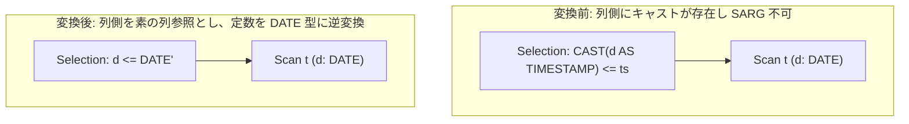

# cast_pushdown_on_comparison

- 状態: draft   /   執筆基準リビジョン: `3880673` (2026-09-12)
- 定義位置: `plan/cascades.cpp` の `RuleSet::Default()`（登録名: `"cast_pushdown_on_comparison"`）

## 概要

`CAST(col AS T) <op> 定数` の形式を持つ比較述語に対し、列側の型キャストを取り除いて定数リテラル側へと型変換を押し込んだ等価述語 `col <op> 定数'` を生成する論理最適化 Rule です。

型キャストを内包した列参照は SARGable（Search Argumentable: インデックス走査範囲として直接利用可能）な述語とはみなされないため、列側を素の列参照へと復元することで、ストレージ層の B+Tree インデックス走査（`index_scan`）の適用を可能にします。変換は、当該キャストが単射（injective）・順序保存（order-preserving）・全域的（total）であると証明できる安全な型ペアに厳格に限定されます。

## 変換前後の関係



## 適用条件

パターンは `Selection(Any("input"))`、ターゲットヒントは `LogicalOperator::kSelection` です。以下の条件をすべて満たす場合に適用されます。

1. 対象式が `kSelection` であり、単一の子ノードを持ち、述語を保持していること。
2. **入力 Group が単一のリレーションであること**（`input_group.relations.size() == 1`）。
3. カタログから対象テーブルの `Schema` が正常に取得できること。
4. 連言内の比較演算子 `op` が比較演算（`=`、`<>`、`<`、`<=`、`>`、`>=`）であり、片方のオペランドが `kCastExp`、もう片方が非 NULL の `kConstantValue` であること。
5. キャストの子式が素の列参照（`kColumnValue`）であり、スキーマ上に実在すること。
6. 列の元型とキャスト目標型が**安全な許可リスト（allowlist）**に適合すること（同種ドメイン間の冗長キャスト、または `DATE -> TIMESTAMP / DATETIME`）。
7. **定数の往復評価（round-trip proof）**に合格すること。

```cpp
// cast_pushdown_on_comparison: CAST(col AS T) <op> const ->
// col <op> const' when the cast is a provably injective, order-preserving,
// total map over col's catalog domain. The rewritten column side is
// sargable (index range extraction sees a bare column), while the
// original is not. Soundness rests on three gates: (1) an allowlist of
// domain pairs (same-domain redundancy, DATE -> TIMESTAMP), so lossy maps
// such as INT64 -> FLOAT64 never rewrite; (2) a constant round-trip
// proof CAST_BACK(const) folds and CAST_FWD(folded) reproduces const, so
// the boundary value survives the domain change exactly; (3) totality of
// the allowlisted maps, so no row can throw in the original and vanish
// in the rewrite. Only single-relation selections are rewritten; joins
// keep their conjuncts for NewJoin canonicalization.
```

## 意味論的根拠と三値論理・例外保護

比較演算におけるキャストの反転は、以下の 3 重の防壁（soundness gates）によって保証されます。

1. **単射性と順序保存性の保証**:
   写像が単射でなければ、逆変換によって満たされる解空間が元の述語と一致しなくなります。たとえば `INT64 -> FLOAT64` のキャストは精度の欠損（桁落ち）により相異なる整数が同一の浮動小数点数に丸められる可能性があるため、許可リストから厳格に排除されています。
2. **定数の往復一致証明（Round-trip Proof）**:
   `DATE -> TIMESTAMP` のキャストにおいて、定数側が `'2026-01-01 12:34:56'` のように時刻成分を含んでいる場合、単純に DATE 型へ切り捨てると境界条件の意味が狂います。逆方向キャスト `CAST_BACK(const)` を評価した結果を再度順方向 `CAST_FWD` し、元の定数値とビットレベルで完全一致する場合に限り、境界値の同値性が証明されたものとして変換を許可します。
3. **全域性（Totality）と例外消去の防止**:
   許可された型変換は入力ドメインの全域で例外を送出しない（total）ことが保証されているため、元のクエリでキャスト例外を発生させるはずだった異常データ行が、書き換えによって例外を出さずに通過してしまうようなセマンティクスの破壊は生じません。

## 実装の詳細

往復評価に合格した場合、列側を素の列参照 `cast.Child()` に差し替え、定数側を逆変換後の畳み込み値 `narrowed` に置換した新しい二項比較式を生成します。

```cpp
const Expression narrowed = ConstantValueExp(folded.Value());
rewritten = cast_on_left
                ? BinaryExpressionExp(cast.Child(), op, narrowed)
                : BinaryExpressionExp(narrowed, op, cast.Child());
changed = true;
```

1 つ以上の連言が書き換わった場合、`CombineConjuncts` で再結合した正規化 Selection 式を生成し、元の Group に代替として登録します。

## 最適化効果

列参照に対する型キャスト関数呼び出しが排除され、インデックスオプティマイザが述語を SARGable なキー範囲（`lower_bound` / `upper_bound`）として認識できるようになります。

これにより、テーブルのフルスキャン（$O(N)$）を B+Tree インデックス走査（$O(\log N + K)$）へと劇的に効率化できます。

## 関連 Rule との相互作用

- `push_selection_into_scan`: 書き換えによって素の列比較となった述語を、スキャンノードの事前フィルタおよびインデックス走査へと供給します。
- `extract_year_sargable`: 日時抽出関数に対する同様の SARG 化論理ルールです。

## 検証テスト

- `plan/cascades_test.cpp` 等における SARG 化テストスイートにより、許可された型変換におけるインデックス走査の導出と、不正な型ペアに対する変換抑止が検証されています。
