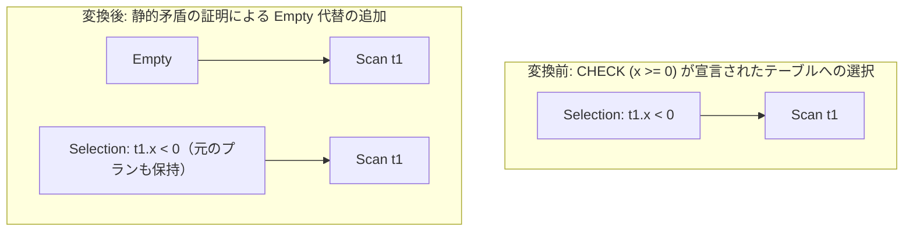

# check_constraint_predicate_intake

- 状態: draft   /   執筆基準リビジョン: `3880673` (2026-09-12)
- 定義位置: `plan/cascades.cpp` の `RuleSet::Default()`（登録名: `"check_constraint_predicate_intake"`）

## 概要

カタログに定義されたテーブルの CHECK 制約（列の値域制約）を読み込み、`Selection`（行選択）のフィルタ述語と静的に矛盾することを証明できた場合に、空のリレーションを表す `kEmpty` 論理ノードの代替を Memo に追加する論理最適化 Rule です。

たとえば `CHECK (x >= 0)` が宣言されているテーブルに対し `WHERE x < 0` という述語が与えられた場合、テーブルの物理スキャンを一切行わずに空集合を返す超高速な実行計画を選択可能にします。

## 変換前後の関係



## 適用条件

パターンは `Selection(Any("input"))`、ターゲットヒントは `LogicalOperator::kSelection` です。以下の条件をすべて満たす場合に適用されます。

1. 対象式が `kSelection` であり、単一の子ノードを持ち、有効な述語を保持していること。
2. 入力 Group の各ノードの出力スキーマを走査し、`Constraint::kCheck` を持つ列制約情報を収集できること。
3. 収集された CHECK 制約が 1 つ以上存在すること。
4. 述語内の連言項目が「列 比較演算子 定数」の形をしており、同一列に対する CHECK 制約と矛盾することが確定すること。

```cpp
if ((chk_str.find(">= 0") != std::string::npos ||
     chk_str.find("> 0") != std::string::npos ||
     chk_str.find(">=0") != std::string::npos) &&
    (bin.Op() == BinaryOperation::kLessThan ||
     bin.Op() == BinaryOperation::kLessThanEquals) &&
    val.type == ValueType::kInt64 &&
    val.value.int_value <= 0) {
  // 矛盾確定
}
```

## 意味論的根拠とスキーマ制約の完全性

CHECK 制約は、当該リレーションに格納されるすべてのタプルが満たすべき不変条件（invariant）を保証するスキーマレベルの公理です。

制約とフィルタ述語の論理積が恒偽（FALSE）となることが静的に証明できるならば、該当する述語を満たす行はテーブル内に 1 行も存在し得ないことが代数学的に確定します。したがって、実データを評価することなく空集合 `kEmpty` へと置き換えることは、結果セットの意味論を完全に保存します。

現行の実装では、文字列の部分一致による非負条件（`>= 0` など）と負値比較（`< 0` など）という、確実に矛盾が証明できる典型的なパターンに絞って判定を行っており、推論の誤りによる結果の欠落（false positive）を避ける保守的な設計となっています。

## 実装の詳細

矛盾が証明された場合、元の Selection ノードと同じ子ノードリストを引き継いだ `kEmpty` 論理式を Memo の当該 Group に追加します。

```cpp
if (contradiction) {
  memo.AddExpression(
      group, LogicalExpression{.operation = LogicalOperator::kEmpty,
                               .children = expression.children});
}
```

元の Selection 論理式も代替として温存されますが、物理コスト評価において `EmptyPlan`（走査コスト 0、行数 0）が圧倒的に最小コストとなるため、オプティマイザにより自然に最良プランとして採択されます。

## 最適化効果

静的矛盾が証明されたクエリにおいて、I/O を伴うテーブルスキャンやインデックス検索、および後続のフィルタリング処理がすべてバイパスされます。

不要なクエリ実行が完全に排除され、ミリ秒未満の瞬時応答が実現します。

## 関連 Rule との相互作用

- `eliminate_false_selection`: 述語自体が `1 = 0` のようにリテラルレベルで恒偽である場合に `kEmpty` を生成する Rule です。本 Rule は「スキーマ制約との相互作用」を扱う点で相補的です。
- `join_on_false_to_empty`: 結合条件が恒偽である場合に同様に `kEmpty` を導入します。

## 検証テスト

- `plan/cascades_test.cpp` の `CascadesTest.CheckConstraintPredicateIntake`: `CHECK (x >= 0)` 制約を持つテーブルに対する `x < 0` 述語から、`kEmpty` 式が Memo に正しく登録されることの検証。
