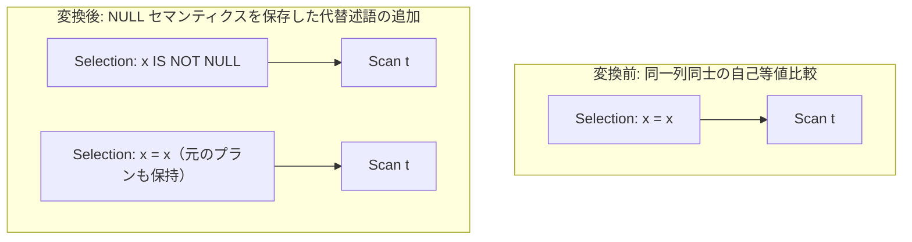

# comparison_self_predicates

- 状態: draft   /   執筆基準リビジョン: `3880673` (2026-09-12)
- 定義位置: `plan/cascades.cpp` の `RuleSet::Default()`（登録名: `"comparison_self_predicates"`）

## 概要

同一列同士の自己比較（例: `x = x`, `x < x`, `x <= x` など）を、SQL の三値論理における NULL セマンティクスを完全に保存した等価式へと書き換える論理最適化 Rule です。

具体的には、`x = x` を `x IS NOT NULL` に、非等値自己比較 `x < x` や `x > x` を「NULL のときは NULL、非 NULL のときは FALSE」を返す CASE 式に、広義不等式 `x <= x` や `x >= x` を「NULL のときは NULL、非 NULL のときは TRUE」を返す CASE 式へと展開します。

## 変換前後の関係



## 適用条件

パターンは `Selection(Any("input"))`、ターゲットヒントは `LogicalOperator::kSelection` です。以下の条件をすべて満たす場合に適用されます。

1. 対象式が `kSelection` であり、単一の子ノードを持ち、有効な述語を保持していること。
2. 入力 Group が自分自身ではないこと（循環抑止）。
3. カタログから対象テーブルのスキーマ情報が正常に取得できること。
4. 連言内の二項比較（`=`、`<`、`>`、`<=`、`>=`）において、左右両オペランドが完全に同一の `ColumnName` を参照していること。
5. 当該列のデータ型が**反射律（reflexivity）が成立するドメイン**（`kInt64`、`kDate`、`kVarChar`）に属すること。

```cpp
const bool reflexive = domain == ValueType::kInt64 ||
                       domain == ValueType::kDate ||
                       domain == ValueType::kVarChar;
```

浮動小数点型（FLOAT64 等）は、IEEE 754 の規準により `NaN = NaN` が FALSE となり反射律が破綻するため、明示的に除外されます。

## 意味論的根拠と三値論理・IEEE 754 例外保護

本 Rule の等価変換は、以下の厳密な論理体系に準拠しています。

```cpp
// comparison_self_predicates: x = x -> x IS NOT NULL; x < x / x > x ->
// NULL-preserving FALSE; x <= x / x >= x -> NULL-preserving TRUE.
// Equality is reflexive exactly for non-null values, so x = x is
// equivalent to the null test; strict self-inequalities can never hold
// but must stay NULL on null input (a bare FALSE would differ), hence
// the CASE form. NaN breaks reflexivity, so floating-point columns are
// excluded via the catalog domain gate (integers, dates and strings
// only).
```

1. **`x = x` と `x IS NOT NULL` の同値性**:
   SQL の三値論理において、`x` が NULL の場合 `x = x` は `UNKNOWN`（NULL）となり行は棄却されます。一方、`x` が非 NULL であれば反射律により必ず TRUE となります。したがって、`x = x` を満たすタプル集合は `x IS NOT NULL` を満たすタプル集合と数学的に一致します。
2. **自己不等式における単なる定数化（FALSE/TRUE）の禁止**:
   `x < x` は真になり得ませんが、単なる定数 `FALSE` に置き換えることはできません。なぜなら、`x` が NULL の場合に `x < x` の評価値は NULL（`UNKNOWN`）であるべきだからです。述語コンテキストの外（CASE 式内部や SELECT 句など）に式が再配置された場合、NULL と FALSE の区別は重要となります。そのため、「`CASE WHEN x IS NULL THEN NULL ELSE FALSE END`」という三値論理保存形式を採用します。
3. **浮動小数点の除外**:
   IEEE 754 において `NaN = NaN` は偽であり、`NaN IS NOT NULL` は真です。浮動小数点数を許容すると NaN の行で結果の不一致が生じるため、カタログのドメイン検査により整数・日付・文字列型のみに限定します。

## 実装の詳細

反射律を満たす列に対して、以下のように式を置換します。

```cpp
if (reflexive) {
  const Expression col = ColumnValueExp(column);
  if (binary.Op() == BinaryOperation::kEquals) {
    rewritten = UnaryExpressionExp(
        col, UnaryOperation::kIsNotNull);
  } else {
    const bool always_true =
        binary.Op() == BinaryOperation::kLessThanEquals ||
        binary.Op() == BinaryOperation::kGreaterThanEquals;
    rewritten = CaseExpressionExp(
        {{UnaryExpressionExp(col, UnaryOperation::kIsNull),
          ConstantValueExp(Value())}},
        ConstantValueExp(Value(always_true)));
  }
  changed = true;
}
```

書き換えが発生した連言を合成し、新たな Selection 式として Memo に追加します。

## 最適化効果

`x = x` が単純な `x IS NOT NULL` に正規化されることで、後続の制約推論（NOT NULL 制約による述語完全消去など）やインデックス走査の適用可能性判定が格段に向上します。

また、同一列の重複比較演算の実行コストが解消されます。

## 関連 Rule との相互作用

- `not_null_is_not_null_elimination`: 対象列がカタログ上で NOT NULL 宣言されている場合、本 Rule が生成した `x IS NOT NULL` をさらに完全消去します。
- `eliminate_true_selection`: `x <= x` 等から生じた恒真述語を後続で消去します。

## 検証テスト

- `plan/cascades_test.cpp` の `CascadesTest.ComparisonSelfPredicatesFold`: 自己比較を持つ Selection から正規化された代替述語が生成されることの検証。
- `plan/cascades_test.cpp` の `CascadesTest.ComparisonSelfPredicatesSkipFloats`: 浮動小数点列に対して反射律の破れを防ぐため変換が正しく抑止されることの検証。
